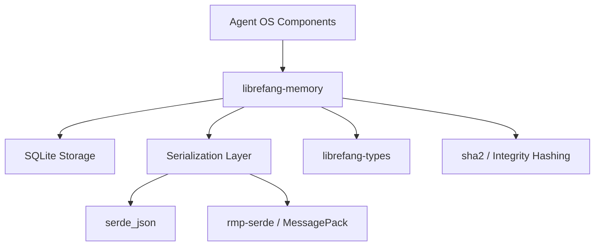

# Other — librefang-memory

# librefang-memory

Memory substrate for the LibreFang Agent OS.

## Overview

`librefang-memory` provides the persistent storage and retrieval layer for the LibreFang Agent OS. It serves as the substrate upon which agents store state, conversation history, task results, and any data that must survive across sessions. The module abstracts storage operations behind async interfaces, allowing the rest of the system to interact with memory without coupling to specific storage backends.

## Architecture

The crate relies on **SQLite** (`rusqlite`) as its primary storage engine, chosen for its reliability, zero-configuration deployment, and suitability for single-node agent runtimes. Data is serialized using either JSON (`serde_json`) or MessagePack (`rmp-serde`), depending on the context — JSON for human-readable debugging and interchange, MessagePack for compact binary storage of large structures.

## Dependencies and Their Roles

| Dependency | Purpose |
|---|---|
| `librefang-types` | Shared type definitions used across all LibreFang crates. Memory entries and metadata structures are defined here. |
| `rusqlite` | Embedded SQLite database engine for persistent, queryable storage. |
| `serde`, `serde_json`, `rmp-serde` | Serialization framework with JSON and MessagePack backends for flexible data encoding. |
| `tokio` | Async runtime. All storage operations are non-blocking. |
| `async-trait` | Enables async method definitions in traits, used for storage backend abstraction. |
| `sha2` | Cryptographic hashing for data integrity verification and content-addressed storage keys. |
| `chrono` | Timestamp management for memory entries — creation, access, and expiration tracking. |
| `uuid` | Unique identifier generation for memory records and sessions. |
| `reqwest` | HTTP client, likely used for memory synchronization or remote storage backends. |
| `tracing` | Structured logging and instrumentation of storage operations. |
| `thiserror` | Ergonomic error type definitions for storage failures. |

## Key Concepts

### Memory as a Substrate

Rather than exposing a simple key-value interface, this module is designed as a *substrate* — a low-level layer that higher-level abstractions (conversation managers, task planners, knowledge graphs) build upon. This means the module prioritizes flexibility and correctness over opinionated data models.

### Async Storage Interface

All operations are async via `tokio`, ensuring that disk I/O never blocks the agent's event loop. The `async-trait` dependency indicates that storage backends are defined as traits with async methods, allowing for swappable implementations (local SQLite, remote services, or in-memory mocks for testing).

### Content Integrity

The presence of `sha2` suggests that stored data is content-addressed or integrity-checked. This prevents silent data corruption and enables deduplication — identical content maps to the same hash regardless of how many times it is stored.

### Serialization Flexibility

Supporting both JSON and MessagePack allows the module to balance readability against storage efficiency. JSON is useful during development and for entries that may be inspected directly. MessagePack reduces storage footprint for high-volume binary data such as embeddings or large structured records.

## Relationship to Other Crates

- **`librefang-types`**: Defines the data structures that `librefang-memory` persists. The memory crate depends on these types but does not define them.
- **Agent modules**: Consume `librefang-memory` to store and retrieve state. They never interact with SQLite directly.
- **Testing crates**: Use `tempfile` (listed in dev-dependencies) to create ephemeral database files for isolated test runs.

## Testing

Tests use `tempfile` to create temporary directories for SQLite databases, ensuring test isolation and no side effects on the host filesystem. The `tokio-test` dependency enables synchronous-style tests for async storage operations.