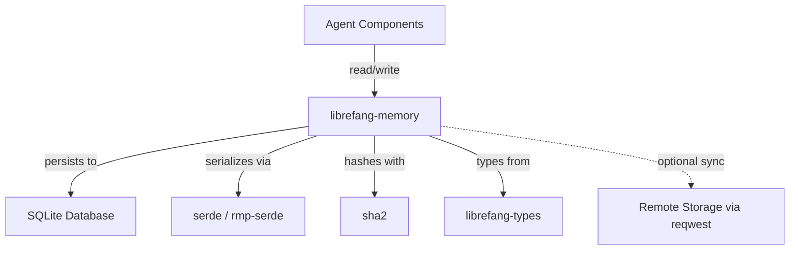

# Other — librefang-memory

# librefang-memory

Memory substrate for the LibreFang Agent OS.

## Overview

`librefang-memory` provides the persistence and retrieval layer for LibreFang agents. It serves as the "memory" component — responsible for storing, indexing, and recalling agent state, conversation history, and any other data that needs to survive across sessions or be shared between agent components.

## Purpose

An agent operating system needs structured, queryable memory. This module abstracts the storage substrate so that the rest of the system can:

- **Persist agent state** across restarts and sessions
- **Recall prior interactions** and context
- **Store and retrieve typed data** using the shared definitions from `librefang-types`

## Dependencies & What They Indicate

| Dependency | Role |
|---|---|
| `rusqlite` | Primary storage backend — SQLite for embedded, file-based persistence |
| `serde` / `serde_json` / `rmp-serde` | Serialization layer supporting both JSON and MessagePack formats |
| `librefang-types` | Shared type definitions used across the LibreFang ecosystem |
| `tokio` | Async runtime integration for non-blocking storage operations |
| `sha2` | Cryptographic hashing — likely for content-addressable storage or integrity checks |
| `uuid` | Unique identifiers for memory entries and records |
| `chrono` | Timestamps for temporal indexing and queries |
| `reqwest` | HTTP client — suggests optional remote storage or synchronization capability |
| `tracing` | Structured logging and diagnostics |
| `thiserror` | Ergonomic error type definitions |
| `async-trait` | Async trait support for defining storage backends as pluggable interfaces |

## Architecture

The module sits between agent components and the underlying storage. All memory operations go through this layer, which handles serialization, indexing, and retrieval.

## Integration Points

- **`librefang-types`** — This module consumes shared type definitions (agent messages, state structures, etc.) rather than defining its own, ensuring consistency across the system.
- **Agent components** — Other modules in LibreFang read from and write to memory through the APIs this crate exposes.
- **Filesystem** — SQLite databases are stored on disk, with `tempfile` used in tests for isolated, ephemeral storage.

## Testing

The `tempfile` dev-dependency indicates that tests create isolated temporary databases. This ensures test runs are repeatable and don't pollute the development environment with leftover state files.