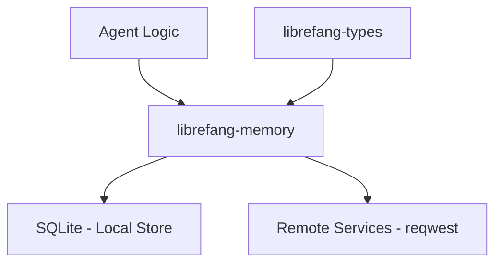

# Other — librefang-memory

# librefang-memory

Memory substrate for the LibreFang Agent OS.

## Purpose

This crate provides the persistence and state management layer for LibreFang agents. It abstracts how memories are stored, retrieved, and organized—serving as the "brain" that outlives any single request or session. Agents rely on this substrate to maintain context, recall past interactions, and make decisions based on accumulated knowledge.

## Role in the System

`librefang-memory` sits between the agent logic and raw storage. Higher-level modules (agents, skills, orchestration) depend on this crate to read and write state without needing to know whether data lives in SQLite, a remote service, or a combination of both.

## Key Dependencies and Their Roles

| Dependency | Purpose |
|---|---|
| **rusqlite** | Primary embedded database for durable local storage of memories, state, and metadata. |
| **serde** / **serde_json** / **rmp-serde** | Serialization framework. JSON for interoperability and debugging; MessagePack (`rmp-serde`) for compact binary representation of memory entries. |
| **tokio** | Async runtime. All storage operations are non-blocking to avoid stalling the agent event loop. |
| **sha2** | Content hashing. Used for integrity checks, deduplication, and content-addressed storage of memory entries. |
| **reqwest** | HTTP client. Enables syncing memories with remote backends or fetching external data to hydrate local state. |
| **uuid** | Unique identifiers for memory entries, sessions, and correlation tokens. |
| **chrono** | Timestamps for memory creation, access, and expiration. |
| **librefang-types** | Shared type definitions—memory entry structs, error types, and configuration models that this crate consumes. |
| **tracing** | Structured logging for observability into storage operations, cache hits/misses, and sync events. |
| **thiserror** | Ergonomic error type definitions for storage failures, serialization errors, and connectivity issues. |
| **async-trait** | Trait definitions for async storage backends, allowing pluggable implementations (local, remote, composite). |

## Architecture

### Storage Backend Abstraction

The crate defines async traits for memory backends, enabling the system to swap or compose storage strategies:

- **Local backend** — SQLite-backed storage for fast, durable, on-disk persistence.
- **Remote backend** — HTTP-based synchronization with external memory services via `reqwest`.
- **Composite backend** — Layered caching that keeps hot data local while delegating long-term storage remotely.

### Memory Model

Memories are content-addressed using SHA-256 hashes, which supports:

- **Deduplication** — Identical entries are stored once.
- **Integrity verification** — Corrupted or tampered entries are detected on read.
- **Efficient lookups** — Hash-based retrieval without full scans.

### Serialization Strategy

Two formats are supported depending on the context:

- **MessagePack** (`rmp-serde`) — Used for on-disk storage and inter-process communication where compactness matters.
- **JSON** (`serde_json`) — Used for debugging, human inspection, and API boundaries where readability is preferred.

The format is selected per-operation, not per-backend, allowing flexibility.

## Error Handling

All errors are captured through types derived via `thiserror`, covering:

- Database errors from `rusqlite` operations.
- Serialization/deserialization failures.
- Network errors from remote sync attempts.
- Integrity validation failures (hash mismatches).

Callers receive structured error types rather than raw exception strings, enabling meaningful retry logic and user-facing diagnostics.

## Testing

Dev dependencies include:

- **tokio-test** — For writing async tests that exercise storage operations under realistic runtime conditions.
- **tempfile** — For creating isolated temporary databases during tests, ensuring no cross-test contamination and no leftover artifacts.

Tests typically spin up a fresh SQLite instance in a temp directory, perform memory operations, and assert on state—keeping tests deterministic and self-contained.

## Integration Points

This crate is consumed by:

- **Agent runtimes** — Reading context and writing new memories after each interaction.
- **Skill modules** — Storing and retrieving skill-specific state.
- **Orchestration layer** — Persisting workflow state across async boundaries.

It depends on `librefang-types` for shared data structures, ensuring consistency across all crates in the workspace.