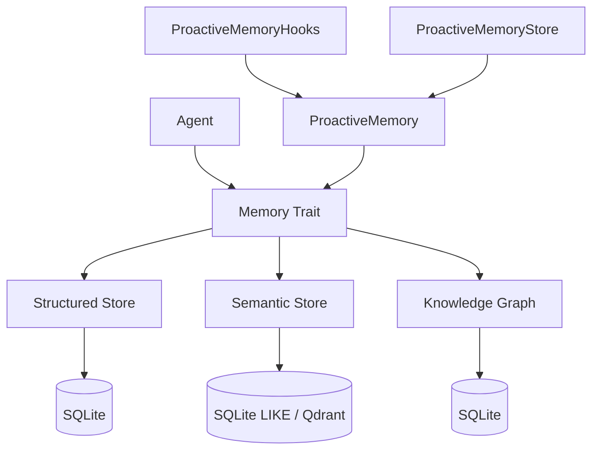

# Other — librefang-memory

# librefang-memory

Memory substrate for the LibreFang Agent OS. Provides a unified memory API that abstracts three distinct storage backends, giving agents a single interface for persisting state, retrieving context, and managing knowledge over time.

## Architecture

Agents never interact with storage backends directly. The `Memory` trait is the sole entry point, delegating to whichever backend is appropriate for the operation. This lets the system swap or combine backends without changing agent code.

## Storage Backends

### Structured Store (`structured`)

SQLite-backed storage for well-defined, tabular data:

- **Key/value pairs** — arbitrary agent configuration and runtime state
- **Sessions** — conversation or task-scoped context windows
- **Agent state** — durable checkpoints for agent resumption
- **Audit trail** — immutable log of actions for accountability

This is the default backend for anything that doesn't need semantic search or graph traversal.

### Semantic Store (`semantic`, `http_vector_store`)

Text search over stored memories. Two modes of operation:

1. **LIKE-based** (default) — uses SQLite `LIKE` queries. Works everywhere, no external services, but limited to substring matching.
2. **Qdrant-backed** (vector path) — delegates to a Qdrant instance via the `http_vector_store` module for true embedding-based similarity search.

The semantic store is what agents query when they need to recall information by meaning rather than exact key.

### Knowledge Graph (`knowledge`)

SQLite-backed entity-relation store. Nodes are entities (agents, users, concepts, resources) and edges are typed relations between them. Useful for:

- Tracking which agents know about which resources
- Modeling relationships between users and their delegated authorities
- Building context maps that span multiple sessions

## Proactive Memory (mem0-style)

The `proactive` module implements an automatic memory management layer inspired by [mem0](https://github.com/mem0ai/mem0). Instead of agents explicitly deciding what to store and when to retrieve, proactive memory handles this automatically.

### Core Types

**`ProactiveMemory`** — the unified API surface exposing four operations:

| Method | Purpose |
|--------|---------|
| `search` | Retrieve relevant memories given a query |
| `add` | Ingest new information into memory |
| `get` | Fetch a specific memory by ID |
| `list` | Enumerate memories, optionally filtered |

**`ProactiveMemoryHooks`** — interceptor-style hooks that wrap agent interactions:

- **Auto-memorize**: extracts facts from agent outputs and stores them without explicit agent action.
- **Auto-retrieve**: injects relevant memories into agent context before each inference step.

**`ProactiveMemoryStore`** — concrete implementation that sits on top of `MemorySubstrate`, wiring the proactive API to the actual storage backends.

### Supporting Modules

| Module | Responsibility |
|--------|---------------|
| `chunker` | Splits raw text into memory-sized segments before ingestion |
| `consolidation` | Merges duplicate or near-duplicate memories over time to prevent bloat |
| `decay` | Implements time-based relevance decay so stale memories naturally fall out of results |
| `migration` | Schema migrations for the underlying SQLite databases |
| `namespace_acl` | Access control: determines which agents can read/write which memory namespaces |
| `prompt` | Prompt templates used during automatic memorization and retrieval |
| `provider` | Abstraction over different LLM providers used for memory extraction |
| `roster_store` | Manages the roster of agents and their memory entitlements |
| `session` | Session-scoped memory boundaries |

## Key Dependencies

| Crate | Role |
|-------|------|
| `rusqlite` + `r2d2` + `r2d2_sqlite` | SQLite with connection pooling; FTS5 enabled for full-text search |
| `serde` + `serde_json` + `rmp-serde` | Serialization to JSON and MessagePack |
| `librefang-types` | Shared type definitions across the LibreFang workspace |
| `sha2` | Content hashing for deduplication and integrity checks |
| `reqwest` | HTTP client for communicating with Qdrant in the vector backend |
| `metrics` + `tracing` | Observability: counters, histograms, structured logging |
| `tokio` | Async runtime |

## Relationship to the Workspace

`librefang-memory` is a leaf crate — it depends on `librefang-types` but nothing else in the workspace. Other crates (the agent runtime, the gateway, the CLI) depend on it. The module boundary is clean: it owns all storage concerns and exposes them through the `Memory` trait, making it replaceable or mockable in tests.

The call graph data shows no outgoing or incoming module-level calls, which reflects that this crate defines interfaces (`Memory`, `ProactiveMemory`) consumed via dependency injection rather than direct cross-module invocation.

## Development Notes

- **Temporary databases in tests**: The `tempfile` dev-dependency is used to create ephemeral SQLite databases for integration tests. Each test gets a fresh, isolated database.
- **FTS5 requirement**: The structured and semantic stores rely on SQLite FTS5. Ensure the `rusqlite` build includes it (controlled via feature flags in the workspace `Cargo.toml`).
- **Serialization format**: MessagePack (`rmp-serde`) is preferred for binary storage in SQLite BLOB columns; JSON is used for human-readable or cross-service boundaries.