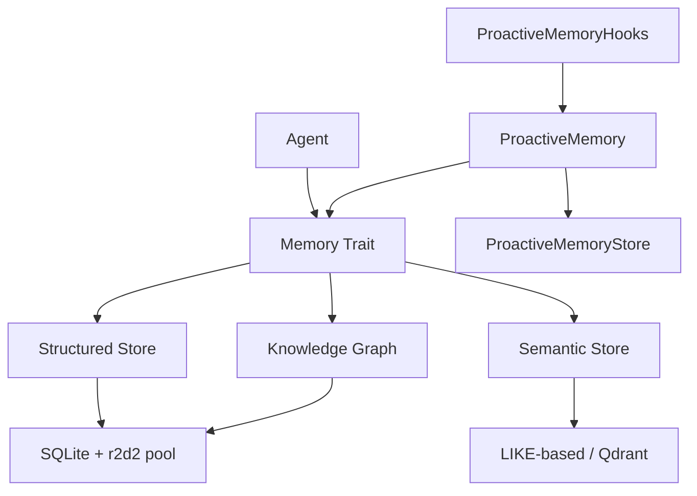

# Other — librefang-memory

# librefang-memory

Memory substrate for the LibreFang Agent OS. Provides a unified memory API that agents interact with through a single `Memory` trait, backed by three specialized storage systems and a proactive memory layer inspired by mem0.

## Architecture


```mermaid
graph TD
    A[Agent] --> B[Memory Trait]
    B --> C[Structured Store]
    B --> D[Semantic Store]
    B --> E[Knowledge Graph]
    C --> F[SQLite + r2d2 pool]
    D --> G[LIKE-based / Qdrant]
    E --> F
    H[ProactiveMemory] --> B
    I[ProactiveMemoryHooks] --> H
    H --> J[ProactiveMemoryStore]
```

Agents call into the `Memory` trait. The trait delegates to three storage backends—structured, semantic, and knowledge graph—all coordinated through a `MemorySubstrate`. The proactive memory layer sits on top, providing automatic memorization and retrieval via hooks.

## Storage Backends

### Structured Store (`structured`)

SQLite-backed storage for structured agent data:

- **Key/value pairs** — arbitrary state an agent needs to persist across turns
- **Sessions** — conversation and interaction history
- **Agent state** — configuration, status, runtime flags
- **Audit trail** — append-only log of actions for accountability

Uses `rusqlite` with FTS5 support for full-text search capabilities, and `r2d2` / `r2d2_sqlite` for connection pooling.

### Semantic Store (`semantic`, `http_vector_store`)

Text search over memories, with two paths:

- **Current path** — LIKE-based text matching (suitable for development and lightweight deployments)
- **Vector path** — Qdrant-backed semantic search (for production-grade retrieval)

### Knowledge Graph (`knowledge`)

SQLite-backed entity-relation store. Models the world as entities connected by typed relations, allowing agents to reason about structured domain knowledge.

## The `Memory` Trait

The central abstraction. All three backends are accessed through a single `Memory` trait so that agents don't need to know which store holds what. The trait unifies structured queries, semantic search, and graph traversal behind one interface.

Agents interact exclusively with this trait. Backend selection and routing happen internally within `MemorySubstrate`.

## Proactive Memory (mem0-style)

The `proactive` module implements a mem0-style memory system that automatically decides what to memorize and when to retrieve it.

### Core Components

| Component | Role |
|---|---|
| `ProactiveMemory` | Unified API exposing `search`, `add`, `get`, `list` |
| `ProactiveMemoryHooks` | Auto-memorize and auto-retrieve hooks that intercept agent interactions |
| `ProactiveMemoryStore` | Concrete implementation backed by `MemorySubstrate` |

### Supporting Modules

- **`chunker`** — splits incoming text into memory-sized chunks before storage
- **`consolidation`** — merges overlapping or redundant memories over time
- **`decay`** — ages out stale memories based on access patterns or time
- **`migration`** — schema migrations for the memory database
- **`namespace_acl`** — access control over memory namespaces (agents can only read/write what they're allowed to)
- **`prompt`** — prompt templates for memory-related LLM calls (e.g., deciding what to extract)
- **`provider`** — abstraction over the underlying memory provider
- **`roster_store`** — tracks which agents exist and their memory entitlements
- **`session`** — session-scoped memory boundaries

### Typical Proactive Flow

1. An agent produces output or receives input.
2. `ProactiveMemoryHooks` intercept the interaction.
3. The hook decides whether to memorize (`add`) new information or retrieve (`search`) relevant past memories.
4. `ProactiveMemoryStore` persists to or queries from `MemorySubstrate`.
5. Over time, `consolidation` merges duplicates and `decay` retires stale entries.

## Key Dependencies

| Crate | Purpose |
|---|---|
| `librefang-types` | Shared type definitions across the LibreFang workspace |
| `rusqlite` + `r2d2` / `r2d2_sqlite` | SQLite storage with connection pooling |
| `serde` / `serde_json` / `rmp-serde` | Serialization (JSON and MessagePack) |
| `tokio` + `async-trait` | Async runtime and trait definitions |
| `sha2` | Content hashing for deduplication and integrity |
| `chrono` / `uuid` | Timestamps and unique identifiers |
| `tracing` / `metrics` | Observability |
| `thiserror` | Error type derivation |
| `reqwest` | HTTP client for the vector store backend |

`tempfile` is available in dev-dependencies for tests that need ephemeral SQLite databases.

## Integration with the Workspace

`librefang-memory` is a library crate consumed by higher-level agent runtime modules. It depends on `librefang-types` for shared data structures and is consumed by agent orchestrators that need persistent, searchable, structured memory. No other workspace crates call into it at compile time (the module is designed to be instantiated and injected at runtime), which is why static call graph analysis shows no incoming or outgoing edges.

## Working with This Crate

### Running Tests

Tests create temporary SQLite databases via `tempfile`, so no external infrastructure is needed:

```sh
cargo test -p librefang-memory
```

For tests exercising the Qdrant vector path, a running Qdrant instance is required.

### Adding a New Backend

1. Implement the relevant subset of the `Memory` trait for your backend.
2. Register the backend in `MemorySubstrate` so the unified API can route to it.
3. Add migration support in the `migration` module if your backend needs schema management.