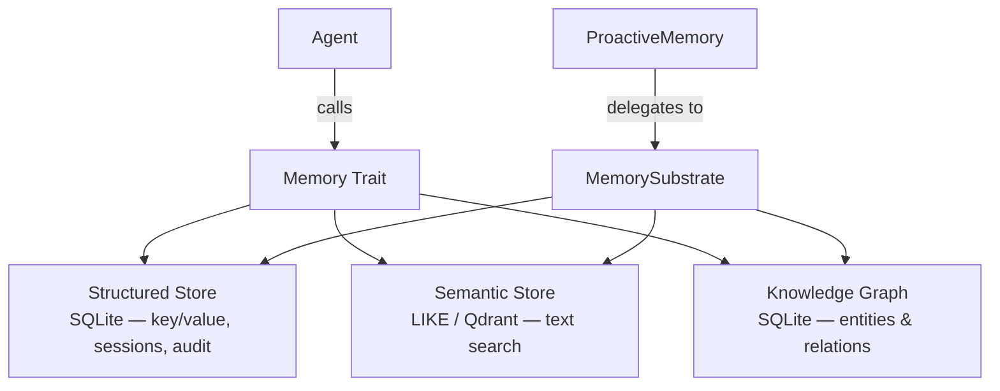

# Other — librefang-memory

# librefang-memory

Memory substrate for the LibreFang Agent OS. Provides persistent, queryable memory for agents through a unified `Memory` trait backed by three storage layers.

## Architecture


```mermaid
graph TD
    A[Agent] -->|calls| T[Memory Trait]
    T --> S[Structured Store<br/>SQLite — key/value, sessions, audit]
    T --> SM[Semantic Store<br/>LIKE / Qdrant — text search]
    T --> KG[Knowledge Graph<br/>SQLite — entities & relations]
    P[ProactiveMemory] -->|delegates to| MS[MemorySubstrate]
    MS --> S
    MS --> SM
    MS --> KG
```

Agents interact with a single `Memory` trait. The trait dispatches to whichever backend is appropriate for the operation. `MemorySubstrate` is the concrete implementation that wires all three together.

## Three Storage Backends

### Structured Store (`structured`)

SQLite-backed storage for key/value pairs, session state, agent configuration, and audit trail. Built on `rusqlite` with connection pooling via `r2d2` / `r2d2_sqlite`.

Use for:
- Session-scoped key/value data
- Agent state persistence across restarts
- Audit logging of agent actions

### Semantic Store (`semantic`, `http_vector_store`)

Text search over stored memories. The current default uses SQL `LIKE`-based matching. The `http_vector_store` path targets a Qdrant-backed vector store for embedding-based similarity search.

Use for:
- Retrieving memories by content similarity
- Searching across conversation history
- Finding relevant past interactions

### Knowledge Graph (`knowledge`)

SQLite-backed entity-relation store. Models entities (people, concepts, resources) and typed relations between them.

Use for:
- Tracking entities mentioned across conversations
- Modeling relationships (e.g., "agent A is responsible for service B")
- Multi-hop reasoning over stored facts

## Proactive Memory (`proactive`)

Mem0-inspired proactive memory system. Instead of requiring agents to explicitly manage memory, this layer automatically captures and retrieves relevant context.

### Core Types

- **`ProactiveMemory`** — Unified API surface with `search`, `add`, `get`, `list`. The primary interface for agents.
- **`ProactiveMemoryHooks`** — Auto-memorize and auto-retrieve hooks. Inject these into agent loops to capture observations and inject relevant memories without explicit agent code.
- **`ProactiveMemoryStore`** — Implementation backed by `MemorySubstrate`.

### Supporting Modules

| Module | Purpose |
|---|---|
| `chunker` | Splits large inputs into memory-sized chunks before storage |
| `consolidation` | Merges duplicate or near-duplicate memories over time |
| `decay` | Applies time-based relevance decay to stored memories |
| `migration` | Schema migrations for the underlying SQLite databases |
| `namespace_acl` | Access control per memory namespace — determines which agents can read/write which memories |
| `prompt` | Prompt templates for memory-related LLM calls (summarization, extraction) |
| `provider` | Abstraction over memory providers for swappable backends |
| `roster_store` | Tracks the set of known agents and their capabilities |
| `session` | Session lifecycle management — creation, expiry, context binding |

## Key Dependencies

| Dependency | Role |
|---|---|
| `librefang-types` | Shared types used across the workspace |
| `rusqlite` / `r2d2` / `r2d2_sqlite` | SQLite storage with async-compatible connection pooling |
| `serde` / `serde_json` / `rmp-serde` | Serialization — JSON for interop, MessagePack for compact storage |
| `tokio` | Async runtime |
| `sha2` | Content hashing for deduplication and integrity checks |
| `tracing` | Structured logging |
| `metrics` | Operational metrics (hit rates, latency, store sizes) |
| `chrono` / `uuid` | Timestamps and unique identifiers |

## Integration Points

This crate is consumed by higher-level agent runtime crates. Agents receive a `Memory` implementation (typically `MemorySubstrate`) and use it for all state persistence. The proactive layer can be layered on top transparently via `ProactiveMemoryHooks`.

```rust
// Typical usage pattern (conceptual)
let substrate = MemorySubstrate::new(config).await?;
let proactive = ProactiveMemory::new(substrate.clone());

// Auto-capture in agent loop
proactive.add("user discussed deployment of service X to prod", namespace).await?;

// Retrieve relevant context before responding
let context = proactive.search("deployment status of X", namespace).await?;
```

## Testing

Tests use `tempfile` (dev-dependency) for ephemeral SQLite databases, ensuring isolation between test runs. No external services are required for the SQLite-backed paths.