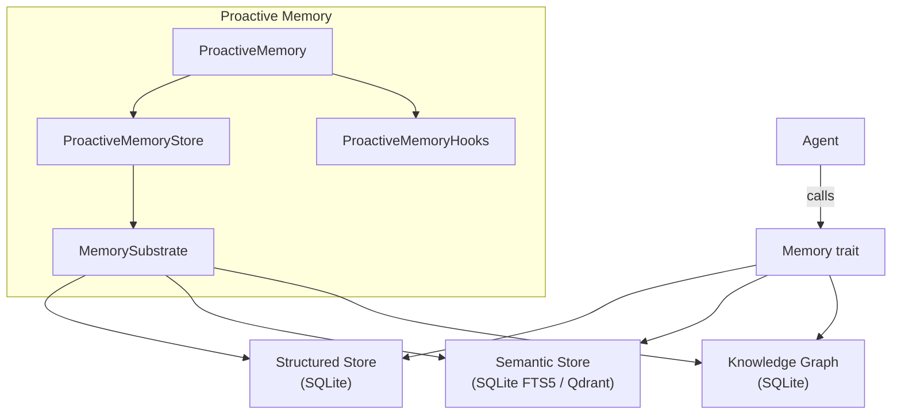

# Other — librefang-memory

# librefang-memory

Memory substrate for the LibreFang Agent OS. Agents operate on a single `Memory` trait backed by three SQLite-driven storage layers, with an optional proactive memory system that provides mem0-style auto-memorization and retrieval.

## Architecture

```mermaid
graph TD
    Agent -->|calls| MT["Memory trait"]
    MT --> SS["Structured Store<br/>(SQLite)"]
    MT --> SM["Semantic Store<br/>(SQLite FTS5 / Qdrant)"]
    MT --> KG["Knowledge Graph<br/>(SQLite)"]

    subgraph "Proactive Memory"
        PM["ProactiveMemory"]
        PM --> PMS["ProactiveMemoryStore"]
        PM --> H["ProactiveMemoryHooks"]
        PMS --> MS["MemorySubstrate"]
    end

    MS --> SS
    MS --> SM
    MS --> KG
```

Agents call into the `Memory` trait. The trait fans out to three backends: structured key/value storage, semantic text search, and a knowledge graph of entities and relations. The proactive memory layer sits on top of `MemorySubstrate`, adding automatic chunking, consolidation, and decay.

## Storage Backends

### Structured Store

SQLite-backed storage for key/value pairs, session data, agent state, and an audit trail. This is the default place for anything that needs transactional durability — conversation context, configuration snapshots, step results.

### Semantic Store

Full-text search over stored documents. The current implementation uses SQLite FTS5 with LIKE-based matching. The `http_vector_store` module provides a path to Qdrant or similar vector databases for embedding-based similarity search.

### Knowledge Graph

SQLite-backed entity-relation store. Nodes are entities (agents, tools, concepts) and edges are typed relations between them. Useful for reasoning about the workspace, tracking dependencies, and building agent rosters.

## Unified `Memory` Trait

All three backends are exposed through a single `Memory` trait. Agents never touch SQLite directly — they call trait methods that route to the correct store. The trait is async (backed by `async-trait`) and wraps rusqlite calls in tokio blocking tasks internally.

## Proactive Memory

The `proactive` module provides mem0-style capabilities:

- **`ProactiveMemory`** — the public API surface with `search`, `add`, `get`, and `list` operations.
- **`ProactiveMemoryStore`** — concrete implementation built on `MemorySubstrate`.
- **`ProactiveMemoryHooks`** — lifecycle hooks for auto-memorizing new information and auto-retrieving relevant context before agent turns.

### Supporting Modules

| Module | Purpose |
|---|---|
| `chunker` | Splits raw input into addressable memory chunks |
| `consolidation` | Merges overlapping or redundant memories over time |
| `decay` | Applies time-based relevance decay to stored memories |
| `migration` | Schema migrations for the memory database |
| `namespace_acl` | Access control scoped by memory namespace |
| `prompt` | Prompt templates for memory-related agent instructions |
| `provider` | Abstraction over memory backends |
| `roster_store` | Tracks which agents have access to which memory namespaces |
| `session` | Session-scoped memory isolation |

## Key Dependencies

- **`librefang-types`** — shared type definitions (`MemoryEntry`, `Entity`, `Relation`, etc.).
- **`rusqlite`** with FTS5 — all local storage.
- **`r2d2` / `r2d2_sqlite`** — connection pooling for concurrent agent access.
- **`serde` / `serde_json` / `rmp-serde`** — serialization; MessagePack for binary payloads, JSON for interop.
- **`sha2`** — content hashing for deduplication.
- **`reqwest`** — HTTP client for the `http_vector_store` backend.
- **`metrics`** — instrumentation counters and histograms for store operations.

## Integration Points

`librefang-memory` is consumed by the agent runtime layer. Agents receive a `Memory`-typed handle at initialization. The proactive hooks integrate into the agent loop: before each turn, `auto-retrieve` pulls relevant context; after each turn, `auto-memorize` persists new facts.

The crate has no incoming or outgoing module-level call edges — it is a leaf dependency consumed through its public API by higher-level agent orchestration code.