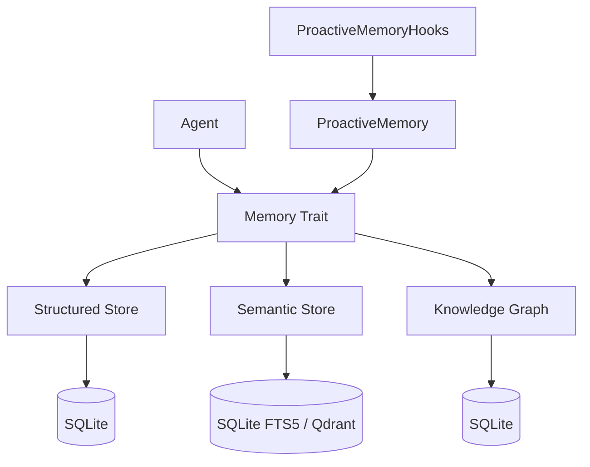

# Other — librefang-memory

# librefang-memory

Memory substrate for the LibreFang Agent OS. Provides persistent, queryable memory for agents through a unified trait abstraction backed by three storage layers.

## Purpose

Agents need memory that goes beyond simple key-value lookups. They require structured state, semantic search over past interactions, and relational knowledge about entities they've encountered. `librefang-memory` unifies all three into a single `Memory` trait so that agent authors deal with one API regardless of which backend services the request.

## Architecture

```mermaid
graph TD
    A[Agent] --> B[Memory Trait]
    B --> C[Structured Store]
    B --> D[Semantic Store]
    B --> E[Knowledge Graph]
    C --> F[(SQLite)]
    D --> G[(SQLite FTS5 / Qdrant)]
    E --> H[(SQLite)]
    I[ProactiveMemory] --> B
    J[ProactiveMemoryHooks] --> I
```

The three storage layers sit behind a unified `Memory` trait. The proactive memory system (mem0-style) layers on top, providing automatic memorization and retrieval hooks that agents can opt into without managing storage directly.

## Storage Backends

### Structured Store

SQLite-backed key/value storage for sessions, agent state, and audit trails. This is the primary store for operational data — things like "which task is this agent running" or "what was the last user message." Uses `r2d2` for connection pooling.

### Semantic Store

Full-text search over stored text. Currently implemented with SQLite's FTS5 via `LIKE`-based queries. The `http_vector_store` module provides a path to Qdrant-backed vector search for environments that need embedding-based retrieval. Agents store freeform text and query it by relevance.

### Knowledge Graph

SQLite-backed entity-and-relation store. Agents record entities (people, services, concepts) and the relationships between them, then traverse those graphs to reason about context.

## Proactive Memory

The `proactive` module implements a mem0-style memory layer that automatically decides what to store and when to retrieve it:

- **`ProactiveMemory`** — the unified API surface exposing `search`, `add`, `get`, and `list`.
- **`ProactiveMemoryHooks`** — intercepts agent interactions to auto-memorize notable content and auto-retrieve relevant context before each turn.
- **`ProactiveMemoryStore`** — concrete implementation backed by `MemorySubstrate`.

Supporting modules:

| Module | Responsibility |
|---|---|
| `chunker` | Splits incoming text into addressable segments |
| `consolidation` | Merges overlapping or redundant memories |
| `decay` | Ages out stale entries over time |
| `migration` | Schema migration for the underlying SQLite databases |
| `namespace_acl` | Access control per memory namespace |
| `prompt` | Prompt templates for memory-related LLM calls |
| `provider` | Abstraction over storage providers |
| `roster_store` | Tracks which agents have access to which memories |
| `session` | Session-scoped memory boundaries |

## Key Dependencies

- **`librefang-types`** — shared type definitions used across the workspace
- **`rusqlite`** — SQLite bindings (compiled with FTS5 support)
- **`r2d2` / `r2d2_sqlite`** — connection pooling for SQLite
- **`serde` / `serde_json` / `rmp-serde`** — serialization (JSON and MessagePack)
- **`tokio`** — async runtime
- **`sha2`** — content hashing for deduplication
- **`tracing`** — structured logging
- **`metrics`** — instrumentation counters and histograms
- **`reqwest`** — HTTP client for the vector store backend

`tempfile` is available in dev-dependencies for tests that need isolated on-disk databases.

## Integration

`librefang-memory` is consumed by the agent runtime and any subsystem that needs persistent state. Other workspace crates depend on `librefang-types` for shared memory-related types (keys, query structs, results) and on this crate for the actual storage implementation. Agents never import backend-specific modules directly — they work through the `Memory` trait.

The connection pool (`r2d2`) is created at startup and shared across all backends. Each backend manages its own table schemas through the `migration` module, which runs automatically on initialization.