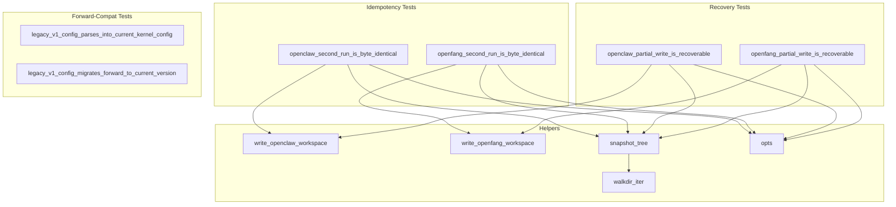

# Other — librefang-migrate-tests

# `librefang-migrate` — Idempotency & Forward-Compatibility Tests

## Overview

`tests/idempotency.rs` is an integration-level test suite that validates the **filesystem-level contracts** of the `librefang-migrate` crate. Where the in-crate unit tests in `src/openclaw.rs` verify idempotency by inspecting the returned `MigrateReport` (asserting `report.imported.is_empty()` on a second run), this module goes further: it snapshots the **actual bytes on disk** before and after re-runs to guarantee that callers never observe duplicate sessions, clobbered configs, or rewritten timestamps.

The tests exercise three distinct guarantees:

1. **Second-run idempotency** — running a migration twice produces a byte-identical destination tree.
2. **Partial-write recovery** — after simulating a killed process (deleting files mid-migration), a re-run reconstructs the missing files without corrupting survivors.
3. **Forward compatibility** — configs authored against the prior major version's schema still deserialize and migrate to the current version.

## Test Architecture



## Helper Functions

### `snapshot_tree(root: &Path) -> BTreeMap<PathBuf, Vec<u8>>`

Recursively reads every regular file under `root` and returns a sorted map of relative paths to byte contents. The `BTreeMap` ordering is critical: when an `assert_eq!` fails, the diff points at the first differing path alphabetically, rather than depending on nondeterministic `HashMap` iteration order.

### `walkdir_iter(root: &Path) -> Vec<PathBuf>`

A minimal recursive directory walker built on `std::fs::read_dir`, intentionally avoiding a `walkdir` dev-dependency. Symlinks are skipped deliberately — neither migrator produces them, and including them would make snapshots unstable across platforms.

### `write_openclaw_workspace(dir: &Path)`

Creates a minimal but representative OpenClaw source workspace containing:

| File | Purpose |
|------|---------|
| `openclaw.json` | JSON5 agent/channel/memory/session config |
| `memory/coder/MEMORY.md` | Per-agent memory file |
| `sessions/agent_coder_main.jsonl` | Session history (must not be duplicated on re-run) |

### `write_openfang_workspace(dir: &Path)`

Creates a minimal OpenFang source workspace containing:

| File | Purpose |
|------|---------|
| `config.toml` | Top-level config (v2 format with root-level fields) |
| `secrets.env` | Environment file (must be copied verbatim) |
| `agents/coder/agent.toml` | Agent manifest (exercises TOML rewrite path) |
| `data/index.db` | Binary file (exercises raw copy path) |

### `opts(source, src, dst) -> MigrateOptions`

Constructs a `MigrateOptions` with `dry_run: false` and the specified source type and directory paths.

## Idempotency Tests

### `openclaw_second_run_is_byte_identical`

Verifies that the OpenClaw migrator's marker file (`.openclaw_migrated`) short-circuits before any writes. After a successful first run, the test:

1. Snapshots the entire destination tree.
2. Calls `openclaw::migrate` a second time.
3. Asserts `report.imported.is_empty()`.
4. Asserts the second snapshot is byte-identical to the first.

This is strictly stronger than the in-crate unit test, which only checks the report — here the timestamp embedded in the marker body must also be unchanged.

### `openfang_second_run_is_byte_identical`

OpenFang has no marker file; it relies on per-entry `dest_path.exists()` guards. After a clean first run, every source path already exists at the destination. This test asserts:

- The second run's `report.imported` is empty.
- `report.skipped.len()` equals the first run's `report.imported.len()` (every previously-imported file is now "already exists").
- The on-disk tree is byte-identical across both runs.

## Recovery Tests

These simulate a migration process that was killed mid-write. The pattern is:

1. Run migration to completion → snapshot the baseline.
2. Delete a "victim" file (and for OpenClaw, the marker file).
3. Re-run migration.
4. Assert the victim is recreated with its original bytes.
5. Assert every surviving file is unchanged.

### `openclaw_partial_write_is_recoverable`

Selects a deterministic victim file from the baseline (preferring an agent manifest like `coder/agent.toml`, falling back to any non-marker file). After deleting the victim and `.openclaw_migrated`, the recovery run must:

- Recreate the victim with byte-identical content.
- Leave all other files untouched (the `promote_staging` never-clobber semantics from #3795).
- Recreate the marker.

### `openfang_partial_write_is_recoverable`

Targets `agents/coder/agent.toml` specifically — a rewritten file that exercises both the copy and rewrite paths. After deletion and re-run:

- The agent manifest is recreated with identical content.
- All other files (config, secrets, binary data) remain byte-identical.

## Forward-Compatibility Tests

These tests reference the fixture at `tests/fixtures/legacy_config/config_v1.toml`, which represents the v1 config schema where `api_key`, `api_listen`, and `log_level` lived under an `[api]` table. The v1→v2 migration hoists these to root level and removes the `[api]` table.

### `legacy_v1_config_parses_into_current_kernel_config`

Asserts that the v1 fixture deserializes directly into `librefang_types::config::KernelConfig`. This works because:

- `KernelConfig` has `#[serde(default)]` annotations — missing root fields fall back to defaults.
- Unknown top-level fields (like the `[api]` table) are silently ignored by serde.

This test acts as an early-warning system: if a required field is added to `KernelConfig` without a `#[serde(default)]` annotation, the v1 fixture will stop deserializing.

### `legacy_v1_config_migrates_forward_to_current_version`

Calls `run_migrations(&mut raw, 1)` on the v1 fixture loaded as raw `toml::Value`, then asserts:

- The returned version number equals `CONFIG_VERSION`.
- The `[api]` table has been removed.
- `api_key`, `api_listen`, and `log_level` are hoisted to the root table with their original values (`legacy-secret-key`, `127.0.0.1:4545`, `info`).

## Relationship to the Rest of the Codebase

```
librefang-migrate
├── src/
│   ├── lib.rs          — MigrateOptions, MigrateSource (used by opts())
│   ├── openclaw.rs     — openclaw::migrate(), marker file logic, unit-level idempotency
│   └── openfang.rs     — openfang::migrate(), per-entry exists() skip logic
├── tests/
│   ├── idempotency.rs  — THIS FILE
│   └── fixtures/
│       └── legacy_config/
│           └── config_v1.toml
│
librefang-types
└── src/config/
    ├── version.rs      — run_migrations(), CONFIG_VERSION
    └── (KernelConfig)
```

The fixture `config_v1.toml` is intentionally minimal — only `config_version` plus the `[api]` table. This avoids the fragility of trying to reconstruct a complete v1 config with every legacy field-by-field default, while still exercising the critical load + migrate path.

## Running the Tests

```sh
# From the workspace root
cargo test -p librefang-migrate --test idempotency

# Individual tests
cargo test -p librefang-migrate --test idempotency -- openclaw_second_run_is_byte_identical
cargo test -p librefang-migrate --test idempotency -- legacy_v1_config_migrates_forward_to_current_version
```

All tests use `tempfile::TempDir` for source and destination directories and clean up automatically on completion.