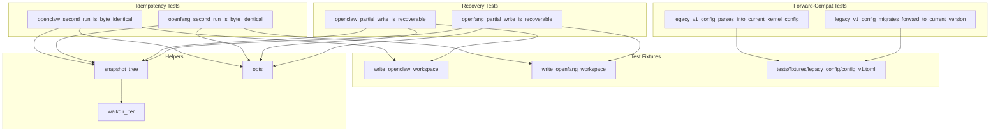

# Other — librefang-migrate-tests

# librefang-migrate-tests: Idempotency & Forward Compatibility

## Purpose

This test module (`tests/idempotency.rs`) provides end-to-end integration tests for the `librefang-migrate` crate, validating filesystem-level contracts that callers depend on but unit tests in `src/openclaw.rs` cannot fully verify. It covers three critical properties:

1. **Idempotency** — a second migration run produces a byte-identical destination tree
2. **Crash recovery** — a partially-completed migration can be re-driven to a correct state
3. **Forward compatibility** — the prior major version's `KernelConfig` still deserialises and migrates forward

These tests sit one level above the in-crate unit tests. Where the unit tests assert `report.imported.is_empty()` on a second run, these tests assert actual file contents on disk are unchanged — the stronger contract that downstream consumers rely on.

## Architecture



## Helper Functions

### `snapshot_tree(root: &Path) -> BTreeMap<PathBuf, Vec<u8>>`

Recursively reads every regular file under `root` and returns a sorted map from relative path to byte contents. Uses `BTreeMap` to guarantee deterministic iteration order — when an `assert_eq!` between two snapshots fails, the diff points at the first differing path alphabetically rather than depending on `HashMap` insertion order.

Deliberately ignores symlinks (neither migrator produces them, and ignoring them keeps snapshots stable across platforms).

### `walkdir_iter(root: &Path) -> Vec<PathBuf>`

A minimal recursive directory walker built on `std::fs::read_dir`. Avoids pulling the `walkdir` crate into dev-dependencies since the test crate compiles separately. Returns a sorted list of all regular files found.

### `write_openclaw_workspace(dir: &Path)`

Creates a minimal but representative openclaw source workspace at `dir`, including:

- `openclaw.json` — a JSON5 config with two agents (`coder`, `researcher`), a Telegram channel, memory, and session configuration
- `memory/coder/MEMORY.md` — per-agent memory file
- `sessions/agent_coder_main.jsonl` — a single-line session file (critical for detecting duplicate-session regressions)

Mirrors the shape used by the in-crate `create_json5_workspace` helper but trimmed to exactly what the idempotency assertions need.

### `write_openfang_workspace(dir: &Path)`

Creates a minimal openfang source workspace, since openfang migration is a recursive copy with `.toml`/`.env` rewriting. Includes:

- `config.toml` — with `config_version`, `api_listen`, `log_level`, and a `[default_model]` table
- `secrets.env` — an env file that must be copied verbatim
- `agents/coder/agent.toml` — a rewritten TOML file
- `data/index.db` — binary data that must pass through unchanged

### `opts(source, src, dst) -> MigrateOptions`

Constructs a `MigrateOptions` with `dry_run: false` for the given source type and directory pair.

## Test Cases

### Idempotency: `openclaw_second_run_is_byte_identical`

**What it verifies:** After a successful openclaw migration, running it again leaves the destination tree byte-identical — no duplicate sessions, no clobbered configs, no rewritten timestamps in the marker body.

**How it works:**

1. Write an openclaw workspace to a temp directory
2. Run `openclaw::migrate` — assert it produces output
3. Snapshot the destination tree
4. Run `openclaw::migrate` again — assert `report.imported.is_empty()`
5. Snapshot again — assert byte-for-byte equality with the first snapshot

The openclaw migrator uses a `.openclaw_migrated` marker file to short-circuit before any writes happen on re-run. This test confirms that short-circuit preserves the marker's own content too.

### Idempotency: `openfang_second_run_is_byte_identical`

**What it verifies:** After a successful openfang migration, a second run is a complete no-op on disk.

**How it works:**

1. Write an openfang workspace to a temp directory
2. Run `openfang::migrate` — assert `imported` is non-empty and `skipped` is empty
3. Snapshot the destination tree
4. Run again — assert `imported` is empty and `skipped.len()` matches the first run's `imported.len()`
5. Snapshot again — assert byte-for-byte equality

Openfang has no marker file; it relies on per-entry `dest_path.exists()` checks. Every previously-imported entry must appear as "skipped: already exists" on re-run.

### Recovery: `openclaw_partial_write_is_recoverable`

**What it verifies:** A migration interrupted mid-write (simulating a killed process) can be re-driven to a correct state without corrupting surviving entries.

**How it works:**

1. Run a full openclaw migration and snapshot the baseline
2. Pick a deterministic "victim" file (prefers an agent manifest like `coder/agent.toml`)
3. Delete the victim file **and** the `.openclaw_migrated` marker (simulating a crash)
4. Re-run the migration
5. Assert the victim is recreated with its original byte content
6. Assert every other surviving file is unchanged (the marker is checked for existence only since it contains a wall-clock timestamp)

This exercises the `promote_staging` never-clobber semantics (issue #3795).

### Recovery: `openfang_partial_write_is_recoverable`

**What it verifies:** Same crash-recovery guarantee for the openfang path.

**How it works:**

1. Run a full openfang migration and snapshot the baseline
2. Delete `agents/coder/agent.toml` (a rewritten file, so recreation exercises the rewrite path)
3. Re-run the migration
4. Assert the victim is recreated with original bytes
5. Assert no other file was clobbered or lost

Since openfang has no marker, only the victim file needs to be deleted.

### Forward Compat: `legacy_v1_config_parses_into_current_kernel_config`

**What it verifies:** A v1 `KernelConfig` TOML fixture (`tests/fixtures/legacy_config/config_v1.toml`) still deserialises into the current `KernelConfig` type.

The current `KernelConfig` uses `#[serde(default)]` and ignores unknown fields, so the legacy `[api]` table is silently dropped and missing root-level fields fall back to defaults. The test asserts `config_version` reads back as `1`.

### Forward Compat: `legacy_v1_config_migrates_forward_to_current_version`

**What it verifies:** `run_migrations` can lift a v1 config to the current `CONFIG_VERSION`, hoisting the `[api]` table fields to root level.

**Specific assertions:**

- The `[api]` table is removed after migration
- `api_key` is hoisted to root with value `"legacy-secret-key"`
- `api_listen` is hoisted to root with value `"127.0.0.1:4545"`
- `log_level` is hoisted to root with value `"info"`
- `final_version == CONFIG_VERSION`

## Fixture: `tests/fixtures/legacy_config/config_v1.toml`

This fixture represents the minimal v1 `KernelConfig` shape — only `config_version` plus the `[api]` table. It is intentionally narrow because:

- The full legacy surface area is enormous and cannot be safely reconstructed
- The minimal form is sufficient to assert the load path still works
- It exercises both raw deserialisation and the `run_migrations(_, 1)` → `CONFIG_VERSION` forward path

## Relationship to the Rest of the Codebase

| Dependency | Usage |
|---|---|
| `librefang_migrate::openclaw` | `openclaw::migrate(&options)` — full migration pipeline |
| `librefang_migrate::openfang` | `openfang::migrate(&options)` — full migration pipeline |
| `librefang_migrate::MigrateOptions` | Options struct constructed by `opts()` |
| `librefang_migrate::MigrateSource` | Enum selecting openclaw vs openfang |
| `librefang_types::config::KernelConfig` | Target type for legacy config deserialisation |
| `librefang_types::config::run_migrations` | v1 → current migration pipeline |
| `librefang_types::config::CONFIG_VERSION` | Current schema version constant |
| `tempfile::TempDir` | Isolated scratch directories for each test |

## Running

```sh
# All idempotency tests
cargo test -p librefang-migrate --test idempotency

# Individual tests
cargo test -p librefang-migrate --test idempotency openclaw_second_run_is_byte_identical
cargo test -p librefang-migrate --test idempotency openfang_partial_write_is_recoverable
cargo test -p librefang-migrate --test idempotency legacy_v1_config_migrates_forward_to_current_version
```