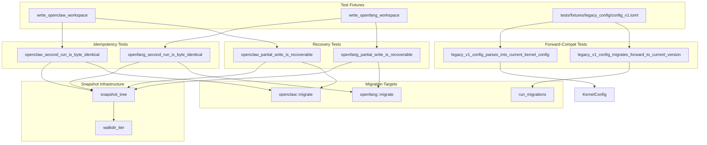

# Other — librefang-migrate-tests

# Idempotency & Forward-Compatibility Tests

## Purpose

`tests/idempotency.rs` provides end-to-end integration tests that verify the **filesystem-level contract** of the migrate crate. While the in-crate unit tests in `src/openclaw.rs` check idempotency by asserting `report.imported.is_empty()` on a second run, these tests go further—they snapshot the entire destination directory tree as raw bytes and assert that nothing on disk changes across runs.

Three behaviours are validated:

1. **Second-run is a no-op** — a repeated migration produces a byte-identical destination tree (no duplicate sessions, no clobbered configs, no rewritten timestamps).
2. **Partial-write recovery** — a migration interrupted mid-write (simulated by deleting a file) can be re-driven to a correct state without corrupting surviving entries.
3. **Forward compatibility** — the prior major version's `KernelConfig` shape still deserialises and round-trips through `run_migrations`.

These tests were introduced for issue #3407.

## Test Architecture



## Infrastructure Functions

### `snapshot_tree(root: &Path) -> BTreeMap<PathBuf, Vec<u8>>`

Reads every regular file under `root` and returns a sorted map from relative path to byte contents. Using `BTreeMap` ensures deterministic iteration order, so `assert_eq!` failures point at the first differing path rather than depending on `HashMap` insertion order. Returns an empty map if `root` doesn't exist.

### `walkdir_iter(root: &Path) -> Vec<PathBuf>`

A small recursive directory walker built on `std::fs::read_dir`. Avoids pulling `walkdir` into dev-dependencies. Symlinks are deliberately ignored since neither migrator produces them. Results are sorted for deterministic ordering.

### `write_openclaw_workspace(dir: &Path)`

Creates a minimal but representative OpenClaw source workspace:

- `openclaw.json` — agent definitions (coder, researcher), channel config (Telegram), memory and session settings
- `memory/coder/MEMORY.md` — per-agent memory file
- `sessions/agent_coder_main.jsonl` — a session file (critical for verifying no duplication on re-run)

### `write_openfang_workspace(dir: &Path)`

Creates a minimal OpenFang source workspace:

- `config.toml` — kernel config with `config_version = 2`, API listen address, log level, and a `[default_model]` table
- `secrets.env` — environment file that must be preserved verbatim
- `agents/coder/agent.toml` — an agent manifest
- `data/index.db` — a binary blob

### `opts(source, src, dst) -> MigrateOptions`

Helper that constructs a `MigrateOptions` with `dry_run: false`. Accepts a `MigrateSource` variant and the source/destination paths.

## Test Details

### A. Second-Run Byte-Identity

#### `openclaw_second_run_is_byte_identical`

1. Write an OpenClaw workspace to a temp directory.
2. Run `openclaw::migrate` and snapshot the destination.
3. Run migration again; assert `report.imported.is_empty()` (the marker file short-circuits before any writes).
4. Snapshot the destination again and assert byte-equality with the first snapshot.

The OpenClaw migrator uses a `.openclaw_migrated` marker file to detect prior runs. This test confirms that the marker's timestamp body is not rewritten on a second invocation.

#### `openfang_second_run_is_byte_identical`

1. Write an OpenFang workspace to a temp directory.
2. Run `openfang::migrate` and snapshot the destination. Assert something was imported and nothing was skipped.
3. Run migration again; assert `report.imported.is_empty()` and that every previously-imported entry is now in `report.skipped`.
4. Assert the two snapshots are byte-identical.

OpenFang migration has no marker file—it relies on per-entry `dest_path.exists()` checks. Each source file should appear as "skipped: already exists" on re-run.

### B. Partial-Write Recovery

#### `openclaw_partial_write_is_recoverable`

1. Run a clean migration and snapshot the baseline.
2. Select a "victim" file (prefers an agent manifest like `agent.toml` for `coder`; falls back to any non-marker file).
3. Delete the victim file **and** the `.openclaw_migrated` marker (simulating a process killed mid-write, before the marker was written).
4. Re-run migration.
5. Assert the victim file is recreated with its original byte content.
6. Assert every other surviving file (excluding the marker, which may have a fresh timestamp) is byte-identical to the baseline.

This tests the **never-clobber semantics** implemented by `promote_staging` (issue #3795).

#### `openfang_partial_write_is_recoverable`

1. Run a clean migration and snapshot the baseline.
2. Delete `agents/coder/agent.toml` (a rewritten file, exercising the rewrite path on recovery).
3. Re-run migration.
4. Assert the victim file is recreated with identical bytes.
5. Assert every other file is unchanged.

Since OpenFang has no marker, only the victim file needs to be deleted.

### C. Forward Compatibility

Both forward-compat tests use the fixture at `tests/fixtures/legacy_config/config_v1.toml`, which represents the minimal v1 `KernelConfig` shape—`config_version = 1` plus an `[api]` table with `api_key`, `api_listen`, and `log_level`. This is the smallest representation that exercises deserialisation and migration; a complete v1 config is not used because the schema surface area makes it impractical to reconstruct.

#### `legacy_v1_config_parses_into_current_kernel_config`

Asserts that the v1 TOML fixture deserialises into the current `KernelConfig` type via `toml::from_str`. Unknown fields (like the `[api]` table) are ignored under `#[serde(default)]`; missing root fields fall back to `Default`. Verifies `config_version == 1`.

#### `legacy_v1_config_migrates_forward_to_current_version`

Calls `run_migrations(&mut raw, 1)` from `librefang_types::config` and asserts:

- The returned version equals `CONFIG_VERSION`.
- The `[api]` table is removed (hoisted to root level).
- `api_key`, `api_listen`, and `log_level` appear as top-level keys with their original values.

## Dependencies

| Dependency | Usage |
|---|---|
| `librefang_migrate` | The crate under test—provides `openclaw::migrate`, `openfang::migrate`, `MigrateOptions`, `MigrateSource` |
| `librefang_types` | Provides `config::KernelConfig`, `config::run_migrations`, `config::CONFIG_VERSION` for forward-compat tests |
| `tempfile` | `TempDir` for isolated source/destination directories |
| `toml` | Parsing the legacy fixture and inspecting migrated `toml::Value` |

## Running

```sh
# All idempotency tests
cargo test -p librefang-migrate --test idempotency

# Individual tests
cargo test -p librefang-migrate --test idempotency openclaw_second_run_is_byte_identical
cargo test -p librefang-migrate --test idempotency openfang_partial_write_is_recoverable
cargo test -p librefang-migrate --test idempotency legacy_v1_config_migrates_forward_to_current_version
```