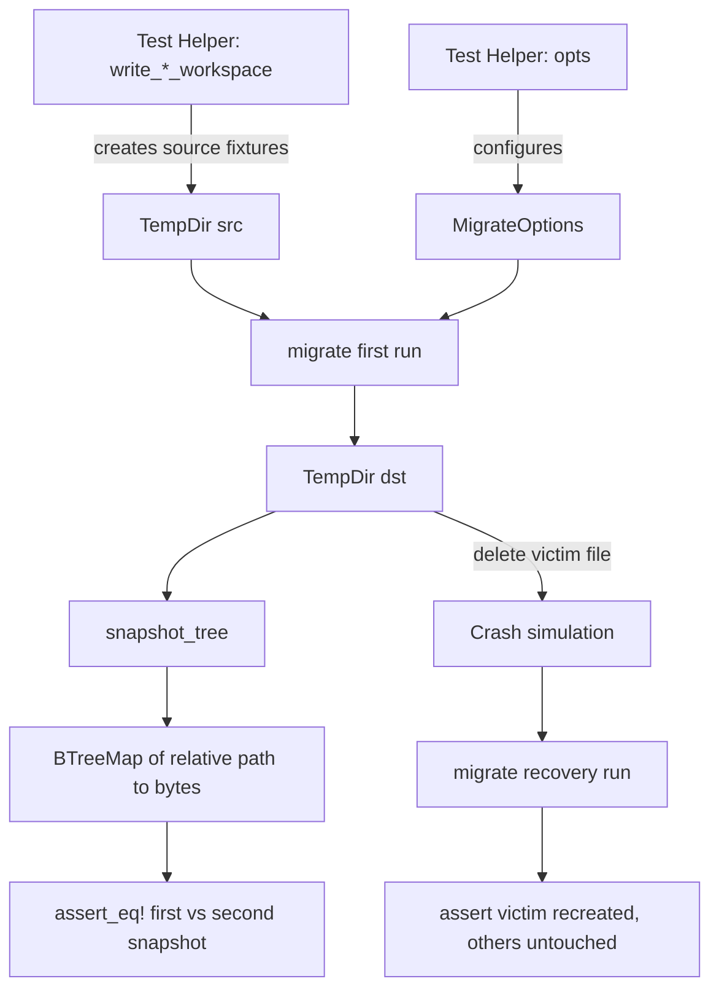

# Other — librefang-migrate-tests

# librefang-migrate/tests/idempotency.rs

End-to-end idempotency and forward-compatibility tests for the `librefang-migrate` crate, introduced for issue #3407.

## Purpose

The unit tests inside `src/openclaw.rs` already verify idempotency at the report level — asserting `report.imported.is_empty()` on a second migration run. This test module sits one layer above and validates the **filesystem-level contract** that callers actually depend on:

1. A second migration run produces a byte-identical destination tree — no duplicate sessions, no clobbered configs, no rewritten timestamps.
2. A partially-completed migration (simulating a process killed mid-write) can be re-driven to a correct state without corrupting surviving entries.
3. The prior major version's `KernelConfig` shape still deserialises and round-trips through `run_migrations`.

## Test Architecture

## Helper Functions

### `snapshot_tree(root: &Path) -> BTreeMap<PathBuf, Vec<u8>>`

Reads every regular file under `root` and returns a sorted map from path-relative-to-root to raw byte contents. Uses `BTreeMap` rather than `HashMap` so that iteration order is deterministic across runs — when an `assert_eq!` between two snapshots fails, the diff points at the first differing path alphabetically rather than depending on hash ordering.

Internally delegates to `walkdir_iter` for directory traversal.

### `walkdir_iter(root: &Path) -> Vec<PathBuf>`

A minimal recursive directory walker built on `std::fs::read_dir`. Avoids pulling in the `walkdir` crate as a dev-dependency — the test crate compiles separately and keeps dependencies minimal. Symlinks are deliberately ignored since neither migrator produces them, and ignoring them keeps snapshots stable across platforms.

Returns a sorted `Vec<PathBuf>` of all regular files found.

### `write_openclaw_workspace(dir: &Path)`

Creates a minimal but representative OpenClaw source workspace in `dir`, containing:

| File | Purpose |
|------|---------|
| `openclaw.json` | JSON5 agent/channel/memory/session configuration with two agents (`coder`, `researcher`) and a Telegram channel |
| `memory/coder/MEMORY.md` | Per-agent memory file |
| `sessions/agent_coder_main.jsonl` | A single-line session file — idempotency must not duplicate it on re-run |

Mirrors the shape used by the in-crate `create_json5_workspace` helper in `src/openclaw.rs`, trimmed to exactly what the idempotency assertions need so that snapshot diffs remain readable when a regression breaks them.

### `write_openfang_workspace(dir: &Path)`

Creates a minimal OpenFang source workspace in `dir`, containing:

| File | Purpose |
|------|---------|
| `config.toml` | Root config with `config_version = 2`, `api_listen`, `log_level`, and `[default_model]` |
| `secrets.env` | A `.env` file — must be copied verbatim |
| `agents/coder/agent.toml` | Agent manifest — exercises the TOML rewrite path |
| `data/index.db` | Binary file — exercises passthrough copy |

Since OpenFang migration is a recursive copy with `.toml`/`.env` rewriting, the fixture only needs a couple of files of each interesting kind.

### `opts(source, src, dst) -> MigrateOptions`

Convenience constructor that builds a `MigrateOptions` struct with `dry_run: false` and the given source type and directory paths.

## Test Cases

### Group A: OpenClaw Idempotency

#### `openclaw_second_run_is_byte_identical`

Verifies that after a successful OpenClaw migration, running it again leaves the destination tree byte-identical. The OpenClaw migrator uses a `.openclaw_migrated` marker file to short-circuit a second run before any writes happen, so the on-disk tree (including the marker body with its timestamp) must remain unchanged.

**Assertions:**
- First run produces non-empty output
- Second run's `report.imported` is empty
- `snapshot_tree` before and after the second run are identical

### Group B: OpenFang Idempotency

#### `openfang_second_run_is_byte_identical`

OpenFang migration has no marker file — it relies on per-entry `dest_path.exists()` checks to skip already-migrated files. After a clean run, every source path is present at the destination, so a second run must be a complete no-op on disk.

**Assertions:**
- First run imports entries and skips nothing
- Second run imports nothing and skips exactly the same number of entries as the first run imported
- `snapshot_tree` before and after the second run are identical

### Group C: Partial-Write Recovery

#### `openclaw_partial_write_is_recoverable`

Simulates a migration killed mid-write by deleting one produced file and the `.openclaw_migrated` marker (since OpenClaw refuses to re-run while the marker is present). The recovery run must recreate the deleted file with its original content and must not clobber any surviving file. This exercises the `promote_staging` never-clobber semantics (#3795).

**Crash simulation steps:**
1. Run migration → snapshot baseline
2. Pick a deterministic "victim" file (prefers an `agent.toml` if present, otherwise any non-marker file)
3. Delete the victim and the marker
4. Run migration again

**Assertions:**
- Victim file is recreated with byte-identical content
- Every other non-marker file is unchanged
- Marker file exists after recovery

#### `openfang_partial_write_is_recoverable`

Same recovery pattern for OpenFang. Since OpenFang has no marker, only the victim file needs to be deleted. The victim is specifically `agents/coder/agent.toml` — a rewritten file — to also exercise the rewrite path during recovery.

**Assertions:**
- Victim file is recreated with byte-identical content
- Every other file is unchanged

### Group D: Forward Compatibility

#### `legacy_v1_config_parses_into_current_kernel_config`

Loads `tests/fixtures/legacy_config/config_v1.toml` and verifies it deserialises into the current `librefang_types::config::KernelConfig`. The fixture represents the v1 layout before the v1→v2 migration hoisted `[api].api_key/api_listen/log_level` to root level. Unknown fields like `[api]` are ignored under `#[serde(default)]` on `KernelConfig`.

**Assertions:**
- Deserialisation succeeds without error
- `config_version == 1` (the fixture declares this verbatim)

#### `legacy_v1_config_migrates_forward_to_current_version`

Verifies that `run_migrations(&mut raw, 1)` correctly lifts the v1 fixture to `CONFIG_VERSION`. The `[api]` table must be removed and its fields hoisted to root level.

**Assertions:**
- `run_migrations` returns `CONFIG_VERSION`
- `[api]` table is removed from the output
- `api_key` is hoisted to root with value `"legacy-secret-key"`
- `api_listen` is hoisted to root with value `"127.0.0.1:4545"`
- `log_level` is hoisted to root with value `"info"`

## Relationship to the Rest of the Codebase

| Component | Relationship |
|-----------|-------------|
| `librefang_migrate::openclaw` | Tested module — provides `migrate(&MigrateOptions)` and `MigrateReport` |
| `librefang_migrate::openfang` | Tested module — provides `migrate(&MigrateOptions)` and `MigrateReport` |
| `librefang_migrate::MigrateOptions` | Configuration struct consumed by both migrators |
| `librefang_migrate::MigrateSource` | Enum selecting OpenClaw vs OpenFang migration path |
| `librefang_types::config::KernelConfig` | Current config type — must still accept v1 shapes |
| `librefang_types::config::run_migrations` | Config version migration engine — tested from v1 to current |
| `librefang_types::config::CONFIG_VERSION` | Current config schema version constant |
| `src/openclaw.rs` in-crate tests | Lower-level idempotency tests that check report contents; this module complements them with filesystem-level checks |

## Fixture Files

The forward-compat tests depend on a committed fixture:

- **`tests/fixtures/legacy_config/config_v1.toml`** — A minimal v1 config containing only `config_version = 1` and an `[api]` table with `api_key`, `api_listen`, and `log_level`. Deliberately narrow to avoid re-constructing every legacy field-by-field default. Sufficient to assert "the load path still works."

The OpenClaw and OpenFang workspaces are built programmatically at test time via `write_openclaw_workspace` and `write_openfang_workspace` into temporary directories — no committed fixtures needed.