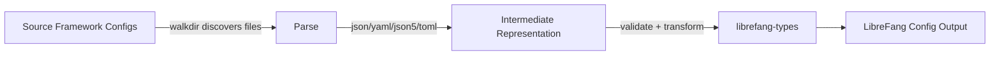

# Other — librefang-migrate

# librefang-migrate

Migration engine for importing configurations and data from other agent frameworks into LibreFang.

## Purpose

`librefang-migrate` provides tooling to bring existing agent framework configurations into the LibreFang ecosystem. Rather than requiring users to rebuild their agent setups from scratch, this module reads foreign configuration formats, translates them into LibreFang-native types (`librefang-types`), and writes them out in the expected structure.

## Supported Input Formats

The module handles a range of common configuration serialization formats, covering most agent frameworks in the wild:

| Format | Crate | Typical Use |
|---|---|---|
| JSON | `serde_json` | Default for many frameworks |
| YAML | `serde_yaml` | Common in Kubernetes-oriented agents |
| JSON5 | `json5` | Human-friendly JSON with comments |
| TOML | `toml` | Popular in Rust-based tooling |

## Key Dependencies

- **`librefang-types`** — Defines the target data structures. All migrated output conforms to these types.
- **`walkdir`** — Recursively traverses directories to locate configuration files from source frameworks.
- **`dirs`** — Resolves standard platform directories (e.g., locating a source framework's default config path on Linux, macOS, or Windows).
- **`chrono`** — Handles timestamp conversion and migration metadata.
- **`thiserror`** — Derives typed errors for migration failures.
- **`tracing`** — Emits structured logs during the migration process, useful for diagnosing conversion issues in large imports.

## Architecture

The migration pipeline follows three phases:

1. **Discovery** — `walkdir` scans a source directory for configuration files. The `dirs` crate can auto-locate well-known framework config paths if the user doesn't supply one explicitly.

2. **Parse & Translate** — Each file is deserialized from its native format into an intermediate representation, then transformed into `librefang-types` structures. Validation occurs at this boundary; incompatible or unrecognized fields produce typed errors via `thiserror`.

3. **Emit** — The resulting LibreFang-native structures are written to the target location.

## Error Handling

All errors are derived through `thiserror`, providing:

- **Parse errors** — Malformed source files (invalid JSON, bad YAML indentation, etc.)
- **Conversion errors** — Semantically valid source configs that don't map cleanly to LibreFang concepts.
- **I/O errors** — Filesystem issues during discovery or output.

Callers should expect `Result<T, MigrationError>` (or similar) as the standard return type from migration entry points. Inspect the error variants to determine whether a failure is recoverable (skip and continue) or fatal.

## Logging

The module uses `tracing` spans and events rather than `println` or `log`. To capture migration output, initialize a `tracing` subscriber in the calling binary or test. Key events include:

- Files discovered and skipped
- Per-file parse success or failure
- Field-level conversion warnings (e.g., dropped unsupported fields)

## Testing

Tests use `tempfile` to create isolated directory trees that mimic source framework layouts. This avoids depending on real agent installations and keeps tests hermetic across platforms.

## Relationship to the Rest of LibreFang

`librefang-migrate` is a standalone utility crate. It depends on `librefang-types` for its output shapes but does not depend on the runtime agent, server, or protocol crates. Other modules do not call into it; it is invoked directly (likely from a CLI binary or a one-shot migration script) and produces static configuration that the rest of the system consumes.