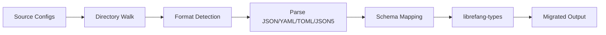

# Other — librefang-migrate

# librefang-migrate

Migration engine for importing agent configurations and data from other agent frameworks into LibreFang's internal format.

## Purpose

This crate provides the tooling needed to bring existing agent definitions, configurations, and related data from third-party agent frameworks into the LibreFang ecosystem. It handles format detection, parsing, schema mapping, and conversion into native `librefang-types` structures.

## When to Use

- Onboarding a team that previously used a different agent framework and needs their agents ported into LibreFang.
- Bulk-importing agent definitions from exported configuration files.
- Writing one-time migration scripts as part of a framework migration.

## Architecture



The migration pipeline follows a straightforward progression: discover source files on disk, detect their serialization format, parse them into intermediate representations, map fields to LibreFang's schema, and emit validated `librefang-types` objects.

## Supported Input Formats

The crate pulls in parsers for four common configuration formats, covering most agent framework exports:

| Format | Crate | Typical Use |
|--------|-------|-------------|
| JSON | `serde_json` | Common export format, REST API dumps |
| YAML | `serde_yaml` | Popular in CI/CD-oriented agent frameworks |
| TOML | `toml` | Rust-ecosystem agent configs |
| JSON5 | `json5` | Human-friendly JSON with comments and trailing commas |

All four are handled through `serde` deserialization, so the parsing layer is uniform regardless of format.

## Key Dependencies

### Internal

- **`librefang-types`** — The target schema. All migrated data is ultimately converted into types defined here. This is the only internal dependency, keeping the migration crate loosely coupled from the rest of the system.

### File Discovery & I/O

- **`walkdir`** — Recursive directory traversal for discovering source configuration files in a given migration root.
- **`dirs`** — Resolves standard platform directories (config home, data home, etc.) so migration sources and output paths can be specified relative to conventional locations.

### Data Handling

- **`chrono`** — Timestamp parsing and generation. Source frameworks may encode creation/modification dates in various formats; `chrono` handles normalization.
- **`uuid`** — Generates new UUIDs for migrated entities that need fresh identifiers in the LibreFang system.

### Error Handling & Observability

- **`thiserror`** — Defines structured error types covering parse failures, schema mismatches, missing fields, and I/O errors. Callers can pattern-match on specific migration failure modes.
- **`tracing`** — Instrumentation throughout the migration pipeline. Expect spans for directory traversal, per-file parsing, and entity conversion, with warnings logged for skipped or partially-migrated records.

## Testing

The dev-dependency on **`tempfile`** indicates that tests construct temporary directory trees with sample configuration files, run the migration pipeline against them, and assert on the output. This allows tests to cover:

- Multi-format detection in a single directory.
- Handling of malformed or incomplete source files.
- Nested directory structures.
- Empty directories and missing expected files.

## Integration Points

This crate is designed as a standalone library with no incoming or outgoing internal calls at the crate level. Other crates or binaries in the workspace consume it by calling into its public API with a source directory or file path, receiving back a collection of `librefang-types` objects ready for persistence or further processing.

To use from another crate:

```toml
[dependencies]
librefang-migrate = { path = "../librefang-migrate" }
```

The migration results (typed `librefang-types` structs) can then be passed to whatever persistence or indexing layer the application uses.