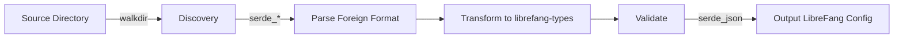

# Other — librefang-migrate

# librefang-migrate

Migration engine for importing agent configurations and data from other agent frameworks into LibreFang.

## Purpose

When adopting LibreFang from an existing agent framework, users need a way to carry over their existing configurations, agent definitions, credentials, and operational data. `librefang-migrate` provides the tooling to discover, parse, transform, and validate data from foreign frameworks and produce native LibreFang structures.

This crate is designed as a standalone utility — it does not hook into the LibreFang runtime or depend on any server-side components. It reads from disk, transforms in memory, and writes the result.

## Supported Input Formats

The crate depends on multiple deserialization libraries to handle the variety of configuration formats used by common agent frameworks:

| Format | Dependency | Typical use |
|--------|-----------|-------------|
| JSON | `serde_json` | Standard structured configs |
| YAML | `serde_yaml` | Human-editable configs (e.g., Ansible-based agents) |
| JSON5 | `json5` |Configs with comments, trailing commas |
| TOML | `toml` | Common in Rust-based tooling |

## Architecture

The pipeline is linear: discover source files on disk, parse them into intermediate representations using the appropriate serde backend, transform them into types defined in `librefang-types`, validate the results, and serialize to LibreFang's native format.

## Key Dependencies and Their Roles

### `librefang-types`
The target type system. All migration output is expressed through the types defined here — agent configurations, credential stores, task definitions, and so on. This is the crate's primary connection to the rest of the LibreFang ecosystem.

### `walkdir`
Handles recursive directory traversal to locate configuration files within a source framework's directory structure. Agent frameworks often scatter configs across nested directories with mixed file types.

### `uuid` and `chrono`
Used during transformation to generate fresh identifiers and timestamps for the imported data. Migrated entities receive new UUIDs to avoid collisions with existing LibreFang data, and import timestamps record when the migration occurred.

### `dirs`
Resolves standard system directories. Used to locate both the default output path for migrated configurations and, in some cases, the default installation paths of source frameworks.

### `thiserror`
Defines a custom error type for migration failures. Errors are structured to identify which phase failed (discovery, parsing, transformation, validation) and which source file or entity was involved.

### `tracing`
Structured logging throughout the pipeline. Migration can involve processing hundreds of files, so trace-level logging for individual files and info-level summaries are both supported.

## Error Handling

The crate uses `thiserror` to produce a typed error enum rather than stringly-typed errors. Errors typically include:

- **Discovery errors** — permission denied, inaccessible directories
- **Parse errors** — malformed JSON/YAML/TOML, schema mismatch with expected foreign format
- **Transformation errors** — data that cannot be meaningfully mapped to LibreFang types
- **Validation errors** — output that parses but violates LibreFang constraints
- **I/O errors** — failure to write output files

All errors propagate with context about the source file and migration phase, making batch migration failures debuggable.

## Testing

The dev-dependency on `tempfile` indicates that tests create temporary directory structures to exercise discovery and parsing against realistic file layouts without touching the real filesystem.