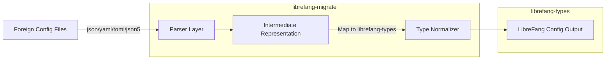

# Other — librefang-migrate

# librefang-migrate

Migration engine for importing configurations and agent definitions from other agent frameworks into LibreFang's internal format.

## Purpose

This module provides tooling to convert projects authored in other agent frameworks (e.g., Mythic, Covenant, Havoc, or similar C2/agent platforms) into LibreFang-compatible agent and module definitions. It handles parsing of foreign configuration files in multiple formats, normalizes their structure against `librefang-types`, and writes out valid LibreFang configuration.

## Supported Input Formats

The engine can ingest configurations stored in:

| Format | Crate |
|--------|-------|
| JSON | `serde_json` |
| YAML | `serde_yaml` |
| JSON5 | `json5` |
| TOML | `toml` |

This covers the majority of configuration conventions used by existing agent frameworks.

## Key Dependencies

- **`librefang-types`** — Canonical type definitions for agents, modules, commands, and configuration. All migration output is validated against these types.
- **`walkdir`** — Recursive directory traversal for scanning imported project trees.
- **`thiserror`** — Typed error definitions for migration failures.
- **`tracing`** — Structured logging throughout the migration pipeline.
- **`chrono` / `uuid`** — Timestamping and identity generation for migrated entities.
- **`dirs`** — Resolution of standard platform directories for default output paths.

## Architecture

The pipeline operates in three stages:

1. **Discovery & Parsing** — `walkdir` scans a source directory. Each file is dispatched to the appropriate parser based on extension or content sniffing, producing a raw `serde_json::Value`.
2. **Intermediate Representation** — Raw values are deserialized into framework-specific intermediate structs that model the original schema. This isolates the rest of the pipeline from quirks of individual foreign formats.
3. **Normalization** — Intermediate structs are mapped onto `librefang-types` definitions (agents, modules, commands, etc.). Fields that have no direct equivalent are logged as warnings via `tracing`.

## Error Handling

All migration errors are captured through a single `thiserror`-derived enum. Expected error variants include:

- **Parse errors** — Malformed or unreadable source files.
- **Schema mismatch** — A foreign config doesn't match any known framework schema.
- **Validation errors** — The normalized output fails constraints defined in `librefang-types`.
- **I/O errors** — Filesystem failures during discovery or output.

Each error carries context (file path, field name, etc.) and is emitted through `tracing` for observability.

## Testing

Tests use `tempfile` to create isolated directory trees that simulate foreign project structures. This allows validation of discovery, parsing, and normalization without touching the real filesystem.

## Relationship to the Workspace

`librefang-migrate` is a utility crate within the LibreFang workspace. It depends on `librefang-types` for its output contract but is not depended upon by any other workspace crate. It is intended to be invoked as a standalone tool or through a CLI integration point, not as a runtime dependency of the agent itself.