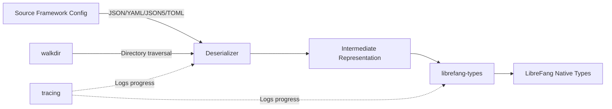

# Other — librefang-migrate

# librefang-migrate

Migration engine for importing configurations and data from other agent frameworks into LibreFang.

## Purpose

`librefang-migrate` provides tooling to transition from competing or legacy agent frameworks by converting their configuration formats, agent definitions, and related data into native LibreFang types. It abstracts the parsing and translation logic so that migrations are consistent, reproducible, and auditable.

This crate is intended to be used as both a library (embedded in tooling or CLIs) and a basis for standalone migration utilities.

## Supported Input Formats

The crate supports reading source configurations in multiple formats, reflecting the diversity of frameworks it can import from:

| Format | Crate |
|--------|-------|
| JSON | `serde_json` |
| YAML | `serde_yaml` |
| JSON5 | `json5` |
| TOML | `toml` |

All formats are deserialized through `serde`, so any source structure that can be represented in these formats is reachable.

## Architecture

## Key Dependencies and Their Roles

### Deserialization Layer
- **serde, serde_json, serde_yaml, json5, toml** — Multi-format parsing. Source configurations may come in any of these formats depending on the originating framework. The migration engine normalizes them through serde's trait system before translating to LibreFang types.

### File Discovery
- **walkdir** — Recursive directory traversal for locating configuration files, agent definitions, and nested module descriptors within a source framework's directory structure.

### Type Conversion
- **librefang-types** — The target type system. All migrated data is ultimately expressed as types defined in this crate, ensuring compatibility with the rest of the LibreFang ecosystem.

### Date/Time Handling
- **chrono** — Timestamps in source configurations (creation dates, scheduling metadata, log entries) are parsed and re-encoded into LibreFang's expected formats.

### Platform Paths
- **dirs** — Resolves standard platform directories (home, config, data) to locate source framework installations and determine sensible defaults for output paths.

### Error Handling
- **thiserror** — Defines structured error types for migration failures: unsupported formats, schema mismatches, missing required fields, and I/O errors. Downstream consumers can match on these variants to provide user-facing diagnostics.

### Observability
- **tracing** — Emits structured log events during migration: files discovered, records processed, conversion warnings, and completion summaries.

## Integration with LibreFang

This crate sits at the edge of the LibreFang workspace. It depends on `librefang-types` but is not depended upon by other workspace crates. This means:

- It can be included or excluded from a build without affecting core functionality.
- Migration tooling can be versioned and released independently.
- The crate produces validated `librefang-types` output that any other LibreFang crate can consume directly.

## Testing

The `tempfile` dev-dependency supports integration tests that create synthetic source directory structures on disk, run migrations against them, and assert the output. This avoids mutating real configuration directories during tests.

## Error Strategy

Migrations can fail for several distinct reasons, and this crate distinguishes them:

- **I/O errors** — Source files unreadable, output paths not writable.
- **Parse errors** — Malformed JSON, invalid YAML anchors, TOML type mismatches.
- **Schema errors** — Well-formed input that doesn't conform to any recognized source framework schema.
- **Conversion errors** — Valid source data that has no equivalent in LibreFang's type system (e.g., unsupported features or deprecated patterns).

All errors are reported through types derived with `thiserror`, carry context about which file or field caused the failure, and are emitted through `tracing` for diagnostic capture.