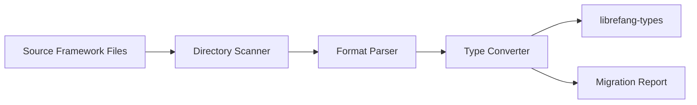

# Other — librefang-migrate

# librefang-migrate

Migration engine for importing agent configurations and data from other agent frameworks into LibreFang's native format.

## Purpose

When adopting LibreFang, teams often have existing agent configurations, prompt libraries, and tool definitions spread across other frameworks. `librefang-migrate` provides the tooling to discover, parse, and convert those external assets into LibreFang-compatible types defined in `librefang-types`.

## Supported Input Formats

The crate pulls in parsers for the most common configuration formats found in agent frameworks:

| Format | Crate | Typical Use |
|---|---|---|
| JSON | `serde_json` | Standard structured data, API responses |
| YAML | `serde_yaml` | Human-editable config files (common in LangChain, AutoGen) |
| JSON5 | `json5` | Lenient JSON with comments and trailing commas |
| TOML | `toml` | Rust-ecosystem configs, lightweight agent definitions |

## Key Dependencies and Their Roles

- **`librefang-types`** — Target type definitions. All migration output is expressed through these types, ensuring consistency with the rest of the LibreFang ecosystem.
- **`walkdir`** — Recursive directory traversal for scanning existing agent project directories and locating migration-eligible files.
- **`chrono`** — Timestamp handling for migration metadata, creation-date preservation, and audit logging.
- **`dirs`** — Resolves standard platform directories (config home, data home) so migration can auto-discover agent installations in conventional locations.
- **`thiserror`** — Derives structured error types for migration failures (parse errors, validation errors, I/O errors).
- **`tracing`** — Structured logging throughout the migration pipeline for progress reporting and diagnostics.

## Architecture

The migration pipeline has four conceptual stages:

1. **Discovery** — `walkdir` and `dirs` locate candidate files on disk.
2. **Parsing** — The appropriate serde-based deserializer converts raw files into intermediate representations.
3. **Conversion** — Intermediate data maps into `librefang-types` structs, applying any necessary schema transformations.
4. **Reporting** — Migration results, warnings, and errors are collected and surfaced via `tracing` and structured migration reports.

## Error Handling

All errors are derived through `thiserror`, producing a typed error enum that covers:

- File I/O failures during discovery or reading
- Parse failures across any supported format
- Schema validation errors when source data doesn't map cleanly to LibreFang types
- Path resolution failures from `dirs`

Callers should expect `Result<T, MigrationError>` (or equivalent) from migration entry points and handle errors appropriate to their context—whether that's CLI output, log aggregation, or programmatic retry.

## Testing

The crate uses `tempfile` in dev-dependencies for isolated filesystem-based tests. Migration tests typically:

1. Create a temporary directory structure mimicking a source framework layout.
2. Populate it with fixture files in various formats.
3. Run migration against the temp directory.
4. Assert the output matches expected `librefang-types` structures.

## Integration with LibreFang

`librefang-migrate` is a utility crate. It has no inbound or outbound runtime dependencies on other LibreFang crates beyond `librefang-types`, meaning it can be used standalone in one-off migration scripts or embedded in a larger LibreFang deployment tool.