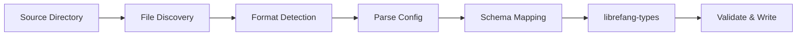

# Other — librefang-migrate

# librefang-migrate

Migration engine for importing configurations and data from other agent frameworks into LibreFang.

## Overview

`librefang-migrate` provides tooling to convert projects, configurations, and agent definitions created in other agent frameworks (such as AutoGen, CrewAI, LangGraph, etc.) into the native LibreFang format. It handles format detection, file discovery, schema mapping, and validation of the resulting output.

## Role in the Workspace

This crate sits at the edge of the LibreFang workspace as a utility module. It depends on `librefang-types` for the target schema definitions used during conversion, but does not expose APIs consumed by other workspace crates. It is typically invoked directly by users or by a CLI frontend during adoption or onboarding of existing agent projects.

## Architecture

The module is structured around a pipeline approach: discover source files, detect the originating framework, parse the configuration in its native format, map fields to LibreFang types, validate, and emit the result.

## Key Dependencies and Their Purpose

| Dependency | Role |
|---|---|
| `librefang-types` | Provides the target type definitions that migrated data is mapped into |
| `serde`, `serde_json`, `serde_yaml`, `json5`, `toml` | Deserialization support for the various configuration formats used by different agent frameworks |
| `walkdir` | Recursive directory traversal to locate configuration files within a source project |
| `chrono` | Timestamp handling for migration metadata and date field conversion |
| `dirs` | Resolution of standard platform directories (e.g., locating default config paths for supported frameworks) |
| `thiserror` | Typed error definitions for migration failures |
| `tracing` | Structured logging of migration progress and diagnostics |

## Supported Configuration Formats

The breadth of serialization libraries reflects the variety of formats used across the agent framework ecosystem:

- **JSON** / **JSON5** — Common in JavaScript-based frameworks and some Python frameworks that tolerate comments or trailing commas.
- **YAML** — Used by frameworks that prefer human-editable configuration.
- **TOML** — Common in Rust-based tooling and some Python frameworks.

## Migration Workflow

1. **Point at a source directory.** The user provides a path to a project built with another agent framework.
2. **Discover files.** `walkdir` recursively scans the directory for recognizable configuration files.
3. **Detect framework and format.** The file names, structure, and extensions are inspected to determine the source framework.
4. **Parse.** The appropriate deserializer reads the configuration into an intermediate representation.
5. **Map to LibreFang types.** Fields are mapped from the source schema into `librefang-types` definitions.
6. **Validate and emit.** The resulting structure is validated and written out in the LibreFang-native format.

## Error Handling

Errors are defined using `thiserror` and cover cases such as:

- Unsupported or unrecognized source frameworks
- Malformed configuration files that fail deserialization
- Missing required fields that have no equivalent mapping
- Filesystem errors during discovery or output

All errors are instrumented with `tracing` spans to provide diagnostic context during long migrations.

## Testing

The `tempfile` dev-dependency is used to construct isolated directory trees in tests. This allows unit and integration tests to:

- Create synthetic source project directories with known configurations
- Run the full migration pipeline against them
- Assert on the correctness of the emitted LibreFang output
- Clean up without side effects

## Adding Support for a New Framework

To add a new source framework:

1. Add a detection function that identifies the framework's configuration files by name, path convention, or structural markers.
2. Define an intermediate struct that mirrors the source framework's configuration schema, with appropriate `serde` attributes.
3. Implement a mapper from that intermediate struct into the relevant `librefang-types`.
4. Register the new framework in the discovery/detection pipeline.
5. Add test fixtures under a `tempfile`-based test covering the new format.