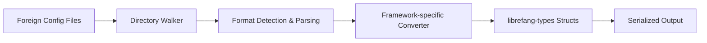

# Other — librefang-migrate

# librefang-migrate

Migration engine for importing configurations, payloads, and agent definitions from other C2/agent frameworks into LibreFang's native format.

## Purpose

When migrating to LibreFang from an existing agent framework, operators typically have accumulated configurations, agent profiles, and infrastructure definitions that need to be converted. `librefang-migrate` provides the tooling to parse these foreign formats and produce validated `librefang-types` structures that the rest of the system can consume.

This crate is a standalone utility — it has no incoming or outgoing runtime dependencies on other LibreFang modules beyond the shared type definitions. It can be run as a one-shot import tool without spinning up the full LibreFang stack.

## Supported Input Formats

The dependency set indicates support for the following configuration formats:

| Format | Crate | Typical Use |
|---|---|---|
| JSON | `serde_json` | Standard structured config, API exports |
| YAML | `serde_yaml` | Human-edited configs, CI/CD pipelines |
| JSON5 | `json5` | Configs with comments, trailing commas |
| TOML | `toml` | Rust-ecosystem configs, simpler files |

This breadth of format support means the migration engine can consume exports from virtually any agent framework without requiring pre-conversion.

## Architecture

The pipeline is linear: discover files, detect their format, parse them, apply framework-specific conversion logic, and emit validated LibreFang types.

## Key Components

### Directory Traversal

Powered by `walkdir`, the engine recursively scans a source directory to locate importable configuration files. This supports batch migrations where an operator points the tool at an existing framework's config directory.

### Format Detection and Parsing

Files are parsed based on their extension or content structure. All four supported formats deserialize through `serde`, so the engine can normalize heterogeneous collections where a foreign framework stores different files in different formats.

### Framework-Specific Converters

Each supported source framework has its own conversion module that maps foreign schema fields to `librefang-types` equivalents. These converters are responsible for:

- Translating agent option names and value types
- Converting timestamp formats (`chrono`) from foreign conventions to LibreFang's standard
- Mapping cryptographic material and credential references
- Resolving path references relative to the source directory

### Error Handling

Errors are structured through `thiserror`, providing clear diagnostics when a foreign config cannot be parsed or contains fields that lack a LibreFang equivalent. The `tracing` integration produces detailed logs during migration runs, which is valuable when diagnosing partial import failures across large config sets.

## Relationship to Other Crates

- **`librefang-types`** — The sole internal dependency. All migration output is expressed as types from this crate (agent configs, listener definitions, credential stores, etc.). This ensures migrated data is immediately usable by the rest of the LibreFang ecosystem without further transformation.
- **No runtime coupling** — Other LibreFang crates do not call into `librefang-migrate`, and it does not call into them. It is a build-time or CLI-invoked tool, not a library consumed during normal agent operation.

## Usage Pattern

Because no execution flows were detected in the call graph, this module is designed to be invoked directly (e.g., via a binary target or CLI subcommand) rather than called programmatically during agent execution. A typical invocation would:

1. Accept a source directory path and a target output path
2. Walk the source directory for recognized config files
3. Detect the source framework from file structure and content
4. Parse and convert each file
5. Write validated `librefang-types` structures to the output location

The `dirs` crate provides access to standard platform directories, which may be used to establish default output paths (e.g., placing migrated configs into the user's LibreFang config directory).

## Testing

Tests use `tempfile` to create isolated directory structures that mimic foreign framework layouts, ensuring conversion logic is verified against realistic file hierarchies without touching the operator's actual configuration.