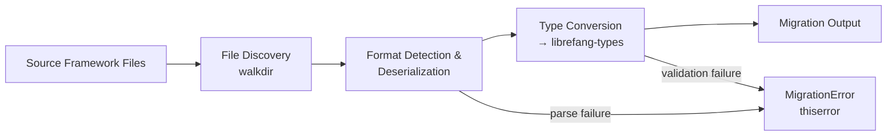

# Other — librefang-migrate

# librefang-migrate

Migration engine for importing configurations, agents, and data from other agent frameworks into LibreFang.

## Overview

`librefang-migrate` provides tooling to bridge existing agent framework installations into the LibreFang ecosystem. It handles parsing foreign configuration formats, converting data structures to LibreFang-native types, and orchestrating the import process.

## Purpose

When adopting LibreFang, teams often have existing agent configurations, dialogue histories, or tool definitions housed in other frameworks. This module eliminates manual translation by:

- **Discovering** source framework artifacts on the filesystem
- **Parsing** configuration and data files across multiple formats (JSON, YAML, TOML, JSON5)
- **Converting** parsed structures into `librefang-types` equivalents
- **Reporting** migration issues with structured error handling

## Dependency Rationale

The crate's dependencies reveal its design:

| Dependency | Role |
|---|---|
| `librefang-types` | Target type definitions — all migrated data is expressed using these shared types |
| `serde` / `serde_json` / `serde_yaml` / `json5` / `toml` | Multi-format deserialization. Most agent frameworks use one of JSON, YAML, TOML, or JSON5 for configuration |
| `walkdir` | Recursive directory traversal to discover source framework files |
| `thiserror` | Typed, ergonomic error definitions for migration failures |
| `tracing` | Instrumentation for migration progress and diagnostics |
| `chrono` | Timestamp parsing and conversion during import |
| `dirs` | Resolving standard platform directories (e.g., locating default framework config paths) |

## Architecture

The migration pipeline follows a linear flow: discover files in a source directory, deserialize each according to its detected format, convert the resulting structures into LibreFang types, and write the output. Errors at any stage are captured as `MigrationError` variants.

## Integration with LibreFang

This module sits at the edge of the LibreFang workspace. It depends on `librefang-types` for its output contract but is not depended upon by any other crate. It is intended to be used as a CLI tool or a one-time setup utility, not as a runtime dependency.

## Testing

Tests use `tempfile` (listed under `[dev-dependencies]`) to create isolated directory trees that simulate source framework layouts, ensuring migration logic works against realistic file structures without side effects.