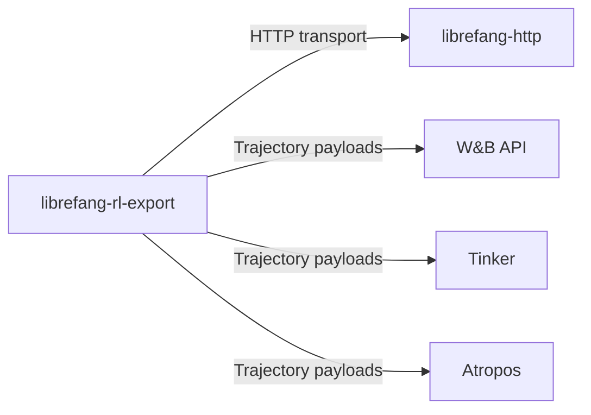

# Other — librefang-rl-export

# librefang-rl-export

Long-horizon RL rollout trajectory exporter providing integration surfaces for W&B (Weights & Biases), Tinker, and Atropos.

## Purpose

This module is responsible for serializing and transmitting reinforcement learning rollout trajectories to external observability and training platforms. It serves as the bridge between the game's RL agents and downstream systems that consume trajectory data for analysis, visualization, or further training.

"Long-horizon" here refers to extended episode rollouts — complete trajectories spanning many steps — as opposed to single-step transitions. The export format and transport are designed around batched trajectory payloads.

## Architecture

The module depends on `librefang-http` for outbound HTTP communication, keeping transport concerns (connection pooling, retries, auth) in a shared layer rather than reimplementing them here.

## Key Dependencies

| Dependency | Role |
|---|---|
| `librefang-http` | Shared HTTP client with retry/auth semantics |
| `reqwest` | Underlying HTTP request execution |
| `serde` / `serde_json` | Trajectory serialization to JSON |
| `base64` | Encoding binary observation data in JSON payloads |
| `urlencoding` | Encoding path/query parameters |
| `url` | Constructing and validating endpoint URLs |
| `regex` | Pattern matching on trajectory metadata |
| `chrono` | Timestamping trajectory records |
| `tracing` | Structured logging of export operations |
| `thiserror` | Typed error definitions |

## Integration Surfaces

### W&B (Weights & Biases)

Trajectories are logged as structured runs with step-level metrics. This enables visualizing reward curves, action distributions, and episode returns over training.

### Tinker

Internal tooling integration for trajectory replay and analysis.

### Atropos

RL training framework integration, supporting trajectory replay for off-policy methods or curriculum learning.

## Error Handling

Errors are defined via `thiserror` and should cover:

- Serialization failures when encoding trajectory data
- HTTP transport errors propagated from `librefang-http`
- URL construction errors
- Response validation errors (unexpected status codes, malformed responses)

## Testing

Tests use `wiremock` to mock external HTTP endpoints, allowing validation of request shape, headers, authentication, and retry behavior without hitting real services. The test runtime is `tokio` with `macros` and `rt-multi-thread` features enabled.

## Relationship to Other Modules

This module is a leaf dependency — it consumes `librefang-http` but nothing in the workspace depends on it. It is invoked by the RL training loop or game runner when trajectories need to be flushed to an external system. There are no incoming calls from other workspace crates, meaning integration is typically driven by application-level orchestration code that calls into this library directly.