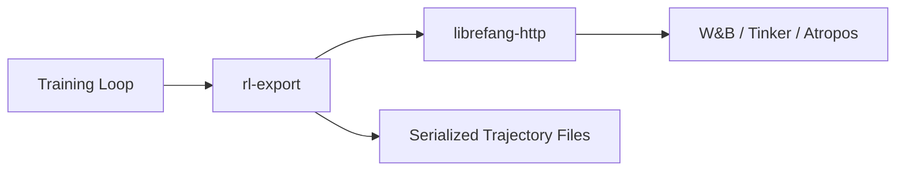

# Other — librefang-rl-export

# librefang-rl-export

Long-horizon reinforcement learning rollout trajectory exporter, providing an integration surface for experiment tracking and training infrastructure including Weights & Biases (W&B), Tinker, and Atropos.

## Purpose

During RL training, agents produce rollout trajectories—sequences of states, actions, and rewards—over long horizons. This crate handles the serialization, encoding, and export of those trajectories to external systems. It acts as a bridge between the core simulation/training loop and downstream consumers that analyze, visualize, or further process rollout data.

## Architecture

```mermaid
graph LR
    A[Training Loop] --> B[rl-export]
    B --> C[librefang-http]
    C --> D[W&B / Tinker / Atropos]
    B --> E[Serialized Trajectory Files]
```

The crate is positioned as a pure export layer. It accepts trajectory data from the training pipeline, serializes it, and dispatches it over HTTP via `librefang-http` or writes it to durable storage. It does not depend on the simulation engine or reward computation—only on the HTTP transport layer.

## Key Dependencies

| Dependency | Role |
|---|---|
| `librefang-http` | Shared HTTP client configuration, authentication, and request plumbing |
| `reqwest` | Underlying async HTTP client for outbound requests |
| `tokio` | Async runtime for non-blocking I/O |
| `serde` / `serde_json` | Serialization of trajectory structs to JSON |
| `chrono` | Timestamping rollout batches and trajectory steps |
| `base64` | Encoding binary or compact trajectory payloads |
| `urlencoding` / `url` | Constructing and encoding API endpoint URLs with query parameters |
| `regex` | Pattern matching for endpoint configuration or data validation |
| `thiserror` | Typed error definitions for export failures |
| `tracing` | Structured logging of export operations and diagnostics |

## Integration Points

### Weights & Biases (W&B)

Trajectories and associated metrics can be logged to W&B for experiment tracking. This typically involves constructing JSON payloads containing step-level data and posting to the W&B API.

### Tinker

Integration with Tinker allows exported trajectories to be consumed by tooling for interactive analysis, debugging, or human-in-the-loop evaluation.

### Atropos

Atropos integration enables trajectory data to feed back into distributed training infrastructure, supporting scenarios where rollout data is shipped to remote training workers.

## Error Handling

The crate uses `thiserror` to define a focused error surface covering:

- HTTP transport failures (connection errors, timeouts, non-2xx responses)
- Serialization errors when encoding trajectory data
- URL construction errors
- Authentication or configuration errors inherited from `librefang-http`

Consumers should expect `Result`-returning APIs and handle errors appropriate to their retry strategy.

## Testing

The test suite uses `wiremock` to mock HTTP endpoints, allowing integration tests that verify request construction, payload shape, and error handling without requiring live external services. Tests run under `tokio` with the `macros` and `rt-multi-thread` features enabled.

## Relationship to Other Crates

This crate sits downstream of the training/simulation crates and depends on `librefang-http` for all network communication. It does not expose APIs consumed by other crates in the workspace—it is a terminal export sink in the dependency graph.