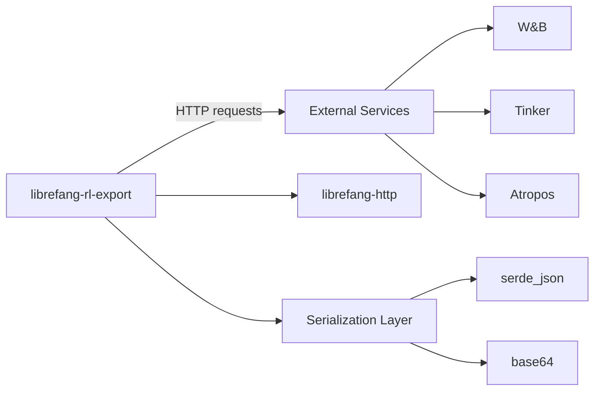

# Other — librefang-rl-export

# librefang-rl-export

Long-horizon RL rollout trajectory exporter providing an integration surface for Weights & Biases (W&B), Tinker, and Atropos.

## Purpose

This module is responsible for serializing and transmitting reinforcement learning rollout trajectory data to external observability and analysis platforms. It serves as the bridge between the game's internal RL state and third-party experiment-tracking systems, enabling long-horizon training analysis, metric visualization, and experiment comparison.

## Architecture

```mermaid
graph LR
    A[librefang-rl-export] -->|HTTP requests| B[External Services]
    B --> B1[W&B]
    B --> B2[Tinker]
    B --> B3[Atropos]
    A --> C[librefang-http]
    A --> D[Serialization Layer]
    D --> D1[serde_json]
    D --> D2[base64]
```

The module is structured as a standalone library crate with no incoming calls from other internal crates. This reflects its role as an **export-only** boundary: other components push trajectory data into it, and it handles all encoding, batching, and transmission externally.

## Key Responsibilities

- **Trajectory serialization** — Encoding RL rollout data (states, actions, rewards, observations) into formats accepted by each target platform.
- **Payload construction** — Building properly structured HTTP request bodies, including base64 encoding for binary observation data and URL encoding for query parameters.
- **Authentication** — Managing API keys and authentication headers for each downstream service.
- **Async transmission** — Non-blocking HTTP export via `reqwest`, orchestrated on the `tokio` runtime.

## Dependencies

| Dependency | Role |
|---|---|
| `librefang-http` | Shared HTTP client configuration and middleware used across the project |
| `reqwest` | Underlying HTTP client for outbound requests to W&B / Tinker / Atropos |
| `serde` / `serde_json` | Serialization of trajectory data structures into JSON payloads |
| `tokio` | Async runtime for non-blocking I/O |
| `thiserror` | Typed error definitions for export failures |
| `tracing` | Structured logging of export events, failures, and retry attempts |
| `chrono` | Timestamp generation for trajectory events and metric records |
| `base64` | Encoding binary observation or state data for transport |
| `urlencoding` | Encoding query parameters and path segments |
| `regex` | Pattern matching for metric name validation or response parsing |
| `url` | URL construction and validation for each platform's API endpoints |

## Integration Surfaces

### Weights & Biases (W&B)

Exports run metrics, trajectory summaries, and artifact data to the W&B API. Payloads are structured as W&B-compatible JSON with project, entity, run ID, and metric key-value pairs.

### Tinker

Pushes formatted trajectory data to the Tinker debugging and analysis surface. Used for interactive inspection of rollout behavior during development.

### Atropos

Transmits structured rollout trajectories to the Atropos training infrastructure. This is the primary training-loop integration, handling the volume and frequency of long-horizon export.

## Error Handling

All errors are defined using `thiserror` derive macros. Expected error categories include:

- **Network failures** — Connection errors, timeouts, and HTTP status errors from `reqwest`.
- **Serialization failures** — JSON encoding errors from `serde_json`.
- **Authentication failures** — Invalid or missing API keys.
- **URL construction failures** — Malformed endpoint URLs.

Errors are instrumented with `tracing` spans to provide context on which platform and which trajectory batch failed.

## Testing

Tests use `wiremock` (declared in `[dev-dependencies]`) to mock external HTTP endpoints, allowing verification of payload structure, request headers, and retry behavior without hitting real services.

## Relationship to the Rest of the Codebase

This crate depends on `librefang-http` for shared HTTP client construction, ensuring consistent TLS configuration, proxy settings, and middleware across all outbound HTTP in the project. No other internal crates depend on `librefang-rl-export` directly — consuming code references it as a leaf dependency and calls into it to initiate exports.