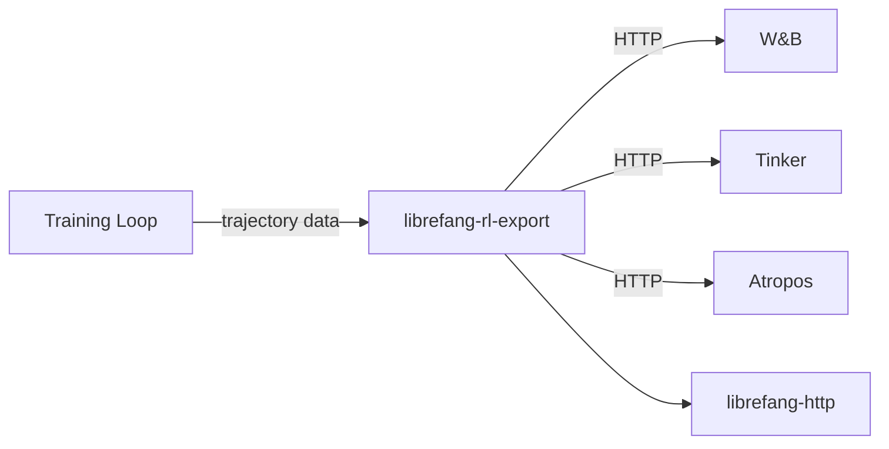

# Other — librefang-rl-export

# librefang-rl-export

Long-horizon reinforcement learning rollout trajectory exporter, providing an integration surface for W&B (Weights & Biases), Tinker, and Atropos.

## Purpose

This module handles the export of RL rollout trajectories generated during long-horizon training. It serves as the bridge between the training loop and external tracking/logging systems, serializing trajectory data and shipping it to configured backends.

## Architecture

```mermaid
graph LR
    A[Training Loop] -->|trajectory data| B[librefang-rl-export]
    B -->|HTTP| C[W&B]
    B -->|HTTP| D[Tinker]
    B -->|HTTP| E[Atropos]
    B --> F[librefang-http]
```

The module depends on `librefang-http` as its HTTP transport layer, keeping network concerns abstracted behind a shared client. All outbound communication to external services flows through this dependency.

## Key Dependencies

| Dependency | Role |
|---|---|
| `librefang-http` | Shared HTTP client infrastructure |
| `reqwest` | Underlying HTTP request execution |
| `serde` / `serde_json` | Trajectory serialization to JSON |
| `tokio` | Async runtime for non-blocking I/O |
| `chrono` | Timestamp handling for trajectory events |
| `base64` / `urlencoding` | Encoding for binary payloads and URL-safe data |
| `url` | URL construction for backend endpoints |
| `regex` | Pattern matching for data validation/transformation |
| `thiserror` | Typed error definitions |
| `tracing` | Structured logging of export operations |

## Integration Surface

The module targets three external systems:

- **W&B (Weights & Biases)** — Experiment tracking. Trajectories are logged as structured data for visualization and comparison across training runs.
- **Tinker** — Local or remote debugging/inspection tooling for rollout data.
- **Atropos** — RL infrastructure backend, receiving trajectory data for centralized storage and analysis.

Each backend is expected to accept JSON-formatted trajectory payloads over HTTP. The module handles serialization, encoding, and transmission.

## Testing

Tests use `wiremock` to mock HTTP endpoints, allowing verification of request structure, headers, and payload format without requiring live backend connections. Test configuration lives in `[dev-dependencies]` with `tokio`'s `macros` and `rt-multi-thread` features enabled for async test execution.