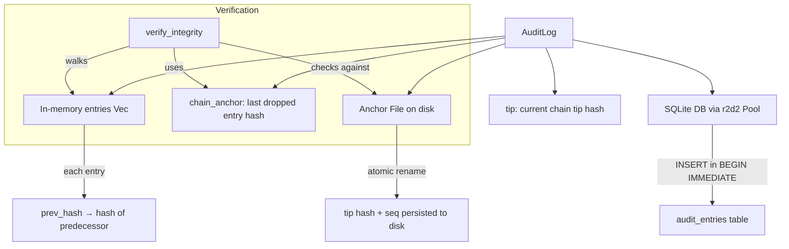

# Other — librefang-runtime-audit-src

# librefang-runtime-audit

Tamper-evident audit logging for the Librefang runtime. Every significant agent action — tool invocations, shell commands, agent spawns, RBAC events — is recorded into a hash-linked chain modeled after a simplified Merkle log. The chain makes after-the-fact tampering detectable, and an optional external anchor file catches the "rewrite the entire database" attack that a pure internal consistency check cannot.

## Architecture



## Core Types

### `AuditEntry`

A single row in the audit log. Fields that go into the hash computation:

| Field | Type | Description |
|-------|------|-------------|
| `seq` | `u64` | Monotonic sequence number |
| `timestamp` | `String` | RFC 3339 timestamp |
| `agent_id` | `String` | ID of the agent that performed the action |
| `action` | `AuditAction` | Categorization of the action |
| `detail` | `String` | Human-readable description of what happened |
| `outcome` | `String` | `"ok"` or `"denied"` |
| `user_id` | `Option<UserId>` | RBAC: the user on whose behalf the action ran |
| `channel` | `Option<String>` | RBAC: the API/channel that originated the request |
| `prev_hash` | `String` | SHA-256 hash of the preceding entry |
| `hash` | `String` | SHA-256 hash of this entry (computed over all fields above) |

The genesis entry (seq 0) uses a sentinel `prev_hash` of `"0" × 64`.

### `AuditAction`

Enum whose `Display` names are **locked** — renaming any variant invalidates every persisted hash that references it. Current variants:

- `AgentSpawn`, `AgentKill`, `AgentMessage`
- `ToolInvoke`, `ShellExec`, `NetworkAccess`, `MemoryAccess`
- `ConfigChange`
- `UserLogin`, `RoleChange`, `PermissionDenied`, `BudgetExceeded`
- `RetentionTrim` (self-audit row written by the kernel after a trim)

### `UserId`

Constructed via `UserId::from_name(name)` — derives a stable UUID from the username so audit attribution survives daemon restarts without requiring a persistent user registry.

## Construction

```rust
// In-memory only (testing, ephemeral runs)
let log = AuditLog::new();

// SQLite-backed (production)
let log = AuditLog::with_db(pool);

// SQLite-backed + external anchor file (full tamper protection)
let log = AuditLog::with_db_anchored(pool, PathBuf::from("/var/lib/librefang/audit.anchor"));
```

`with_db` reads existing rows from the `audit_entries` table, reconstructs the in-memory chain, and recovers the `chain_anchor` from the first surviving entry's `prev_hash` if it doesn't match the genesis sentinel.

`with_db_anchored` additionally reads the anchor file and compares its stored tip against the DB's actual tip. If the anchor file doesn't exist yet (upgrade path), it is seeded from the current tip.

## Recording Events

```rust
// Legacy — no RBAC context
log.record("agent-1", AuditAction::ShellExec, "ls -la", "ok");

// With RBAC attribution
log.record_with_context(
    "agent-1",
    AuditAction::ToolInvoke,
    "read_file /etc/passwd",
    "denied",
    Some(UserId::from_name("Alice")),
    Some("api".to_string()),
);
```

Every `record` / `record_with_context` call:

1. Takes a snapshot of the current `tip` hash.
2. Builds an `AuditEntry` with `prev_hash = tip`.
3. Computes the entry's `hash` via `compute_entry_hash` (all fields including optional `user_id` and `channel`).
4. If a DB pool exists, INSERTs the row inside `BEGIN IMMEDIATE` so concurrent writers are serialized at the SQLite level — this prevents chain forks where two threads reuse the same `prev_hash`.
5. On successful DB write, appends to the in-memory `entries` vector and advances `tip`. On DB failure, the in-memory state is **not** mutated (regression test for #4078 / #4050).
6. If an anchor path is configured, writes the new tip to the anchor file via atomic rename (`write to .tmp`, then `rename .tmp → .anchor`).

## Integrity Verification

`log.verify_integrity()` walks the chain and checks:

1. **Chain anchor**: If `chain_anchor` is set (from a prior trim/prune), the first surviving entry's `prev_hash` must equal it. Otherwise, the first entry's `prev_hash` must be the genesis sentinel.
2. **Linked-list consistency**: Each entry's `prev_hash` equals its predecessor's `hash`.
3. **Hash correctness**: Each entry's stored `hash` matches `compute_entry_hash` recomputed over its fields.
4. **External anchor**: If an anchor file is configured, it must exist and its stored tip must equal the DB's actual tip.

Returns `Ok(())` on success, or `Err(String)` describing the failure (e.g., `"hash mismatch at seq N"`, `"audit anchor mismatch"`, `"missing"`).

### Threat model

| Attack | Detection mechanism |
|--------|-------------------|
| Modify a single row's `detail` or `outcome` | Hash mismatch at that seq |
| Reorder rows | prev_hash chain breaks |
| Delete a middle row | Chain break (prev_hash points to missing predecessor) |
| Wipe DB and fabricate entire history | External anchor file holds pre-wipe tip |
| Delete anchor file | `verify_integrity` fails closed with "missing" |

## Retention

### Per-action trim — `log.trim(&policy, now)`

`AuditRetentionConfig` holds:
- `retention_days_by_action: HashMap<String, u64>` — per-action retention windows
- `max_in_memory_entries: Option<usize>` — hard cap on in-memory entries

`trim` operates as a **prefix-only** drop: it walks from the oldest entry forward, dropping entries whose action has a retention rule and whose age exceeds the configured days. It stops at the first entry that must be kept (no matching rule, or still within the window). This prefix-only approach is critical — it means the surviving chain's first entry always has a `prev_hash` pointing to a real (now-dropped) predecessor.

The `chain_anchor` field is set to the last dropped entry's hash. On restart, `with_db` recovers this anchor from the surviving first entry's `prev_hash`, so `verify_integrity` passes across the trim boundary.

`trim` returns an `AuditTrimReport` with:
- `total_dropped`
- `dropped_by_action: HashMap<String, usize>`
- `new_chain_anchor: Option<String>`

The caller (kernel periodic task) is responsible for writing a `RetentionTrim` self-audit row recording what was dropped.

### Legacy prune — `log.prune(max_age_days)`

Day-based prefix drop. Sets `chain_anchor` the same way as `trim`. Maintained for backward compatibility.

### Drop-everything edge case

When every entry in the log is older than its retention window, the entire in-memory vector and all DB rows are cleared. Both `trim` and `prune` handle this by ensuring no orphan tail row remains in SQLite. The next `record()` call starts fresh against the `chain_anchor`.

## Cursor-Based Streaming — `since_seq`

```rust
let new_entries = log.since_seq(last_seen_seq);
```

Returns all entries with `seq > cursor` — strictly greater, so the SSE poll loop can set `cursor = entries.last().seq` after delivering a batch without re-emitting the tail. This replaced an earlier `recent(200)` + skip approach that silently dropped bursts larger than 200 within a single poll interval.

## Concurrency

When backed by an r2d2 pool with `max_size > 1`, concurrent `record_with_context` calls are serialized at the SQLite layer via `BEGIN IMMEDIATE` transactions. This guarantees:

- **No writes lost**: total persisted rows equals the number of `record` calls.
- **Linear chain**: every row's `prev_hash` is the `hash` of the preceding row (by seq); no two rows share the same `prev_hash`.
- **No chain forks**: the tip mutation and the INSERT that depends on it are atomic.

## Database Schema

```sql
CREATE TABLE audit_entries (
    seq        INTEGER PRIMARY KEY,
    timestamp  TEXT NOT NULL,
    agent_id   TEXT NOT NULL,
    action     TEXT NOT NULL,
    detail     TEXT NOT NULL,
    outcome    TEXT NOT NULL,
    user_id    TEXT,
    channel    TEXT,
    prev_hash  TEXT NOT NULL,
    hash       TEXT NOT NULL
);
```

Production deployments should set `PRAGMA journal_mode=WAL` and `PRAGMA busy_timeout=5000` on the connection manager for concurrent-write resilience.