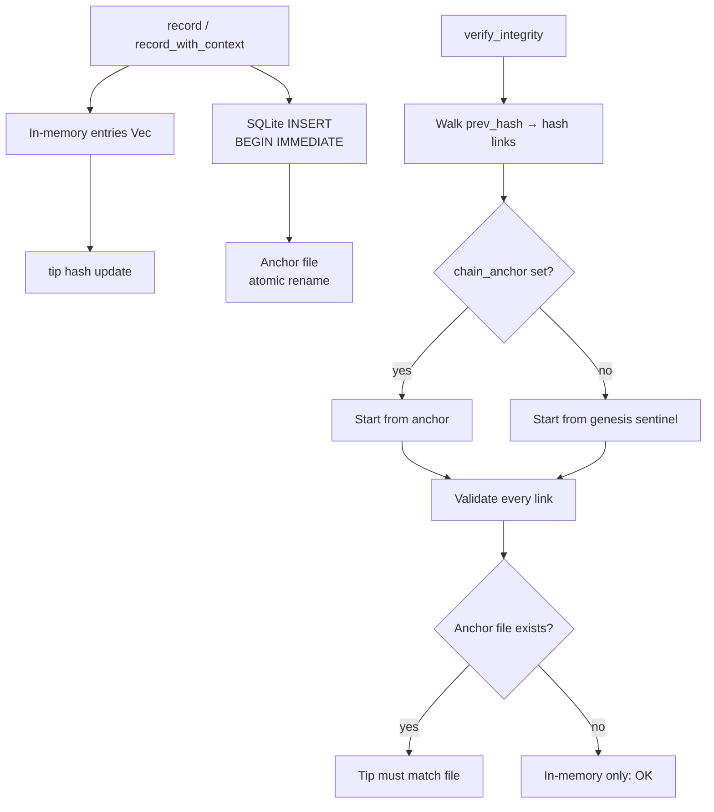

# Other — librefang-runtime-audit-src

# librefang-runtime-audit

Tamper-evident audit trail for the Librefang runtime. Every agent action—tool invocations, shell commands, role changes, budget events—is recorded into a hash-linked Merkle chain that survives daemon restarts, detects tampering, and supports configurable retention.

## Architecture


```mermaid
graph TD
    A[record / record_with_context] --> B[In-memory entries Vec]
    A --> C[SQLite INSERT<br>BEGIN IMMEDIATE]
    B --> D[tip hash update]
    C --> E[Anchor file<br>atomic rename]
    F[verify_integrity] --> G[Walk prev_hash → hash links]
    G --> H{chain_anchor set?}
    H -- yes --> I[Start from anchor]
    H -- no --> J[Start from genesis sentinel]
    I --> K[Validate every link]
    J --> K
    K --> L{Anchor file exists?}
    L -- yes --> M[Tip must match file]
    L -- no --> N[In-memory only: OK]
```

## Core Types

### `AuditLog`

The primary handle. Three constructors, each adding a persistence layer:

| Constructor | Persistence | Tamper Anchor |
|---|---|---|
| `AuditLog::new()` | In-memory only | None |
| `AuditLog::with_db(pool)` | SQLite via r2d2 pool | None (chain_anchor recovered from DB on reload) |
| `AuditLog::with_db_anchored(pool, path)` | SQLite + external file | Yes — file holds the tip hash |

### `AuditEntry`

Each row in the chain. Fields are committed into the Merkle hash:

```
seq: u64              — monotonic sequence number
timestamp: String     — RFC 3339
agent_id: String      — originating agent
action: AuditAction   — enum variant (Display name is locked)
detail: String        — free-form description
outcome: String       — "ok" | "denied" | etc.
user_id: Option<UserId>   — RBAC attribution (optional)
channel: Option<String>   — attribution source: "api", "telegram", etc.
prev_hash: String     — hash of the preceding entry
hash: String          — SHA-256 of all the above
```

### `AuditAction`

Enum whose `Display` names are **locked** — renaming a variant invalidates every persisted hash that mentions it. Current variants:

| Variant | Category |
|---|---|
| `ToolInvoke` | Agent ops |
| `ShellExec` | Agent ops |
| `AgentSpawn` | Lifecycle |
| `AgentKill` | Lifecycle |
| `AgentMessage` | Lifecycle |
| `MemoryAccess` | Agent ops |
| `NetworkAccess` | Agent ops |
| `ConfigChange` | System |
| `UserLogin` | RBAC |
| `RoleChange` | RBAC |
| `PermissionDenied` | RBAC |
| `BudgetExceeded` | RBAC |
| `RetentionTrim` | Self-audit |

### `UserId`

Deterministic identity derived from a human-readable name via `UserId::from_name(name)`. Re-deriving from the same name always yields the same internal UUID, so audit attribution survives daemon restarts without a separate user database.

## Merkle Chain

The chain is a singly-linked list where each entry's `hash` covers its own fields plus the `prev_hash` of its predecessor.

**Genesis sentinel:** The first entry's `prev_hash` is `"0" × 64` (64 ASCII zeroes).

**Hash computation** via `compute_entry_hash(seq, timestamp, agent_id, action, detail, outcome, user_id, channel, prev_hash)` — all fields participate, so tampering with any attribute (including `user_id` or `channel`) changes the hash and breaks the chain.

**Verification** (`verify_integrity()`):
1. If `chain_anchor` is set, treat that hash as the effective genesis — the first surviving entry's `prev_hash` must equal it.
2. Walk every consecutive pair: `entries[i+1].prev_hash == entries[i].hash`.
3. If an external anchor file exists, the current tip must match the file contents. If the file is missing, fail closed.

## Recording Events

### `record(agent_id, action, detail, outcome)`

Legacy path — `user_id` and `channel` are both `None`.

### `record_with_context(agent_id, action, detail, outcome, user_id, channel)`

RBAC-aware path. The `user_id` and `channel` are committed into the Merkle hash, making retroactive attribution changes detectable.

Both methods:
- Advance the in-memory chain (append to `entries`, update `tip`)
- Persist to SQLite if a pool is configured (inside `BEGIN IMMEDIATE` to prevent concurrent chain forks)
- Update the external anchor file if configured (atomic write via rename)
- Enforce the in-memory soft cap (see below)

## Persistence and Recovery

### SQLite Schema

```sql
CREATE TABLE audit_entries (
    seq INTEGER PRIMARY KEY,
    timestamp TEXT NOT NULL,
    agent_id TEXT NOT NULL,
    action TEXT NOT NULL,
    detail TEXT NOT NULL,
    outcome TEXT NOT NULL,
    user_id TEXT,
    channel TEXT,
    prev_hash TEXT NOT NULL,
    hash TEXT NOT NULL
);
```

### Restart Recovery

On `AuditLog::with_db(pool)`, the log reloads all rows from SQLite ordered by `seq`. The `chain_anchor` is recovered automatically: if the first row's `prev_hash` is not the genesis sentinel, that `prev_hash` becomes the anchor — this means a prefix-trimmed chain still verifies because the dropped prefix is treated as an opaque anchor.

### External Anchor File

`with_db_anchored(pool, path)` writes the current tip hash to a file after every successful `record()`. This catches the threat where an attacker with DB write access wipes the entire `audit_entries` table and recomputes a fabricated chain from the genesis sentinel. The external file is written outside the DB, so the fabricated chain's tip won't match.

- **Seeding:** If the file doesn't exist at construction but the DB has rows, the current tip is written automatically (upgrade path).
- **Fail-closed:** If the file was previously written but is now missing, `verify_integrity()` returns an error.
- **Atomic writes:** Uses write-to-temp-then-rename; no `.tmp` artifacts remain.

## Retention

### `trim(policy, now)` → `TrimReport`

Per-action retention with a prefix-only drop strategy:

1. **Pass 1 (per-action rules):** Walk entries from oldest to newest. An entry is dropped if its action has a `retention_days_by_action` rule and its age exceeds the configured days. Trimming stops at the first entry that survives (no rule or within window) — only a contiguous prefix is removed.
2. **Pass 2 (in-memory cap):** If `max_in_memory_entries` is set and the log still exceeds it, drop additional entries from the head.

Returns a `TrimReport`:

```rust
struct TrimReport {
    total_dropped: usize,
    dropped_by_action: HashMap<String, usize>,
    new_chain_anchor: Option<String>,  // hash of last dropped entry
}
```

The caller (kernel periodic task) is responsible for writing a `RetentionTrim` self-audit row using the report data. This keeps `trim()` a pure data primitive.

### `prune(days)` → usize

Legacy day-based retention. Drops every entry older than `days`. Also updates `chain_anchor` so `verify_integrity()` continues to pass. Maintained for backwards compatibility; `trim()` is preferred.

### In-Memory Soft Cap

Between periodic `trim()` calls, the append path enforces a soft cap of `configured_max × 1.5` (fallback: `MAX_AUDIT_ENTRIES = 10_000`). When the in-memory window exceeds this threshold, the oldest entries are evicted and `chain_anchor` advances. This prevents unbounded memory growth during high-throughput bursts.

Configured via `set_max_in_memory_entries(n)`. Query the effective cap with `effective_soft_cap()`.

### Drop-Everything Edge Case

When every entry in the log matches a retention rule and is expired, both `trim()` and `prune()` drop all entries — including from the SQLite table. The next `record()` call (typically the `RetentionTrim` self-audit) re-anchors against `chain_anchor`, and `verify_integrity()` passes because the anchor satisfies the check for the first surviving entry's `prev_hash`.

## Streaming: `since_seq(cursor)` → Vec\<AuditEntry\>

Returns all entries with `seq > cursor`. Designed for the SSE `/api/logs/stream` endpoint:

- `cursor` is the highest `seq` the consumer has already received.
- Returns strictly newer entries — never re-emits the cursor entry.
- Empty result when the cursor is at or past the tail.
- No burst-size limit — delivers every entry after the cursor regardless of how many accumulated between polls.

Initial backfill is handled separately via `recent(n)` in the HTTP handler.

## Concurrency Safety

The `BEGIN IMMEDIATE` transaction around the SQLite INSERT serialises the chain append at the database layer. This prevents chain forks when multiple threads call `record_with_context` concurrently through an r2d2 pool with `max_size > 1`. Without it, two threads could snapshot the same `prev_hash`, build entries that both claim the same predecessor, and produce a forked chain.

The in-memory `tip` mutation is serialised separately (internal mutex). Together, these guarantees ensure:

1. **No writes lost** — every `record()` call produces exactly one persisted row.
2. **Linear chain** — every entry's `prev_hash` is unique; no two rows share a parent.
3. **`verify_integrity()` passes** after concurrent appends and even after a fresh `with_db()` reload.

## Failure Mode: DB Write Failure

If the SQLite INSERT fails (e.g., dropped table, disk full), the in-memory chain does **not** advance. The entry is discarded entirely — no retry queue, no phantom entry. This prevents the class of bugs where a never-persisted entry's hash becomes the `prev_hash` of a later persisted entry, causing `chain break at seq N` on the next daemon restart.