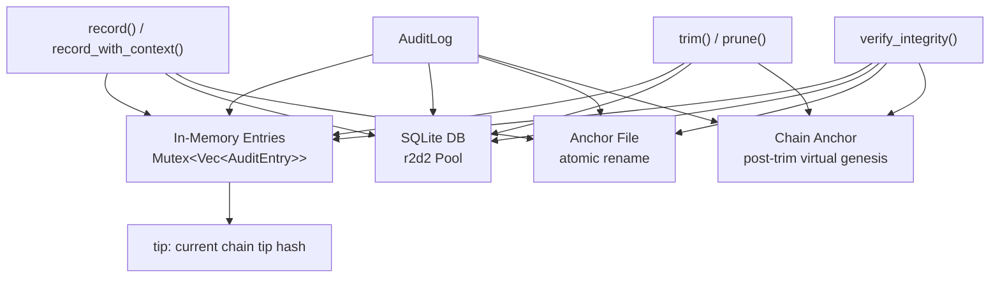

# Other — librefang-runtime-audit-src

# librefang-runtime-audit

Tamper-evident audit logging for the Librefang runtime. Every agent action is recorded as an entry in a hash-linked Merkle chain, persisted to SQLite, and optionally anchored to an external file. The module detects both in-place tampering and full chain rewrites.

## Architecture


```mermaid
graph TD
    A[AuditLog] --> B[In-Memory Entries<br/>Mutex&lt;Vec&lt;AuditEntry&gt;&gt;]
    A --> C[SQLite DB<br/>r2d2 Pool]
    A --> D[Anchor File<br/>atomic rename]
    A --> E[Chain Anchor<br/>post-trim virtual genesis]
    B --> F[tip: current chain tip hash]
    record["record() / record_with_context()"] --> B
    record --> C
    record --> D
    G["trim() / prune()"] --> B
    G --> C
    G --> E
    H["verify_integrity()"] --> B
    H --> C
    H --> D
    H --> E
```

## Core Data Structures

### AuditEntry

Each entry is a node in the Merkle chain:

| Field | Type | Description |
|-------|------|-------------|
| `seq` | `u64` | Monotonic sequence number (0-indexed) |
| `timestamp` | `String` | RFC 3339 timestamp |
| `agent_id` | `String` | Agent that performed the action |
| `action` | `AuditAction` | Categorised action type |
| `detail` | `String` | Free-form description of what happened |
| `outcome` | `String` | `"ok"`, `"denied"`, or similar |
| `user_id` | `Option<UserId>` | RBAC user attribution (optional) |
| `channel` | `Option<String>` | Request origin — `"api"`, `"telegram"`, etc. |
| `prev_hash` | `String` | SHA-256 of the previous entry (genesis sentinel for seq 0) |
| `hash` | `String` | SHA-256 of this entry |

### AuditAction

All variants and their locked `Display` names. Renaming any of these strings invalidates every persisted hash that mentions the variant:

| Variant | Display String | Category |
|---------|---------------|----------|
| `ToolInvoke` | `"ToolInvoke"` | Agent operations |
| `ShellExec` | `"ShellExec"` | Agent operations |
| `AgentSpawn` | `"AgentSpawn"` | Agent lifecycle |
| `AgentKill` | `"AgentKill"` | Agent lifecycle |
| `AgentMessage` | `"AgentMessage"` | Agent operations |
| `NetworkAccess` | `"NetworkAccess"` | Agent operations |
| `MemoryAccess` | `"MemoryAccess"` | Agent operations |
| `ConfigChange` | `"ConfigChange"` | Agent operations |
| `UserLogin` | `"UserLogin"` | RBAC (M5) |
| `RoleChange` | `"RoleChange"` | RBAC (M5) |
| `PermissionDenied` | `"PermissionDenied"` | RBAC (M5) |
| `BudgetExceeded` | `"BudgetExceeded"` | RBAC (M5) |
| `RetentionTrim` | `"RetentionTrim"` | Self-audit (M7) |

### UserId

Deterministic UUID derived from a username via `UserId::from_name(name)`. Re-deriving from the same name always produces the same UUID, so audit attribution survives daemon restarts without requiring a separate user database.

## AuditLog — Construction

### `AuditLog::new()`

In-memory only. No persistence, no anchor. The chain starts with the genesis sentinel (`"0" × 64`) as the tip.

### `AuditLog::with_db(pool)`

SQLite-backed via an `r2d2::Pool<SqliteConnectionManager>`. On construction:

1. Loads all rows from `audit_entries` ordered by `seq`.
2. Recovers the `chain_anchor` from the first loaded entry's `prev_hash` — if it differs from the genesis sentinel, the prefix before that entry was previously trimmed, and the anchor is set to that `prev_hash`.
3. Sets `tip` to the last entry's hash.

### `AuditLog::with_db_anchored(pool, anchor_path)`

Same as `with_db`, plus an external tip anchor file. Behaviour depends on anchor state:

| DB has rows? | Anchor file exists? | Behaviour |
|-------------|--------------------|-----------|
| Yes | No | Seeds the anchor file with the current tip (upgrade path) |
| Yes | Yes | Loads anchor; `verify_integrity()` checks it matches the chain |
| No | No | Creates anchor pointing at genesis on first `record()` |
| No | Yes | Loads anchor; will verify against the new chain |

The anchor file is written atomically (write to `.tmp`, then `rename`).

## Recording Events

### `record(agent_id, action, detail, outcome) -> String`

Basic append. Sets `user_id` and `channel` to `None`. Returns the new entry's hash.

### `record_with_context(agent_id, action, detail, outcome, user_id, channel) -> String`

RBAC-aware append. The `user_id` and `channel` are committed into the Merkle hash — stripping or altering them after the fact changes the digest and triggers a tamper detection.

Both methods:

1. Lock `tip` to get the current chain head.
2. Build the entry with `prev_hash = tip`.
3. Compute `hash` via `compute_entry_hash` (v2 delimited format).
4. If a DB pool exists, `INSERT` the row inside `BEGIN IMMEDIATE` / `COMMIT` to serialise concurrent appends at the SQLite level. **If the INSERT fails, the in-memory chain does not advance** — this prevents chain-break-on-restart bugs.
5. Update in-memory entries vector and `tip`.
6. If anchored, rewrite the anchor file atomically.

### Soft Cap

Between periodic `trim()` calls, `record()` enforces a soft in-memory cap at `configured_max × 1.5`. When the in-memory window exceeds this ceiling, the oldest prefix is evicted and `chain_anchor` is advanced to the last dropped entry's hash. This prevents unbounded memory growth when `trim_interval_secs` is large.

The hard default when `max_in_memory_entries` is unset is 10,000 entries (`MAX_AUDIT_ENTRIES`).

## Hash Computation

### v2 (current) — `compute_entry_hash`

Uses delimited field concatenation to prevent collision attacks where bytes are shifted across adjacent free-form fields:

```
SHA-256( len|seq | len|timestamp | len|agent_id | len|action | len|detail | len|outcome | len|user_id | len|channel | len|prev_hash )
```

The length prefixes make `"ab"+"c"` and `"a"+"bc"` produce different digests. This was not the case in v1.

### v1 (legacy) — `compute_entry_hash_legacy`

Undelimited concatenation. Kept for backward compatibility: `verify_integrity()` falls back to v1 when the v2 digest doesn't match a persisted row, so upgrades don't produce false tamper alarms on pre-existing data.

## Integrity Verification — `verify_integrity()`

Returns `Result<(), String>`. Checks:

1. **Chain linkage**: For each entry (ordered by `seq`), `entry.prev_hash == previous_entry.hash`. The first entry is checked against the `chain_anchor` if set, or the genesis sentinel otherwise.
2. **Hash correctness**: Each entry's stored `hash` matches the recomputed digest (tries v2 first, falls back to v1).
3. **Anchor match** (if anchored): The anchor file's stored hash must equal the current tip. If the anchor file is missing, verification **fails closed** — an attacker removing the anchor cannot silently fall back to DB-only verification.

### Threat Model Coverage

| Attack | Detected by |
|--------|------------|
| Modify an entry's field in-place | Hash mismatch at that seq |
| Full DB wipe + fabricated chain | Anchor mismatch (external file) |
| Remove anchor file | Fails closed ("missing anchor") |
| Shift bytes across detail/outcome boundary | v2 delimited hashing |
| Concurrent writes produce chain fork | `BEGIN IMMEDIATE` serialises INSERTs |

## Retention

### `trim(policy: &AuditRetentionConfig, now: DateTime<Utc>) -> TrimReport`

Per-action retention. Two-pass algorithm:

**Pass 1 (per-action)**: Walks entries from oldest to newest. An entry is dropped if its action has a `retention_days_by_action` entry and its timestamp is older than the configured window. Stops at the first entry that survives (trim is prefix-only — it never deletes from the middle).

**Pass 2 (cap)**: If `max_in_memory_entries` is set and more entries remain than the cap, drops the oldest surplus.

Returns a `TrimReport`:

| Field | Description |
|-------|-------------|
| `total_dropped` | Number of entries removed |
| `dropped_by_action` | `HashMap<String, usize>` breakdown |
| `new_chain_anchor` | `Some(hash)` of the last dropped entry, or `None` |

When entries are dropped, `chain_anchor` is set to the last dropped entry's hash. This allows `verify_integrity()` to treat the first surviving entry's `prev_hash` as valid even though its predecessor no longer exists.

If every entry is dropped, the DB is fully cleared (no orphan tail row left behind), and the next `record()` re-anchors against `chain_anchor`.

**Self-audit**: `trim()` itself does not write a `RetentionTrim` entry. The caller (kernel periodic task) is responsible for recording one using the report's `dropped_by_action` as the detail payload.

### `prune(days: u64) -> usize`

Legacy day-based retention. Drops entries older than `days`. Also updates `chain_anchor`. Exists for backward compatibility alongside the newer per-action `trim`.

### Persistence Across Restarts

After a `trim()` or `prune()` that drops entries, the in-memory `chain_anchor` is lost on shutdown. On the next boot, `with_db()` recovers it from the first surviving row's `prev_hash` — if that hash is not the genesis sentinel, it becomes the `chain_anchor`, and `verify_integrity()` uses it as the virtual genesis.

### `AuditRetentionConfig`

| Field | Type | Default |
|-------|------|---------|
| `retention_days_by_action` | `HashMap<String, u64>` | Empty (no per-action rules) |
| `max_in_memory_entries` | `Option<usize>` | `None` (no cap) |

The default config is a no-op: `trim()` returns an empty report.

## Cursor-Based Delivery — `since_seq(cursor: u64) -> Vec<AuditEntry>`

Returns all entries with `seq > cursor`. Designed for the SSE `/api/logs/stream` handler:

- The consumer sends the highest `seq` it has already received.
- `since_seq(N)` returns strictly newer entries (no re-delivery).
- On an empty log or when the cursor is at/past the tail, returns an empty vector.
- Delivers **all** entries after the cursor regardless of burst size (no silent drops at 200-entry windows).

## SQLite Schema

```sql
CREATE TABLE audit_entries (
    seq        INTEGER PRIMARY KEY,
    timestamp  TEXT NOT NULL,
    agent_id   TEXT NOT NULL,
    action     TEXT NOT NULL,
    detail     TEXT NOT NULL,
    outcome    TEXT NOT NULL,
    user_id    TEXT,
    channel    TEXT,
    prev_hash  TEXT NOT NULL,
    hash       TEXT NOT NULL
);
```

`action` stores the `Display` string of the `AuditAction` variant. `user_id` stores the stringified `UserId` UUID.

## Anchor File Format

The anchor file contains the tip hash and sequence number after the most recent `record()` call. Written via atomic rename (`.tmp` → final path) to avoid partial reads. Read via `AuditLog::read_anchor(path)`.

## Concurrency Safety

When using an `r2d2` pool with `max_size > 1`, concurrent `record_with_context` calls are serialised by wrapping each INSERT in `BEGIN IMMEDIATE` / `COMMIT`. This prevents chain forks where two threads grab the same tip snapshot and produce sibling rows with identical `prev_hash` values. File-backed databases are required for multi-connection pooling; `:memory:` databases are per-connection and won't share state across pool connections.

Recommended PRAGMAs for file-backed pools:

```sql
PRAGMA journal_mode=WAL;
PRAGMA busy_timeout=5000;
PRAGMA synchronous=NORMAL;
```