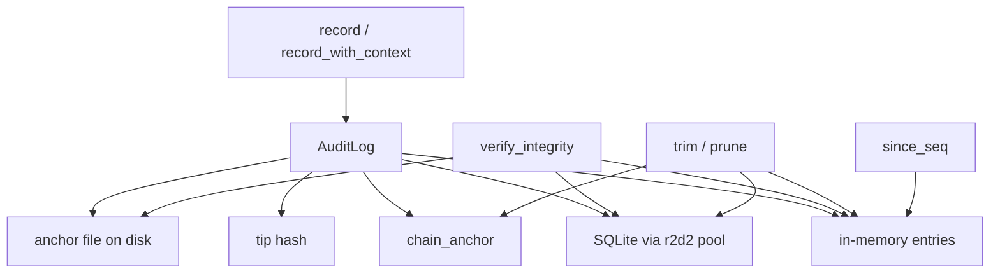

# Other — librefang-runtime-audit-src

# librefang-runtime-audit

Tamper-evident audit logging for the Librefang runtime. Every action an agent takes — tool invocations, shell commands, network access, role changes, budget events — is recorded as an entry in a hash-chained log. The chain makes any retroactive modification or deletion detectable, and an external anchor file catches even a full database rewrite by an attacker with write access to SQLite.

## Architecture


```mermaid
graph TD
    A[AuditLog] --> B[in-memory entries]
    A --> C[tip hash]
    A --> D[chain_anchor]
    A --> E[SQLite via r2d2 pool]
    A --> F[anchor file on disk]
    G[record / record_with_context] --> A
    H[verify_integrity] --> B
    H --> E
    H --> F
    I[trim / prune] --> B
    I --> E
    I --> D
    J[since_seq] --> B
```

The `AuditLog` is the single entry point. It maintains:

- An **in-memory vector** of entries for fast reads (capped to a configurable soft limit).
- A **SQLite table** (`audit_entries`) for durable persistence across daemon restarts.
- An **anchor file** on disk holding the tip hash, protecting against full-DB rewrites.
- A **chain anchor** in memory that records the hash of the last entry dropped by a trim/prune, so `verify_integrity()` can validate the surviving prefix without the dropped rows.

## Core Data Structures

### AuditEntry

Each row in the chain carries:

| Field | Purpose |
|---|---|
| `seq` | Monotonically increasing sequence number (0-based) |
| `timestamp` | RFC 3339 UTC timestamp |
| `agent_id` | Identifier of the agent that performed the action |
| `action` | `AuditAction` enum variant (see below) |
| `detail` | Free-form description of the operation |
| `outcome` | Result — typically `"ok"` or `"denied"` |
| `user_id` | Optional `UserId` for RBAC attribution |
| `channel` | Optional channel identifier (e.g. `"api"`, `"telegram"`) |
| `prev_hash` | SHA-256 hash of the previous entry (genesis sentinel is 64 zero characters) |
| `hash` | SHA-256 hash of this entry's own fields |

### AuditAction

All variants and their locked `Display` names:

| Variant | Display string | Category |
|---|---|---|
| `AgentSpawn` | `"AgentSpawn"` | Agent lifecycle |
| `AgentKill` | `"AgentKill"` | Agent lifecycle |
| `AgentMessage` | `"AgentMessage"` | Agent lifecycle |
| `ToolInvoke` | `"ToolInvoke"` | Capability |
| `ShellExec` | `"ShellExec"` | Capability |
| `NetworkAccess` | `"NetworkAccess"` | Capability |
| `MemoryAccess` | `"MemoryAccess"` | Capability |
| `ConfigChange` | `"ConfigChange"` | Configuration |
| `UserLogin` | `"UserLogin"` | RBAC |
| `RoleChange` | `"RoleChange"` | RBAC |
| `PermissionDenied` | `"PermissionDenied"` | RBAC |
| `BudgetExceeded` | `"BudgetExceeded"` | RBAC |
| `RetentionTrim` | `"RetentionTrim"` | Self-audit |

The `Display` strings are **locked** — renaming any variant would invalidate every persisted hash that references it. The test suite asserts these names explicitly.

### UserId

`UserId::from_name(name)` produces a deterministic, stable identifier from a human-readable name. Re-deriving from the same name always yields the same internal UUID, so audit attribution survives daemon restarts without a separate user database.

## Hash Chain Integrity

Each entry's `hash` is computed over all of its fields plus the `prev_hash` of its predecessor. The first entry chains to a genesis sentinel of `"0".repeat(64)`.

```
seq=0  prev=0000…0000  hash=H(0, ts, agent, action, …, "0000…0000")
seq=1  prev=H0         hash=H(1, ts, agent, action, …, H0)
seq=2  prev=H1         hash=H(2, ts, agent, action, …, H1)
```

`verify_integrity()` walks the chain and checks that every entry's `hash` matches a recomputation from its stored fields, and that `prev_hash` matches the predecessor's `hash`. A mismatch at any position produces an error like `"hash mismatch at seq N"`.

### Hash field delimiting (v2)

The current `compute_entry_hash` inserts explicit delimiters between fields. The legacy `compute_entry_hash_legacy` (v1) concatenated fields without delimiters, which allowed a collision: `detail="ab", outcome="c"` and `detail="a", outcome="bc"` produced the same digest. An attacker with DB write access could shift bytes across the field boundary while keeping the stored hash valid.

`verify_integrity()` tries the v2 layout first, and falls back to v1 for each entry — so rows written before the delimiter upgrade still pass verification without a migration step.

## Persistence and Recovery

### Constructors

- **`AuditLog::new()`** — in-memory only, no SQLite backing. Used in tests and single-session scenarios.
- **`AuditLog::with_db(pool)`** — backed by an r2d2 SQLite pool. Entries are INSERT'd inside `BEGIN IMMEDIATE` transactions to serialize concurrent appends. On construction, rows are loaded from the DB and the chain anchor is recovered from the first surviving entry's `prev_hash` (if it differs from the genesis sentinel).
- **`AuditLog::with_db_anchored(pool, path)`** — additionally maintains an on-disk anchor file holding the current tip hash.

### Crash consistency

If a SQLite INSERT fails (e.g. disk full, schema corruption), the in-memory chain **does not advance**. The entry is not added to the in-memory vector, the tip hash stays where it was, and the next successful `record()` call resumes from the last persisted state. This prevents the class of bugs where a restart finds an on-disk row whose `prev_hash` points at a hash that was never persisted.

### Concurrent writes

Multiple threads calling `record_with_context` through an r2d2 pool with `max_size > 1` is safe. The INSERT is wrapped in `BEGIN IMMEDIATE`, which serializes the chain append at the SQLite layer. The test suite fires 8 threads × 50 appends against a file-backed WAL database and asserts no writes are lost, no `prev_hash` collisions exist, and the chain is linear after reload.

## External Tip Anchor

A threat model the linked-list check cannot catch: an attacker with write access to `audit_entries` can DELETE all rows, fabricate a new history, and recompute every hash from the genesis sentinel forward. The in-DB chain would be internally consistent and pass `verify_integrity()`.

The anchor file solves this. It stores the tip hash (and seq) of the last committed entry, written via atomic rename (`write to .tmp → rename over target`). On verification:

1. If the anchor file exists, `verify_integrity()` compares its stored hash against the current in-DB tip. A mismatch produces `"audit anchor mismatch"`.
2. If the anchor file is **missing** after it was once configured, verification **fails closed** (`"missing anchor"`). An attacker cannot simply delete the file to fall back to DB-only checks.
3. On first boot with an existing DB but no anchor file, `with_db_anchored()` seeds the anchor from the current tip (upgrade path).

The `anchor_path()` accessor exposes the configured path to the dashboard UI so operators can see "anchor: ok" vs "anchor: none".

## Retention and Trimming

### Per-action trim (`trim`)

`trim(policy, now)` enforces `AuditRetentionConfig`:

- **`retention_days_by_action`** — map from `AuditAction` display name to a day count. Entries older than the configured window are eligible for dropping. Actions without a rule are kept indefinitely.
- **`max_in_memory_entries`** — hard cap on the in-memory window. When set, `trim()` drops the oldest prefix to bring the count down to this limit.

Trim operates as a **prefix-only** drop: it walks from the oldest entry forward, dropping contiguous expired entries until it hits one that must be kept (different action, within retention window, or no rule). This is critical for the chain anchor mechanism — the surviving first entry's `prev_hash` still points to a real (now-dropped) predecessor, and the anchor records that predecessor's hash so verification can bridge the gap.

**Self-audit**: `trim()` itself does not write a `RetentionTrim` row. The kernel periodic task that calls `trim()` is responsible for recording one afterward, so trim remains a pure data-mutation primitive.

### Legacy day-based prune (`prune`)

`prune(max_age_days)` drops entries older than `max_age_days` regardless of action type. It also updates the chain anchor, so `verify_integrity()` continues to pass. This runs in parallel with the newer per-action trim during the transition period.

### Soft cap on append

Between periodic trim ticks (default interval: 3600s), the append path enforces a **soft cap** at `configured_max × 1.5`. When the in-memory vector exceeds this ceiling, `record()` evicts the oldest prefix and advances the chain anchor. This prevents unbounded memory growth during bursty activity. When `max_in_memory_entries` is unset (the `0` sentinel), the hard default is `MAX_AUDIT_ENTRIES = 10_000`.

### DB failure safety

Both `trim()` and `prune()` perform the in-memory drain **after** the SQLite DELETE succeeds. If the DELETE fails (e.g. dropped table), the in-memory window is preserved intact — no entries are lost, no anchor is advanced, and the operation retries on the next tick.

### Drop-everything edge case

When every entry in the log is expired and gets dropped, both trim and prune must clear the DB completely (including the tail row). Leaving an orphan behind would break `verify_integrity()` on the next boot because the orphan's `prev_hash` would reference a deleted predecessor. After a drop-everything operation, the next `record()` call (typically the `RetentionTrim` self-audit row) re-anchors the chain.

## RBAC Attribution

`record_with_context(agent_id, action, detail, outcome, user_id, channel)` extends the basic `record()` call with:

- **`user_id: Option<UserId>`** — the human whose authority the agent is acting under.
- **`channel: Option<String>`** — the interface that originated the request (e.g. `"api"`, `"telegram"`).

Both fields are committed into the Merkle hash — tampering with a recorded `user_id` changes the digest and triggers a hash mismatch. Legacy `record()` calls fold to `None` for both fields and remain fully compatible.

## Cursor-Based Streaming (`since_seq`)

`since_seq(cursor)` returns all entries with `seq > cursor` (strictly greater). This supports the SSE log stream: the consumer sets its cursor to `entries.last().seq` after each delivery, and the next poll picks up exactly the new entries.

The semantics are deliberately `>` not `≥`:
- `since_seq(0)` on a log starting at seq=0 **omits** seq=0. The initial backfill is handled by `recent(...)` in the `/api/logs/stream` handler.
- `since_seq(N)` where `N ≥ last_seq` returns an empty vector, preventing re-emission of the tail.
- Unlike the previous `recent(200)` + skip approach, `since_seq` does not silently drop entries during bursts larger than any fixed window size.

## Test Infrastructure

The test file (`tests.rs`) is the primary specification for this module. Key helper functions:

### `push_aged_entry`

Creates an entry with a controlled timestamp by recording normally, then back-dating the timestamp and recomputing the hash in-place. This lets retention tests simulate entries that are days or months old without waiting. The post-edit chain still verifies because the helper re-links the hash properly.

```rust
fn push_aged_entry(
    log: &AuditLog,
    agent_id: &str,
    action: AuditAction,
    detail: &str,
    outcome: &str,
    timestamp: chrono::DateTime<chrono::Utc>,
)
```

### `setup_anchored_log`

Creates an in-memory SQLite pool, initializes the `audit_entries` schema, provisions a temp directory for the anchor file, and returns `(AuditLog, Pool, PathBuf)`. Used by all anchor-related tests.

### Test categories

| Category | Key tests | What they prove |
|---|---|---|
| **Chain integrity** | `test_audit_chain_integrity`, `test_audit_tamper_detection` | Links are correct; tampering is detected |
| **Tip tracking** | `test_audit_tip_changes` | `tip_hash()` advances with each record |
| **RBAC round-trip** | `test_record_with_context_round_trips_user_and_channel`, `test_record_with_context_persists_user_and_channel` | user_id/channel commit to the hash and survive reload |
| **Action variant stability** | `test_new_rbac_variants_preserve_chain` | Display names are locked; new variants hash correctly |
| **UserId stability** | `test_user_id_from_name_is_stable_across_audit_writes` | `from_name` is deterministic |
| **DB persistence** | `test_audit_persists_to_db` | Entries survive across `AuditLog` instances |
| **Anchor** | `test_anchor_detects_full_chain_rewrite`, `test_anchor_missing_after_config_fails_closed`, `test_anchor_is_seeded_on_first_boot_if_missing` | Full-rewrite detection, fail-closed, upgrade seeding |
| **Retention trim** | `test_trim_drops_old_entries_by_action`, `test_trim_preserves_chain_via_anchor`, `test_max_in_memory_cap_enforced` | Per-action rules, anchor bridging, memory cap |
| **Prune** | `test_prune_updates_chain_anchor_so_verify_passes`, `test_prune_drops_all_persists_consistently_across_restart` | Legacy prune also maintains the anchor |
| **DB failure** | `test_db_failure_does_not_advance_in_memory_chain`, `trim_keeps_memory_consistent_when_db_delete_fails`, `prune_keeps_memory_consistent_when_db_delete_fails` | In-memory state is preserved on DB errors |
| **Soft cap** | `test_record_soft_caps_in_memory_between_trims`, `test_record_soft_cap_default_falls_back_to_hard_cap` | Append-path eviction works, defaults are sane |
| **Concurrency** | `audit_chain_holds_under_concurrent_record` | 8-thread stress test: no lost writes, no forks |
| **Hash v2** | `delimited_hash_distinguishes_field_boundary_shifts`, `verify_integrity_accepts_legacy_hashed_entries` | v2 prevents collisions; v1 rows still verify |
| **Streaming** | `since_seq_*` tests | Cursor semantics, edge cases, burst handling |