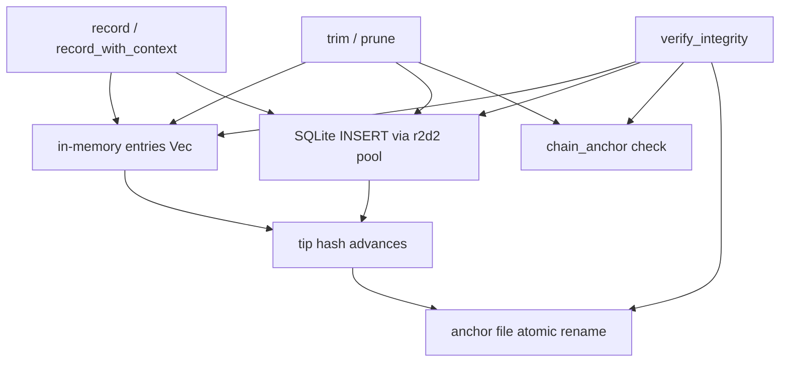

# Other — librefang-runtime-audit-src

# librefang-runtime-audit

Tamper-evident audit log for the Librefang runtime. Every action an agent takes — tool invocations, shell executions, role changes, budget events — is appended to a hash-chained Merkle log. Any post-hoc modification to a recorded entry breaks the chain and is detected by `verify_integrity()`.

## Architecture


```mermaid
graph TD
    A[record / record_with_context] --> B[in-memory entries Vec]
    A --> C[SQLite INSERT via r2d2 pool]
    B --> D[tip hash advances]
    C --> D
    D --> E[anchor file atomic rename]
    F[verify_integrity] --> B
    F --> C
    F --> G[chain_anchor check]
    F --> E
    H[trim / prune] --> B
    H --> C
    H --> G
```

## Core Data Structures

### AuditLog

The central type. Three constructors, each building on the previous:

| Constructor | Storage | Anchor | Use case |
|---|---|---|---|
| `AuditLog::new()` | In-memory only | None | Tests, ephemeral runs |
| `AuditLog::with_db(pool)` | In-memory + SQLite | None | Single-host production |
| `AuditLog::with_db_anchored(pool, path)` | In-memory + SQLite + file | Yes | Hardened production |

**Thread safety.** `AuditLog` is `Send + Sync`. Internally it holds:
- `entries: Arc<Mutex<Vec<AuditEntry>>>` — the in-memory window
- `tip: Arc<Mutex<String>>` — current chain tip hash
- `chain_anchor: Arc<Mutex<Option<String>>>` — hash of the last entry dropped by `trim`/`prune`
- An `r2d2::Pool<SqliteConnectionManager>` for persistence (optional)

### AuditEntry

| Field | Type | Description |
|---|---|---|
| `seq` | `u64` | Monotonic sequence number (0-based) |
| `timestamp` | `String` | RFC 3339 / ISO 8601 |
| `agent_id` | `String` | Agent that performed the action |
| `action` | `AuditAction` | Categorised action type |
| `detail` | `String` | Free-form description |
| `outcome` | `String` | `"ok"` or `"denied"` |
| `user_id` | `Option<UserId>` | RBAC user attribution |
| `channel` | `Option<String>` | API surface that initiated the action |
| `prev_hash` | `String` | SHA-256 of the previous entry (genesis = `"0" × 64`) |
| `hash` | `String` | SHA-256 of this entry's committed fields |

### AuditAction

Locked-display enum — the `to_string()` representation is stability-guaranteed because it is committed into the hash. Renaming any variant invalidates every persisted hash that mentions it.

| Variant | Added | Purpose |
|---|---|---|
| `ToolInvoke` | Initial | Tool/framework call |
| `ShellExec` | Initial | Shell command execution |
| `AgentSpawn` | Initial | Sub-agent created |
| `AgentKill` | Initial | Agent terminated |
| `NetworkAccess` | Initial | Outbound network request |
| `MemoryAccess` | Initial | Memory/key read |
| `AgentMessage` | Initial | Inter-agent message |
| `ConfigChange` | M1 | Configuration mutation |
| `UserLogin` | M5 | User authentication event |
| `RoleChange` | M5 | Role assignment change |
| `PermissionDenied` | M5 | Access denied event |
| `BudgetExceeded` | M5 | Budget limit breach |
| `RetentionTrim` | M7 | Self-audit row for trim operations |

### UserId

Deterministic, stable identifier derived from a username:

```rust
let alice = UserId::from_name("Alice");
```

Re-deriving from the same name always produces the same internal UUID, ensuring audit attribution survives daemon restarts.

### AuditRetentionConfig

```rust
let mut policy = AuditRetentionConfig::default();
policy.retention_days_by_action.insert("ToolInvoke".to_string(), 1);
policy.max_in_memory_entries = Some(100);
```

| Field | Type | Default | Description |
|---|---|---|---|
| `retention_days_by_action` | `HashMap<String, u64>` | Empty (keep forever) | Per-action retention window in days |
| `max_in_memory_entries` | `Option<usize>` | `None` | Hard cap on in-memory entries |

## Merkle Chain

Each entry's hash covers all committed fields, chained to its predecessor:

```
genesis  ──►  entry 0  ──►  entry 1  ──►  entry 2  ──►  tip
"0"×64       hash₀          hash₁          hash₂         hash₂
             prev=genesis   prev=hash₀    prev=hash₁
```

### Hash computation

`compute_entry_hash` concatenates all fields with field-length delimiters to prevent boundary-shift collisions:

```
seq | len(timestamp) | timestamp | len(agent_id) | agent_id | ... | prev_hash
```

The v1 format (`compute_entry_hash_legacy`) simply concatenated fields without delimiters, which allowed an attacker to shift bytes between adjacent free-form fields (e.g., `detail`/`outcome`) while keeping the same digest. The v2 delimited format is the default for all new entries.

### Integrity verification

`verify_integrity()` checks:

1. **Linked-list consistency** — each entry's `prev_hash` equals the prior entry's `hash`.
2. **Hash correctness** — recomputing each entry's hash from its fields matches the stored `hash`.
3. **Anchor agreement** (if `with_db_anchored` was used) — the on-disk anchor file's hash matches the current tip.
4. **Anchor existence** (if configured) — missing anchor file fails closed with an error containing `"missing"`.

Legacy v1-hashed entries are accepted via an internal fallback — no false tamper alarms after upgrade.

## External Anchor File

The anchor file is the defense against an attacker who can write directly to `audit_entries` and recomputes the entire chain from genesis. The linked-list check alone only proves internal consistency; a fully rewritten chain would still pass.

### Lifecycle

1. **First boot with existing DB, no anchor file** — `with_db_anchored` seeds the anchor with the current tip hash. This is the upgrade path.
2. **First boot with empty DB** — the anchor is created on the first `record()` call.
3. **Subsequent boots** — the anchor's hash must match the current tip; mismatch produces `"audit anchor mismatch"`.
4. **Anchor removed by attacker** — `verify_integrity()` fails closed with a `"missing"` error.

### Write mechanism

The anchor is written atomically: content goes to a `.tmp` file, then `rename()` replaces the real anchor. This prevents readers from seeing a partially-written file.

### Reading the anchor

`AuditLog::read_anchor(&path)` returns `Option<AnchorRecord>` — `None` if the file does not exist, parsed record otherwise.

```rust
let record = AuditLog::read_anchor(&anchor_path)
    .unwrap()
    .expect("anchor file should parse");
assert_eq!(record.hash, current_tip);
assert_eq!(record.seq, log.len() as u64);
```

## Persistence

### SQLite schema

```sql
CREATE TABLE audit_entries (
    seq        INTEGER PRIMARY KEY,
    timestamp  TEXT NOT NULL,
    agent_id   TEXT NOT NULL,
    action     TEXT NOT NULL,
    detail     TEXT NOT NULL,
    outcome    TEXT NOT NULL,
    user_id    TEXT,
    channel    TEXT,
    prev_hash  TEXT NOT NULL,
    hash       TEXT NOT NULL
);
```

### Concurrent writes

When backed by an r2d2 pool with `max_size > 1`, the INSERT is wrapped in `BEGIN IMMEDIATE` to serialise chain appends at the SQLite level. This prevents chain forks where two threads grab the same tip snapshot and both INSERT entries with identical `prev_hash` values.

### DB write failure

If the SQLite INSERT fails (e.g., table dropped by operator error), the in-memory chain does **not** advance. The entry is discarded rather than buffered. This avoids the class of bugs where a never-persisted entry's hash becomes the `prev_hash` of a later row, producing `"chain break at seq N"` on the next daemon restart.

### Restart recovery

`with_db(pool)` reloads all rows from SQLite into memory and reconstructs:
- The `tip` from the last row's `hash`.
- The `chain_anchor` from the first row's `prev_hash` — if it is not the genesis sentinel, the anchor is set to that value, allowing `verify_integrity()` to pass across a prefix that was dropped by a previous `trim`/`prune`.

## Retention

Two mechanisms for dropping old entries, both of which maintain chain integrity via the `chain_anchor` field.

### Per-action trim (`log.trim(&policy, now)`)

1. Walks entries from the front (prefix-only).
2. For each entry, checks `retention_days_by_action` for its action type.
3. Stops at the first entry that survives (entries without a rule are kept forever).
4. Sets `chain_anchor` to the hash of the last dropped entry.
5. Returns a `TrimReport` with counts and the new anchor.

**Important:** `trim()` does not write a self-audit row. The caller (kernel periodic task) is responsible for recording `RetentionTrim`:

```rust
let report = log.trim(&policy, now);
let detail = serde_json::to_string(&report.dropped_by_action).unwrap();
log.record("system", AuditAction::RetentionTrim, detail, "ok");
```

### Legacy day-based prune (`log.prune(days)`)

Drops all entries whose age exceeds `days`. Functionally equivalent to a single retention window applied to every action type. Also updates `chain_anchor`.

### Soft cap on `record()`

Between periodic `trim()` calls, the in-memory window can grow unboundedly. To prevent this, `record()` enforces a soft cap at `1.5 × max_in_memory_entries` (or `10_000` when unconfigured):

```rust
log.set_max_in_memory_entries(100);
// After 150 records, record() evicts the oldest ~50 entries from the front.
```

When the soft cap fires, `chain_anchor` advances to the hash of the last evicted entry, so `verify_integrity()` continues to pass.

### Drop-all edge case

When every entry is expired, both `trim` and `prune` must clear the DB completely — including the tail row. Leaving an orphan whose `prev_hash` points at a dropped predecessor would break `verify_integrity()` on the next boot. After a drop-all, the next `record()` (typically the `RetentionTrim` self-audit) re-anchors from `chain_anchor`.

## Cursor-based delivery (`since_seq`)

For the SSE log stream, `since_seq(cursor)` returns entries with `seq > cursor` — strictly greater, not greater-or-equal. The initial backfill is handled separately by `recent()`.

```rust
// Client already received up to seq=199.
let new_entries = log.since_seq(199); // returns seq 200..499
```

This avoids the previous `recent(200)` approach which silently dropped bursts exceeding the window size within a single poll interval.

## Recording entries

### Basic recording

```rust
let log = AuditLog::new();
log.record("agent-1", AuditAction::ShellExec, "ls -la", "ok");
```

`user_id` and `channel` default to `None`.

### RBAC-attributed recording

```rust
let alice = UserId::from_name("Alice");
log.record_with_context(
    "agent-1",
    AuditAction::ToolInvoke,
    "read_file /etc/passwd",
    "ok",
    Some(alice),
    Some("api".to_string()),
);
```

Both `user_id` and `channel` are committed into the Merkle hash. Stripping either field from a persisted entry changes the digest, which triggers tamper detection.