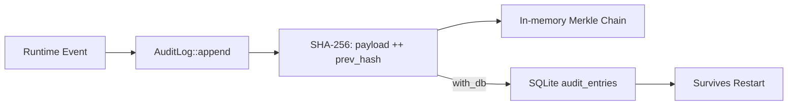

# Other — librefang-runtime-audit

# librefang-runtime-audit

Tamper-evident audit log for the LibreFang runtime. Every auditable event is appended to a Merkle hash chain where each entry holds the SHA-256 of its own contents concatenated with the prior entry's hash, making any retroactive edit immediately detectable.

## Architecture

The chain is constructed entry-by-entry. Each new entry's hash is computed over its own serialized payload plus the hash of the preceding entry. This creates a linked structure where modifying any historical entry invalidates every subsequent hash.

## Key Design Decisions

### Hash Chain Integrity

The core invariant is straightforward: `hash(n) = SHA-256(payload(n) || hash(n-1))`. The genesis entry uses a fixed sentinel value (typically an all-zero hash) as its predecessor. Verification walks the chain from head to tail, recomputing each hash and confirming it matches the stored value.

### Dual Persistence

When constructed via `with_db`, the audit log persists entries to the `audit_entries` table in SQLite (schema V8). This path uses `r2d2`/`r2d2_sqlite` for connection pooling. Without a database, the chain lives only in memory and is lost on restart — suitable for testing or ephemeral sessions.

### Re-export Path

This crate was extracted from `librefang-runtime` as part of the #3710 god-crate split. The parent crate re-exports it at the historical path `runtime::audit`, so existing call sites require no import changes.

## Dependencies and Their Roles

| Dependency | Role |
|---|---|
| `librefang-types` | Shared type definitions for auditable events |
| `sha2` | SHA-256 hashing for the Merkle chain |
| `rusqlite` / `r2d2` / `r2d2_sqlite` | SQLite persistence with connection pooling |
| `serde` / `serde_json` | Serialization of audit payloads |
| `chrono` | Timestamps on audit entries |
| `uuid` | Unique identifiers for entries |
| `hex` | Hex encoding of hashes for storage/display |
| `tracing` / `metrics` | Observability |

## Database Schema

When using `with_db`, entries are written to the `audit_entries` table (SQLite schema V8). Each row stores at minimum:

- A unique entry identifier (`uuid`)
- The entry timestamp (`chrono`)
- The serialized payload (`serde_json`)
- The computed SHA-256 hash for this entry
- The hash of the previous entry (enabling chain verification)

## Usage Patterns

### With Database Persistence

Construct the audit log with a database connection pool. Entries are appended atomically — the hash is computed, the row is inserted, and the in-memory chain head is updated. On restart, the chain can be reconstructed from the persisted entries.

### In-Memory Only

Construct without a database for testing or short-lived sessions. The chain operates identically but has no durability guarantees.

### Chain Verification

At any point, the chain can be walked from the genesis entry to the current head, recomputing hashes along the way. A mismatch at any position indicates tampering or corruption.

## Integration with LibreFang

This crate operates independently — it has no outgoing calls to other LibreFang crates beyond `librefang-types`. `librefang-runtime` consumes it by:

1. Re-exporting the public API at `runtime::audit`
2. Constructing the audit log during daemon initialization (optionally `with_db`)
3. Calling `append` on auditable runtime events (state transitions, configuration changes, administrative actions)

Downstream code should import from `librefang-runtime::audit` unless working with this crate directly.