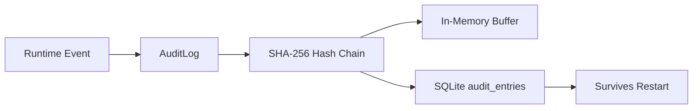

# Other — librefang-runtime-audit

# librefang-runtime-audit

Tamper-evident audit log for the LibreFang runtime. Every auditable event is appended to a Merkle hash chain — each entry stores the SHA-256 digest of its own payload concatenated with the previous entry's hash. Any retroactive modification breaks the chain, making tampering detectable.

## Purpose

This crate provides an append-only audit trail for runtime events. It was extracted from `librefang-runtime` as part of the #3710 god-crate split, and `librefang-runtime` re-exports it at the historical path `runtime::audit`, so downstream consumers do not need to change imports.

## Architecture


```mermaid
flowchart LR
    E[Runtime Event] --> A[AuditLog]
    A --> H[SHA-256 Hash Chain]
    H --> M[In-Memory Buffer]
    H --> D[SQLite audit_entries]
    D --> R[Survives Restart]
```

The core data structure is a linked hash chain. Each `AuditEntry` contains:

- **payload** — the serialized event data (JSON via `serde_json`)
- **timestamp** — creation time (`chrono::Utc`)
- **prev_hash** — the SHA-256 digest of the preceding entry
- **hash** — SHA-256 of `prev_hash || payload || timestamp`

The first entry uses a well-known sentinel value (typically all-zero bytes or a configured genesis hash) as its `prev_hash`, bootstrapping the chain.

## Persistence

Two modes are available:

1. **In-memory only** — entries live in a `Vec` and are lost on process exit. Suitable for tests or short-lived processes.
2. **SQLite-backed** (`with_db`) — entries are written to the `audit_entries` table (schema V8). The connection pool is managed by `r2d2` / `r2d2_sqlite`, ensuring thread-safe access across the runtime. Entries survive daemon restarts.

When constructing with `with_db`, the crate expects the database to already have the V8 schema applied (including the `audit_entries` table definition). Schema migration is handled upstream by the workspace's migration tooling, not by this crate.

## Dependencies

| Crate | Role |
|-------|------|
| `librefang-types` | Shared type definitions for audit events |
| `sha2` / `hex` | SHA-256 hashing and hex encoding |
| `chrono` | Timestamps (UTC) |
| `serde` / `serde_json` | Event serialization to JSON payloads |
| `rusqlite` | SQLite storage backend |
| `r2d2` / `r2d2_sqlite` | Connection pooling for concurrent access |
| `tracing` | Structured logging of audit operations |
| `metrics` | Counters/histograms for audit throughput |

## Integration with the Workspace

`librefang-runtime` re-exports this crate:

```rust
// Consumers continue to use the historical path:
use librefang_runtime::audit::AuditLog;
```

To depend on this crate directly (e.g., in tests or tooling):

```toml
[dependencies]
librefang-runtime-audit = { path = "../librefang-runtime-audit" }
```

## Testing

The `tempfile` crate is included in dev-dependencies for creating ephemeral SQLite databases in integration tests, ensuring the persistence layer is validated without touching production state.

## Linting

Follows workspace-level lints defined in the root `Cargo.toml`.