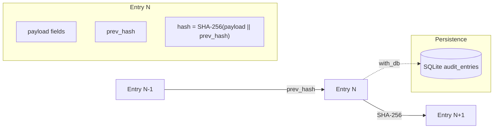

# Other — librefang-runtime-audit

# librefang-runtime-audit

Tamper-evident audit log for the LibreFang runtime. Every auditable runtime event is appended to a Merkle hash chain, making retroactive edits detectable.

## Overview

This crate provides an append-only audit log where each entry is cryptographically linked to its predecessor. Each entry stores the SHA-256 digest of its own contents concatenated with the previous entry's hash, forming a continuous chain. Any modification to a past entry invalidates every subsequent hash, providing strong tamper evidence.

The crate was extracted from `librefang-runtime` as part of the #3710 god-crate split. Downstream consumers should not need to change imports — `librefang-runtime` re-exports this crate at its historical path (`runtime::audit`).

## Architecture


```mermaid
flowchart LR
    E1[Entry N-1] -->|prev_hash| E2[Entry N]
    E2 -->|SHA-256| E3[Entry N+1]

    subgraph "Entry N"
        direction TB
        P[payload fields]
        H[prev_hash]
        C["hash = SHA-256(payload || prev_hash)"]
    end

    subgraph "Persistence"
        DB[(SQLite audit_entries)]
    end

    E2 -.->|with_db| DB
```

## How the Hash Chain Works

1. **Genesis entry** — The first entry uses a fixed sentinel value (typically all-zero bytes) as `prev_hash`.
2. **Subsequent entries** — Each entry computes `hash = SHA-256(serialize(entry_fields) || prev_hash)`, where `prev_hash` is the hash of the immediately preceding entry.
3. **Verification** — Walking the chain from genesis forward and recomputing each hash confirms integrity. A mismatch at any position indicates that the entry or an earlier one was altered.

This is a linear Merkle chain (a Merkle tree with a single branch), chosen for simplicity and deterministic verification.

## Persistence

When the audit log is constructed **with_db**, entries are written to the `audit_entries` table in SQLite (schema V8). This ensures the chain survives daemon restarts and process crashes. The connection pool is managed via `r2d2` and `r2d2_sqlite`.

Key properties of the persistence layer:

- **Append-only** — Entries are never updated or deleted by normal operations.
- **Atomic** — Each entry insertion is a single transaction, preventing partial writes.
- **Restart-safe** — On startup, the log reads the last known hash from the database to continue the chain seamlessly.

Without `with_db`, the chain operates in-memory only and is lost when the process exits.

## Dependencies

| Dependency | Purpose |
|---|---|
| `librefang-types` | Shared type definitions for audit events |
| `sha2` | SHA-256 hashing for the Merkle chain |
| `hex` | Hex encoding of digests for storage and display |
| `chrono` | Timestamps on audit entries |
| `rusqlite` / `r2d2` / `r2d2_sqlite` | SQLite storage with connection pooling |
| `serde` / `serde_json` | Serialization of entry payloads for hashing and storage |
| `tracing` | Structured logging of audit operations |
| `metrics` | Operational metrics (entry count, chain length, verification results) |

## Integration with the Workspace

```
librefang-types
       ↓
librefang-runtime-audit
       ↓
librefang-runtime  (re-exports as runtime::audit)
```

`librefang-runtime` re-exports this crate, so existing call sites using `runtime::audit` continue to work without modification. Direct dependency on `librefang-runtime-audit` is only necessary for crates that need audit functionality without pulling in the full runtime.

## Testing

Tests use the `tempfile` crate to create ephemeral SQLite databases, ensuring isolation between test cases. Verification routines are tested against known chains to confirm that both valid chains pass and tampered chains fail detection.

## Schema Reference

The `audit_entries` table (schema V8) stores the chain on disk. Each row corresponds to one audit entry and includes the serialized payload, the previous entry's hash, and the computed hash for that entry. The exact column layout is defined in the database migration files within the workspace schema directory.