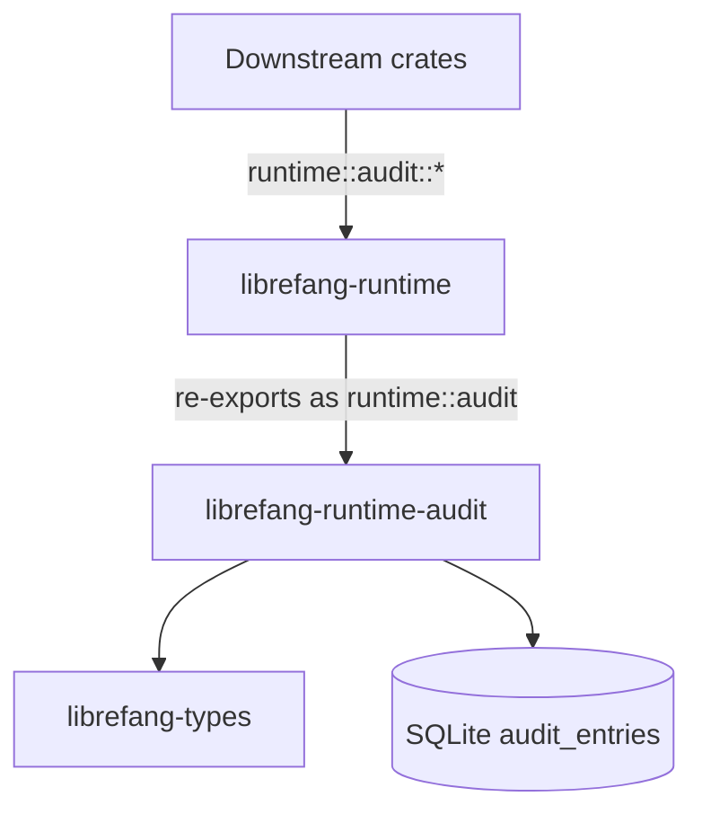

# Other — librefang-runtime-audit

# librefang-runtime-audit

Tamper-evident audit log for the LibreFang runtime. Every auditable event is appended to a Merkle hash chain — each entry stores the SHA-256 digest of its own payload concatenated with the previous entry's hash. Any retroactive modification to a logged entry invalidates every subsequent hash, making tampering detectable.

## Background

This crate was extracted from `librefang-runtime` during the #3710 god-crate split (Phase 1). The parent crate re-exports it at the historical path `runtime::audit`, so existing call sites require no import changes.

## How the Hash Chain Works

```
Entry 0                         Entry 1                         Entry 2
┌──────────────────────┐       ┌──────────────────────┐       ┌──────────────────────┐
│ payload_0            │       │ payload_1            │       │ payload_2            │
│ prev_hash = NULL     │       │ prev_hash = hash_0   │       │ prev_hash = hash_1   │
│ hash_0               │       │ hash_1               │       │ hash_2               │
│     = SHA256(        │       │     = SHA256(        │       │     = SHA256(        │
│       payload_0      │       │       payload_1      │       │       payload_2      │
│     )                │       │       || hash_0       │       │       || hash_1       │
│                      │       │     )                │       │     )                │
└──────────────────────┘       └──────────────────────┘       └──────────────────────┘
```

The first entry is the chain root — its hash covers only its own payload (there is no predecessor). Every subsequent entry's digest incorporates the prior entry's hash, forming a linked cryptographic chain. To verify integrity, walk the chain from head to root and recompute each digest; any mismatch proves tampering.

## Persistence

When constructed via `with_db`, entries are written to the `audit_entries` table in SQLite (schema V8) using a connection pool (`r2d2` + `r2d2_sqlite`). This means audit records survive daemon restarts and are queryable through standard SQL.

The in-memory path (without `with_db`) chains entries in process but does not persist them — suitable for testing or short-lived contexts.

## Dependencies

| Dependency | Role |
|---|---|
| `librefang-types` | Shared domain types used across the workspace |
| `sha2` | SHA-256 hashing for the Merkle chain |
| `hex` | Digest encoding |
| `chrono` | Timestamps on audit entries |
| `serde` / `serde_json` | Payload serialization |
| `rusqlite` | SQLite bindings for persistent storage |
| `r2d2` / `r2d2_sqlite` | Connection pooling for concurrent database access |
| `tracing` | Structured logging of audit operations |
| `metrics` | Operational metrics (chain length, append latency, etc.) |

## Integration with the Workspace


```mermaid
graph TD
    A[librefang-runtime] -->|"re-exports as runtime::audit"| B[librefang-runtime-audit]
    B --> C[librefang-types]
    B --> D[(SQLite audit_entries)]
    E[Downstream crates] -->|"runtime::audit::*"| A
```

`librefang-runtime` re-exports this crate at the `runtime::audit` path. Downstream consumers continue importing from the historical location — no migration required. The crate is self-contained and can also be used directly if independence from the runtime god-crate is desired.

## Verification

To verify chain integrity at any point, iterate entries in insertion order and confirm each `hash` equals `SHA256(payload || prev_hash)`. The root entry has a null `prev_hash` and its digest covers only the payload. A mismatch at any position indicates that entry or an earlier one was altered after insertion.