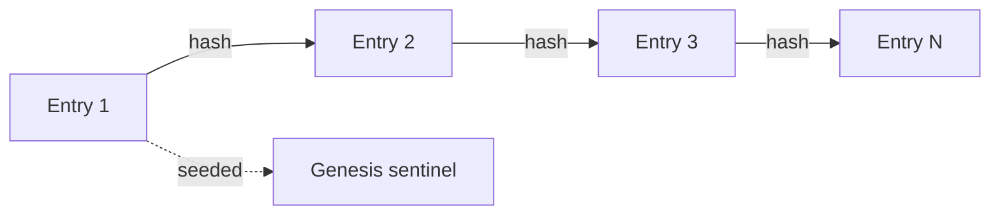

# Other — librefang-runtime-audit

# librefang-runtime-audit

Tamper-evident audit log for the LibreFang runtime. Every auditable event is appended to a SHA-256 hash chain, making retroactive tampering detectable. Entries can be held in memory or persisted to SQLite for survival across daemon restarts.

Extracted from `librefang-runtime` during the #3710 god-crate split. Downstream consumers access it through the re-export at `runtime::audit` — no import changes required.

## Architecture

The core idea is a sequential hash chain. Each entry stores a SHA-256 digest computed over its own serialised content concatenated with the hash of the preceding entry. The first entry is seeded with a fixed sentinel value. Any modification to a past entry invalidates every subsequent hash, making tampering trivially detectable by walking the chain.

```mermaid
flowchart LR
    E1[Entry 1] -->|hash| E2[Entry 2]
    E2 -->|hash| E3[Entry 3]
    E3 -->|hash| EN[Entry N]
    E1 -.->|seeded| S[Genesis sentinel]
```

## Key Dependencies

| Crate | Role |
|---|---|
| `sha2` | SHA-256 digest computation for the hash chain |
| `rusqlite` | SQLite storage backend for persistent mode |
| `r2d2` / `r2d2_sqlite` | Connection pooling for concurrent audit writes |
| `librefang-types` | Shared domain types referenced by audit entries |
| `chrono` | Timestamps on audit entries |
| `serde` / `serde_json` | Serialisation of entry payloads prior to hashing |
| `tracing` | Diagnostic logging within audit operations |
| `metrics` | Operational metrics (e.g. entry count, chain validation failures) |

## Persistence

When the auditor is constructed `with_db`, entries are written to the `audit_entries` table in SQLite (schema V8). This table holds each entry's content alongside its chain hash and metadata, allowing full reconstruction and verification of the chain after a daemon restart.

The `r2d2` connection pool ensures that concurrent audit writes from multiple runtime tasks do not contend on a single connection.

In-memory mode (without a database) is available for testing or ephemeral deployments where persistence is not required.

## Verification

To detect tampering, a verifier walks the chain from the genesis entry forward, recomputing each hash and comparing it against the stored value. A mismatch at any position proves that the chain has been altered from that point onward.

## Testing

The `tempfile` dev-dependency is used in tests to create ephemeral SQLite databases, allowing full integration tests of the persistent audit path without touching production state.