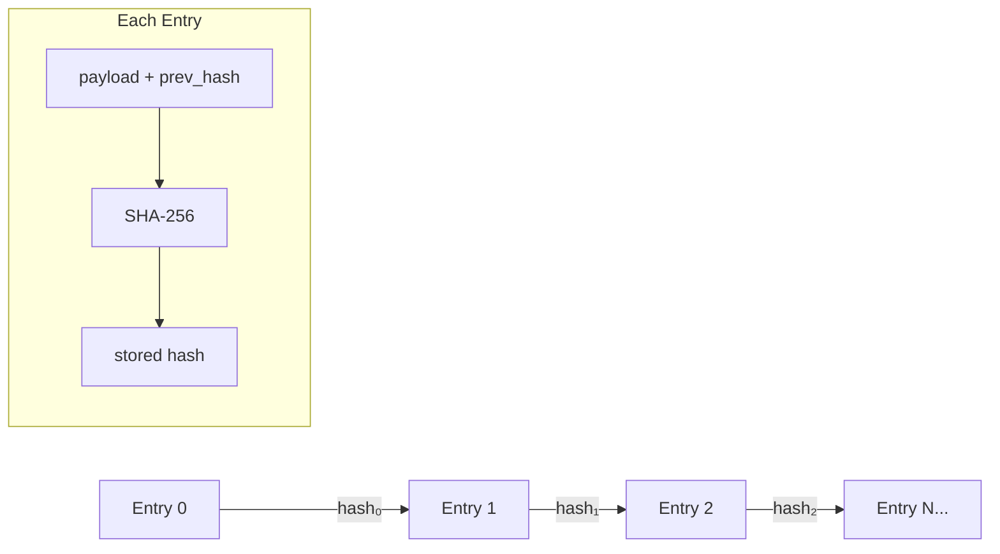

# Other — librefang-runtime-audit

# librefang-runtime-audit

Tamper-evident audit log for the LibreFang runtime. Every auditable event is appended to a SHA-256 Merkle hash chain, making retroactive edits or deletions detectable. Optionally persisted to SQLite so the chain survives process restarts.

## Overview

This crate was extracted from `librefang-runtime` during the #3710 god-crate split. It provides a standalone, self-contained audit logging facility that can be used independently or re-exported through `runtime::audit`.

The core idea is simple: each audit entry contains the SHA-256 digest of its own payload concatenated with the previous entry's hash. This creates an immutable chain where tampering with any single entry invalidates every subsequent hash.


```mermaid
flowchart LR
    E1[Entry 0] -->|"hash₀"| E2[Entry 1]
    E2 -->|"hash₁"| E3[Entry 2]
    E3 -->|"hash₂"| E4[Entry N...]
    
    subgraph "Each Entry"
        payload[payload + prev_hash] --> sha["SHA-256"] --> stored["stored hash"]
    end
```

## Key Dependencies

| Crate | Purpose |
|-------|---------|
| `sha2` | SHA-256 hashing for the Merkle chain |
| `hex` | Encoding digests for storage and display |
| `chrono` | Timestamps on audit entries |
| `rusqlite` / `r2d2` / `r2d2_sqlite` | Optional SQLite persistence via connection pool |
| `serde` / `serde_json` | Serialization of audit payloads |
| `librefang-types` | Shared type definitions |
| `tracing` | Structured logging of audit operations |
| `metrics` | Operational metrics (entry count, chain validation, etc.) |

## How It Works

### Merkle Hash Chain

When a new auditable event is recorded:

1. The event payload is serialized to JSON.
2. The previous entry's SHA-256 hash is retrieved.
3. A new SHA-256 is computed over `previous_hash || serialized_payload`.
4. The resulting hash is stored alongside the entry and becomes the input for the next entry.

The first entry in the chain uses a fixed sentinel value (e.g., all-zero bytes) as its predecessor hash.

### Persistence Modes

**In-memory only.** The chain exists only for the lifetime of the process. Useful for testing or ephemeral runtimes.

**With database (`with_db`).** Entries are written to the `audit_entries` table in SQLite (schema V8). The connection is managed through an `r2d2` pool, supporting concurrent readers. On startup, the chain is rehydrated from the last persisted entry so the hash chain continues unbroken across daemon restarts.

### Tamper Detection

To verify chain integrity, iterate all stored entries in order and recompute each hash:

- If `computed_hash != stored_hash` at any position, the chain has been tampered with.
- If an entry is missing (gap in sequence), the chain is broken.

This verification can be run on-demand or as a periodic background check.

## Integration with LibreFang

`librefang-runtime` re-exports this crate at its historical path (`runtime::audit`), so existing call sites continue to work without import changes. Downstream crates should depend on `librefang-runtime` unless they need audit logging in isolation.

```
librefang-runtime
  └── re-exports librefang-runtime-audit as runtime::audit
```

## Development

### Running Tests

Tests use `tempfile` to create ephemeral SQLite databases:

```bash
cargo test -p librefang-runtime-audit
```

### Adding New Auditable Events

Define the event payload using types from `librefang-types` (or locally if specific to audit). Ensure the type implements `Serialize`. Record it through the audit logger — the hash chain mechanics are handled internally.