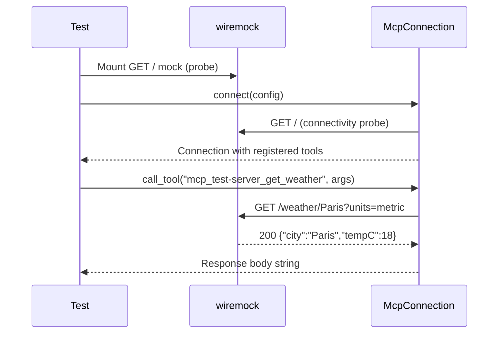

# Other — librefang-runtime-mcp-tests

# HttpCompat Integration Tests

## Overview

The `http_compat_integration.rs` test module validates the `HttpCompat` MCP transport end-to-end against a real HTTP server (`wiremock`). `HttpCompat` is the simplest MCP transport: it maps statically-declared tool calls onto plain HTTP/JSON requests to a user-supplied base URL, without performing an MCP `initialize` handshake. This makes it the ideal integration test entry point since no actual MCP-protocol-speaking peer is required.

## What Is Being Tested

The tests verify three critical behaviors that downstream consumers (the agent loop, dashboard, and tool dispatch) depend on:

1. **Tool registration with namespacing** — `McpConnection::connect` succeeds and registers declared tools under the `mcp_<server>_<tool>` naming convention.
2. **Tool invocation with path rendering** — `call_tool` issues a real HTTP request, interpolates path-template parameters from arguments, forwards remaining arguments as query parameters or JSON body, applies configured headers, and returns the backend response verbatim.
3. **Unknown tool rejection** — calling a tool that was never registered returns a descriptive error rather than silently issuing an unrelated request.

## Test Fixtures

### `http_compat_config`

```rust
fn http_compat_config(base_url: String, tools: Vec<HttpCompatToolConfig>) -> McpServerConfig
```

Builds a complete `McpServerConfig` configured with:

- **Server name**: `"test-server"` — used as the namespace prefix for all tool names.
- **Transport**: `McpTransport::HttpCompat` with a static `x-test-token` header (`"integration-fixture"`) attached to every request.
- **Timeout**: 5 seconds.
- **Taint scanning**: disabled, with an empty rule set handle from `empty_taint_rule_sets_handle()`.

All three test cases share this fixture to avoid duplicating boilerplate.

### `weather_tool`

```rust
fn weather_tool() -> HttpCompatToolConfig
```

A representative tool configuration modeled as a weather lookup:

| Field | Value |
|---|---|
| `name` | `"get_weather"` |
| `path` | `"/weather/{city}"` |
| `method` | `GET` |
| `request_mode` | `Query` |
| `response_mode` | `Json` |
| `input_schema` | `{ city: string (required), units: string }` |

The `{city}` path template is the key detail — the driver must extract `city` from the call arguments, URL-encode it, interpolate it into the path, and consume that key so only `units` remains for the query string.

## Test Cases

### `http_compat_connect_registers_namespaced_tools`

**Verifies**: `McpConnection::connect` succeeds and the tool appears in the connection's tool list under its namespaced name.

The test mounts a catch-all `GET /` mock (the connectivity probe fired during connect — failure is acceptable, but 200 is used here), then asserts:

- The connection's tool list contains `mcp_test-server_get_weather` (produced by `format_mcp_tool_name("test-server", "get_weather")`).
- `conn.name()` returns `"test-server"`.

**Why this matters**: The agent loop and tool dispatch key entirely on the prefixed `mcp_<server>_<tool>` form. A regression here breaks tool routing end-to-end.

### `http_compat_call_tool_renders_path_and_returns_body`

**Verifies**: `call_tool` renders path templates, strips consumed keys from the argument map, forwards remaining keys as query parameters, includes configured headers, and returns the response body.

Wiremock expectations:

```
GET /weather/Paris?units=metric
Header: x-test-token: integration-fixture
→ 200 {"city": "Paris", "tempC": 18}
```

The test calls `call_tool` with arguments `{"city": "Paris", "units": "metric"}` and asserts the response string contains `"city"`, `"Paris"`, and `"18"`.

**Why this matters**: This exercises the full HTTP request pipeline — path interpolation, argument consumption, query serialization, header injection, and response forwarding — all against a real HTTP round-trip.

### `http_compat_call_tool_unknown_name_errors`

**Verifies**: Calling a tool name that was never registered fails with an error message mentioning the missing tool.

The test calls `call_tool("mcp_test-server_does_not_exist", {})` and asserts the error string contains `"not found"`, `"unknown"`, or `"does not exist"`.

**Why this matters**: Prevents silent misrouting where a typo in a tool name could cause an unrelated HTTP request to an unintended endpoint.

## Execution Flow



## Dependencies on Production Code

| Symbol | Source | Purpose |
|---|---|---|
| `McpConnection` | `librefang-runtime-mcp` | The connection struct under test |
| `McpServerConfig` | `librefang-runtime-mcp` | Configuration type for the server |
| `McpTransport::HttpCompat` | `librefang-runtime-mcp` | The transport variant being tested |
| `format_mcp_tool_name` | `librefang-runtime-mcp` | Produces the `mcp_<server>_<tool>` namespaced name |
| `empty_taint_rule_sets_handle` | `librefang-runtime-mcp` | Provides a no-op taint rule set for test configs |
| `HttpCompatToolConfig` | `librefang-types` | Per-tool declaration (path, method, schema) |
| `HttpCompatHeaderConfig` | `librefang-types` | Static header injection config |
| `HttpCompatMethod` / `HttpCompatRequestMode` / `HttpCompatResponseMode` | `librefang-types` | Enums for HTTP method, request serialization, and response handling |

## Running

```bash
# Run just this test file
cargo test -p librefang-runtime-mcp --test http_compat_integration

# Run with output visible
cargo test -p librefang-runtime-mcp --test http_compat_integration -- --nocapture
```

No external services or environment variables are required — `wiremock` provides the HTTP server in-process.