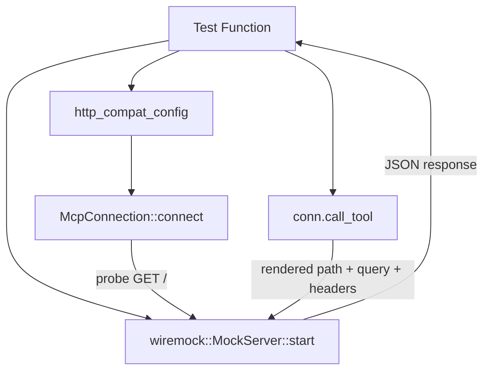

# Other — librefang-runtime-mcp-tests

# HttpCompat Integration Tests

## Overview

This module (`http_compat_integration.rs`) provides end-to-end integration tests for the **HttpCompat** MCP transport layer. HttpCompat is the simplest transport: it maps declared tool calls onto plain HTTP/JSON requests against a user-supplied base URL, without performing an MCP `initialize` handshake. Because it has no protocol-level startup requirements, it is the ideal candidate for integration testing against a lightweight mock server.

The tests validate three critical behaviors that, if broken, would silently break tool dispatch across the agent loop and dashboard:

1. Tool registration with correct namespacing during `connect`.
2. Path-template interpolation, query-parameter forwarding, header injection, and response passthrough during `call_tool`.
3. Proper error handling when an unknown tool name is invoked.

## Architecture

All three tests share the same pattern: spin up a `wiremock` server, configure an `McpConnection` with the HttpCompat transport pointing at it, and assert on the observable results.



## Test Fixtures

### `http_compat_config(base_url, tools) -> McpServerConfig`

Builds a complete `McpServerConfig` wired for HttpCompat testing. It configures:

| Field | Value |
|---|---|
| `name` | `"test-server"` |
| `transport` | `McpTransport::HttpCompat` with one static header (`x-test-token: integration-fixture`) |
| `timeout_secs` | `5` |
| `taint_scanning` | `false` |
| `taint_rule_sets` | empty handle via `empty_taint_rule_sets_handle()` |

All other fields (`env`, `headers`, `oauth_provider`, `oauth_config`, `taint_policy`, `roots`) are set to empty/`None`.

### `weather_tool() -> HttpCompatToolConfig`

A sample tool declaration used across all tests:

- **Name**: `get_weather`
- **Path template**: `/weather/{city}` — `{city}` is interpolated from call args
- **HTTP method**: `GET`
- **Request mode**: `Query` — remaining args (after path consumption) are sent as query parameters
- **Response mode**: `Json` — the backend response body is forwarded verbatim
- **Input schema**: requires `city` (string), optional `units` (string)

## Test Cases

### `http_compat_connect_registers_namespaced_tools`

**What it verifies**: That `McpConnection::connect` succeeds for HttpCompat and registers tools under the namespaced convention `mcp_<server>_<tool>`.

The test mounts a catch-all `GET /` mock (the probe that `connect` issues to verify liveness), then calls `McpConnection::connect` and inspects `conn.tools()`. It asserts that the tool list contains `format_mcp_tool_name("test-server", "get_weather")` and that `conn.name()` returns `"test-server"`.

**Why it matters**: The agent loop and dashboard key off the prefixed tool name for dispatch. A regression here breaks the entire tool-routing pipeline.

### `http_compat_call_tool_renders_path_and_returns_body`

**What it verifies**: The full `call_tool` request pipeline — path interpolation, query forwarding, header injection, and response passthrough.

The test sets up two mocks on the wiremock server:

1. `GET /` — for the connect probe.
2. `GET /weather/Paris` — expects `units=metric` as a query parameter and the `x-test-token` header, responds with `{"city": "Paris", "tempC": 18}`. This mock has `.expect(1)` to verify exactly one request is made.

After connecting, the test calls `call_tool` with the namespaced tool name and args `{"city": "Paris", "units": "metric"}`. It asserts that the returned string contains `"city"`, `"Paris"`, and `"18"` — confirming the JSON response body round-trips to the caller.

**Key behavioral detail**: The driver consumes `city` from the args to fill the path template, so only the remaining key (`units`) is forwarded as a query parameter.

### `http_compat_call_tool_unknown_name_errors`

**What it verifies**: That calling a tool name that was never registered returns a descriptive error rather than silently issuing an incorrect HTTP request.

After connecting with a single `get_weather` tool, the test calls `call_tool("mcp_test-server_does_not_exist", ...)`. It asserts the result is an `Err` whose message contains one of: `"not found"`, `"unknown"`, or `"does not exist"`.

## Dependencies and Integration Points

This test module depends on the following from the main library crate:

- **`McpConnection`** — the primary API under test; its `connect` and `call_tool` methods exercise the HttpCompat transport end-to-end.
- **`McpServerConfig`** / **`McpTransport`** — configuration types that define the HttpCompat transport, base URL, headers, and tool declarations.
- **`format_mcp_tool_name`** — produces the namespaced tool identifier (`mcp_<server>_<tool>`).
- **`empty_taint_rule_sets_handle`** — provides a no-op taint rule handle so the config can be constructed without pulling in taint infrastructure.
- **`librefang_types::config`** — supplies `HttpCompatToolConfig`, `HttpCompatHeaderConfig`, `HttpCompatMethod`, `HttpCompatRequestMode`, and `HttpCompatResponseMode`.

External test dependencies:

- **`wiremock`** — in-process HTTP mock server used to simulate the backend without network access.
- **`serde_json`** — for building JSON fixtures and input schemas.
- **`tokio`** — async test runtime (`#[tokio::test]`).

## Running

```sh
# Run all HttpCompat integration tests
cargo test -p librefang-runtime-mcp --test http_compat_integration

# Run a single test case
cargo test -p librefang-runtime-mcp --test http_compat_integration -- http_compat_call_tool_renders_path_and_returns_body
```

No external services or environment variables are required. The `wiremock` server runs in-process on a random port assigned at startup.