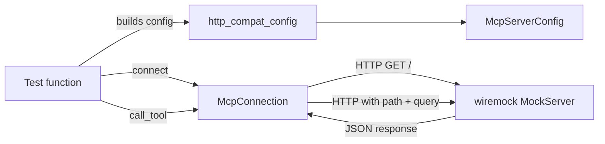

# Other — librefang-runtime-mcp-tests

# HttpCompat Integration Tests

Integration test suite for the `HttpCompat` MCP transport. These tests exercise the full connect → tool-discovery → call-tool lifecycle against a real `wiremock` HTTP server, with no MCP protocol handshake required.

## Why HttpCompat

`HttpCompat` is the simplest MCP transport: it maps declared tool calls directly onto plain HTTP/JSON requests to a user-supplied base URL. Unlike stdio or SSE transports, it does **not** perform an MCP `initialize` handshake. This makes it the ideal candidate for integration testing—no MCP-protocol-speaking peer is needed, just a conformant HTTP backend.

## What the tests verify

| Test | Scenario | Verified behavior |
|------|----------|-------------------|
| `http_compat_connect_registers_namespaced_tools` | `McpConnection::connect` with one declared tool | The tool appears in the connection's tool list under the namespaced name `mcp_<server>_<tool>`. The agent loop and dashboard key off this prefixed form, so a regression here breaks dispatch. |
| `http_compat_call_tool_renders_path_and_returns_body` | `call_tool` with a path-template tool (`/weather/{city}`) | Path parameters are interpolated and consumed from the args; remaining args (`units`) arrive as query parameters. Custom headers from config are attached. The JSON response body is forwarded verbatim. |
| `http_compat_call_tool_unknown_name_errors` | `call_tool` with a name not in the registered tool list | Returns an error mentioning "not found", "unknown", or "does not exist" rather than silently issuing a stray HTTP request. |

## Test architecture



Each test spins up an isolated `wiremock::MockServer`, configures expected request/response pairs, builds an `McpServerConfig` pointing at it, then exercises `McpConnection` through the public API.

## Key helpers

### `http_compat_config`

```rust
fn http_compat_config(base_url: String, tools: Vec<HttpCompatToolConfig>) -> McpServerConfig
```

Constructs a minimal `McpServerConfig` with the `HttpCompat` transport. The config includes:

- **Server name**: `"test-server"` — used for tool name namespacing via `format_mcp_tool_name`.
- **Headers**: A single `x-test-token: integration-fixture` header attached to every outbound request. Tests assert on this to verify header propagation.
- **Taint scanning**: Disabled (`taint_scanning: false`) with an empty rule-set handle from `empty_taint_rule_sets_handle`.
- **Timeout**: 5 seconds.

### `weather_tool`

```rust
fn weather_tool() -> HttpCompatToolConfig
```

Returns a sample tool declaration used across all three tests:

| Field | Value |
|-------|-------|
| `name` | `get_weather` |
| `path` | `/weather/{city}` |
| `method` | `GET` |
| `request_mode` | `Query` |
| `response_mode` | `Json` |
| `input_schema` | `{ city: string (required), units: string }` |

The `{city}` path parameter is the key test case: `McpConnection::call_tool` must interpolate it into the URL, consume it from the arguments map, then send remaining arguments (`units`) as a query string.

## Behavioral contracts verified

### Path-template interpolation

When a tool declares `path: "/weather/{city}"` and `call_tool` receives `{"city": "Paris", "units": "metric"}`:

1. `"city"` is extracted and interpolated → `GET /weather/Paris`
2. `"city"` is removed from the args map
3. Remaining `"units"` is sent as `?units=metric` (because `request_mode` is `Query`)
4. The response JSON body is returned as a string

### Tool namespacing

`McpConnection::connect` registers each declared tool under the prefixed name `mcp_<server_name>_<tool_name>`. The test asserts the presence of `mcp_test-server_get_weather` in the tool list. Consumers (agent loop, dashboard) rely on this naming convention for routing—changing it is a breaking change.

### Unknown tool rejection

Calling `call_tool` with a name not present in the registered tool list must return an error. The test checks for substrings "not found", "unknown", or "does not exist" in the error message.

## Running

```bash
# From the workspace root
cargo test -p librefang-runtime-mcp --test http_compat_integration
```

Tests are async and use `#[tokio::test]`. Each test is self-contained with its own `wiremock` server, so they can run in parallel without interference.

## Dependencies

- **`wiremock`** — Provides the mock HTTP server and request matchers (`method`, `path`, `query_param`, `header`).
- **`librefang_runtime_mcp`** — The library under test. Imports: `McpConnection`, `McpServerConfig`, `McpTransport`, `format_mcp_tool_name`, `empty_taint_rule_sets_handle`.
- **`librefang_types::config`** — Configuration types: `HttpCompatToolConfig`, `HttpCompatHeaderConfig`, `HttpCompatMethod`, `HttpCompatRequestMode`, `HttpCompatResponseMode`.