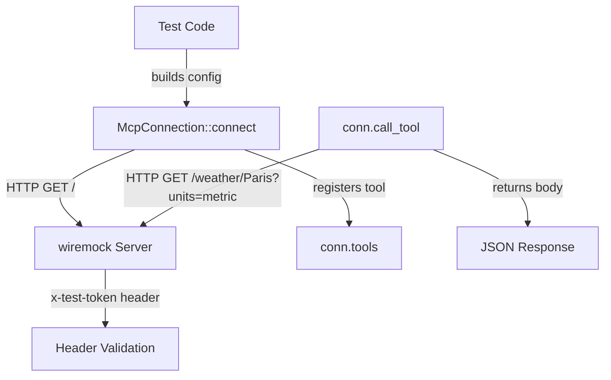

# Other — librefang-runtime-mcp-tests

# HttpCompat Integration Tests (`librefang-runtime-mcp-tests`)

## Purpose

This module contains integration tests for the `HttpCompat` MCP transport layer. `HttpCompat` is the simplest transport in the MCP stack—it maps declared tool calls directly onto plain HTTP/JSON requests against a user-supplied base URL, with no MCP `initialize` handshake. This makes it the ideal candidate for end-to-end testing without requiring a full MCP-protocol-speaking peer.

The tests spin up a real `wiremock` HTTP server to validate the full lifecycle: connection setup, tool registration, path-template rendering, argument forwarding, and error handling.

## What Is Being Tested

The tests exercise the following contract guarantees that the rest of the system (agent loop, dashboard, tool dispatch) depends on:

1. **Namespaced tool registration** — tools declared in `HttpCompatToolConfig` are registered under the `mcp_<server>_<tool>` naming convention during `connect`.
2. **Path-template interpolation and argument consumption** — path parameters like `{city}` are interpolated into the URL and removed from the remaining arguments, which are then forwarded as query parameters (or JSON body, depending on `request_mode`).
3. **Unknown tool rejection** — calling a tool name that was never registered returns a descriptive error rather than silently issuing a malformed request.

## Test Architecture



## Helper Functions

### `http_compat_config`

```rust
fn http_compat_config(base_url: String, tools: Vec<HttpCompatToolConfig>) -> McpServerConfig
```

Constructs a complete `McpServerConfig` wired to the `HttpCompat` transport. Every test uses this to ensure consistent configuration. Key defaults:

- **Server name**: `"test-server"` (used to produce the `mcp_test-server_<tool>` namespace prefix).
- **Headers**: injects `x-test-token: integration-fixture` on every request, allowing wiremock matchers to verify header propagation.
- **Timeout**: 5 seconds.
- **Taint scanning**: disabled via `empty_taint_rule_sets_handle()`.
- **OAuth**: none.

### `weather_tool`

```rust
fn weather_tool() -> HttpCompatToolConfig
```

Returns a sample tool configuration for a weather lookup endpoint. This is the fixture used across all tests.

| Field | Value |
|---|---|
| `name` | `"get_weather"` |
| `path` | `"/weather/{city}"` |
| `method` | `HttpCompatMethod::Get` |
| `request_mode` | `HttpCompatRequestMode::Query` |
| `response_mode` | `HttpCompatResponseMode::Json` |

The `{city}` placeholder in `path` is the key detail: the HttpCompat driver must interpolate it from call arguments and consume that key before forwarding remaining args as query parameters.

## Test Cases

### `http_compat_connect_registers_namespaced_tools`

**Verifies**: `McpConnection::connect` succeeds and the declared tools appear under their namespaced names.

The test expects exactly one tool named `mcp_test-server_get_weather` (produced by `format_mcp_tool_name("test-server", "get_weather")`) in the connection's tool list. It also confirms `conn.name()` returns `"test-server"`.

> A regression here would break tool dispatch end-to-end because downstream consumers key off the prefixed form.

### `http_compat_call_tool_renders_path_and_returns_body`

**Verifies**: `call_tool` performs a real HTTP request with correct path interpolation, argument forwarding, and header injection.

The wiremock mock expects:

- **Method**: `GET`
- **Path**: `/weather/Paris` (the `{city}` placeholder resolved from the call arguments)
- **Query param**: `units=metric` (remaining argument after `city` was consumed by the path)
- **Header**: `x-test-token: integration-fixture`

The mock responds with `{"city": "Paris", "tempC": 18}`. The test asserts the response string round-trips the city and temperature values.

### `http_compat_call_tool_unknown_name_errors`

**Verifies**: Calling a tool that was never registered fails with a descriptive error.

The test calls `"mcp_test-server_does_not_exist"` and expects the error message to contain `"not found"`, `"unknown"`, or `"does not exist"`. This ensures the transport layer does not silently issue requests for undeclared tools.

## Relationship to the Codebase

These tests sit at the boundary between configuration types and the runtime MCP connection layer:

- **`librefang_types::config`** — provides `HttpCompatToolConfig`, `HttpCompatMethod`, `HttpCompatRequestMode`, `HttpCompatResponseMode`, and `HttpCompatHeaderConfig`.
- **`librefang_runtime_mcp`** — provides `McpConnection`, `McpServerConfig`, `McpTransport`, `format_mcp_tool_name`, and `empty_taint_rule_sets_handle`.
- **`wiremock`** — external HTTP mock server, used as the stand-in backend.

## Running the Tests

```bash
# From the workspace root
cargo test -p librefang-runtime-mcp --test http_compat_integration

# Or run all integration tests in the crate
cargo test -p librefang-runtime-mcp
```

All three tests are async (`#[tokio::test]`) and require no external services—they are fully self-contained via `wiremock::MockServer::start().await`.