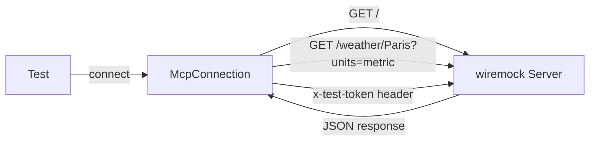

# Other — librefang-runtime-mcp-tests

# librefang-runtime-mcp-tests — HttpCompat Integration Tests

## Overview

This module contains end-to-end integration tests for the `HttpCompat` MCP transport. `HttpCompat` is the simplest MCP transport variant: it maps declared tool calls onto plain HTTP/JSON requests against a user-supplied base URL, without performing an MCP `initialize` handshake. Because it requires no MCP-protocol-speaking peer, it is the ideal entry point for integration testing the connection and dispatch pipeline.

The tests spin up real `wiremock` HTTP servers to verify the full path from `McpConnection::connect` through `call_tool`, including path-template rendering, header injection, query-parameter handling, and error cases.

## What Is Being Tested

| Behavior under test | Test function |
|---|---|
| `connect` registers declared tools under the namespaced `mcp_<server>_<tool>` convention | `http_compat_connect_registers_namespaced_tools` |
| `call_tool` renders `{path}` parameters from arguments, consumes them, sends remaining args as query/body, and forwards the response | `http_compat_call_tool_renders_path_and_returns_body` |
| `call_tool` rejects unknown tool names with a descriptive error | `http_compat_call_tool_unknown_name_errors` |

## Architecture


```mermaid
graph LR
    T[Test] -->|connect| C[McpConnection]
    C -->|GET /| W[wiremock Server]
    C -->|GET /weather/Paris?units=metric| W
    C -->|x-test-token header| W
    W -->|JSON response| C
```

Each test builds an `McpServerConfig` with `McpTransport::HttpCompat`, starts a `wiremock::MockServer`, mounts stubbed responses, and asserts on the behavior of `McpConnection`.

## Test Fixtures

### `http_compat_config`

```rust
fn http_compat_config(base_url: String, tools: Vec<HttpCompatToolConfig>) -> McpServerConfig
```

Constructs a fully-wired `McpServerConfig` for the `"test-server"` server. Key defaults:

- **Transport**: `McpTransport::HttpCompat` with the given `base_url` and tool declarations.
- **Headers**: A single static header `x-test-token: integration-fixture` injected on every request. This lets tests assert that configured headers actually reach the backend.
- **Taint scanning**: Disabled (`taint_scanning: false`), with a no-op rule-set handle from `empty_taint_rule_sets_handle()`.
- **Timeout**: 5 seconds.
- **OAuth**: None.

### `weather_tool`

```rust
fn weather_tool() -> HttpCompatToolConfig
```

Returns a canonical test tool declaration modeling a weather-lookup endpoint:

| Field | Value |
|---|---|
| `name` | `"get_weather"` |
| `path` | `"/weather/{city}"` — `{city}` is a path-template parameter |
| `method` | `HttpCompatMethod::Get` |
| `request_mode` | `HttpCompatRequestMode::Query` — remaining args become query parameters |
| `response_mode` | `HttpCompatResponseMode::Json` — backend JSON is forwarded verbatim |
| `input_schema` | Requires `"city"` (string); optional `"units"` (string) |

The combination of `path`, `request_mode`, and `response_mode` exercises the core parameter-splitting logic: the driver extracts `city` to fill the path template, then sends whatever is left (`units`) as a query string.

## Test Details

### `http_compat_connect_registers_namespaced_tools`

Verifies that after `McpConnection::connect`, the tool list contains the namespaced name produced by `format_mcp_tool_name("test-server", "get_weather")`. The agent loop and dashboard all key off this prefixed form (`mcp_<server>_<tool>`), so a regression here breaks tool dispatch.

The test also confirms `conn.name()` returns `"test-server"`.

A mock for `GET /` is mounted because `connect` may issue a connectivity probe. The probe's response (or even failure) is non-blocking for `HttpCompat`.

### `http_compat_call_tool_renders_path_and_returns_body`

This is the main round-trip test. It verifies:

1. **Path interpolation**: `{city}` in `/weather/{city}` is replaced with the `"city"` argument value (`"Paris"`), producing `/weather/Paris`.
2. **Argument consumption**: The `city` key is consumed by the path template and does **not** appear as a query parameter. Only `units=metric` arrives in the query string.
3. **Header injection**: The `x-test-token: integration-fixture` header from the config is present on the outbound request.
4. **Response forwarding**: The JSON body returned by the mock (`{"city": "Paris", "tempC": 18}`) is forwarded verbatim to the caller (because `response_mode` is `Json`).
5. **Wiremock verification**: `expect(1)` ensures the mock was hit exactly once.

The test calls `call_tool` with the **namespaced** tool name (obtained via `format_mcp_tool_name`), not the raw tool name, matching the real dispatch path.

### `http_compat_call_tool_unknown_name_errors`

Confirms that calling a tool name not present in the registered list returns an error rather than silently issuing a request. The error message must contain language like `"not found"`, `"unknown"`, or `"does not exist"` to be useful for callers.

## Relationship to the Codebase

These tests exercise the public API of `librefang-runtime-mcp`:

- **`McpConnection::connect`** — the primary entry point that resolves a `McpServerConfig` into a live connection with a populated tool list.
- **`McpConnection::call_tool`** — dispatches a tool invocation by name, routing through the appropriate transport.
- **`format_mcp_tool_name`** — the naming convention function that produces the `mcp_<server>_<tool>` identifier used everywhere in tool dispatch.
- **`empty_taint_rule_sets_handle`** — provides a no-op taint handle so that tests don't need to set up real taint infrastructure.

The test types (`HttpCompatToolConfig`, `HttpCompatMethod`, `HttpCompatRequestMode`, `HttpCompatResponseMode`, `HttpCompatHeaderConfig`) come from `librefang_types::config`, confirming that the config layer is the shared contract between the runtime and its consumers.

## Running the Tests

```bash
# Run all HttpCompat integration tests
cargo test -p librefang-runtime-mcp --test http_compat_integration

# Run a single test
cargo test -p librefang-runtime-mcp --test http_compat_integration -- http_compat_call_tool_renders_path_and_returns_body
```

The tests are fully self-contained — `wiremock` starts an in-process HTTP server on a random port, so no external infrastructure is required.