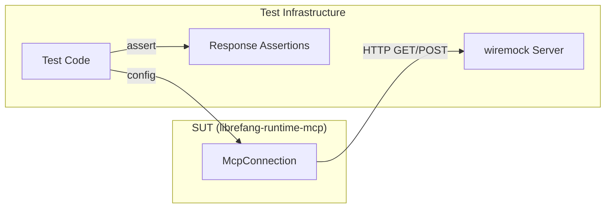

# Other — librefang-runtime-mcp-tests

# HttpCompat Integration Tests

## Overview

This module (`http_compat_integration.rs`) provides end-to-end integration tests for the `HttpCompat` MCP transport. It validates that the simplest transport in the MCP stack—static tool declarations mapped to plain HTTP/JSON requests—connects, registers tools, dispatches calls, and handles errors correctly, all against a real HTTP mock server.

`HttpCompat` is specifically chosen for integration testing because it skips the MCP `initialize` handshake, eliminating the need for a full MCP-protocol-speaking peer.

## Architecture


```mermaid
graph LR
    TC[Test Code] -->|config| MC[McpConnection]
    MC -->|HTTP GET/POST| WM[wiremock Server]
    TC -->|assert| R[Response Assertions]
    
    subgraph "SUT (librefang-runtime-mcp)"
        MC
    end
    
    subgraph "Test Infrastructure"
        TC
        WM
        R
    end
```

## Test Fixtures

### `http_compat_config`

Builds a complete `McpServerConfig` for the `HttpCompat` transport. Every test uses this as the base configuration.

Key configuration details:
- **Server name**: `"test-server"` — determines the tool namespace prefix (`mcp_test-server_*`)
- **Transport**: `McpTransport::HttpCompat` with a wiremock base URL
- **Headers**: Injects `x-test-token: integration-fixture` on every request, verifying that static header injection flows through the transport
- **Timeout**: 5 seconds (generous for localhost wiremock)
- **Taint scanning**: Disabled via `empty_taint_rule_sets_handle()`

### `weather_tool`

Creates a sample `HttpCompatToolConfig` used by all three tests. It defines:

| Field | Value | Purpose |
|-------|-------|---------|
| `name` | `"get_weather"` | Tool identifier before namespacing |
| `path` | `"/weather/{city}"` | Path template with `{city}` placeholder |
| `method` | `GET` | HTTP method |
| `request_mode` | `Query` | Remaining args sent as query parameters |
| `response_mode` | `Json` | Response body forwarded verbatim |
| `input_schema` | `{city, units}` | Declared parameters; `city` is required |

This fixture is the sole tool used because it exercises all the interesting transport behaviors: path interpolation, query parameter forwarding, and header injection.

## Test Cases

### `http_compat_connect_registers_namespaced_tools`

**Validates**: `McpConnection::connect` succeeds and registers tools under their namespaced names.

1. Starts a wiremock server with a catch-all `GET /` probe endpoint.
2. Calls `McpConnection::connect` with the `HttpCompat` config.
3. Asserts the returned connection's tool list contains `mcp_test-server_get_weather` (produced by `format_mcp_tool_name`).
4. Asserts `conn.name()` returns `"test-server"`.

The namespaced naming convention is critical: the agent loop and dashboard both key off the `mcp_<server>_<tool>` form. A regression here breaks tool dispatch across the entire system.

### `http_compat_call_tool_renders_path_and_returns_body`

**Validates**: `call_tool` renders path templates, forwards remaining args, injects headers, and returns the response body.

1. Configures wiremock to expect:
   - `GET /weather/Paris` (path template rendered with `city=Paris`)
   - Query param `units=metric` (remaining arg after `city` is consumed)
   - Header `x-test-token: integration-fixture` (static config header)
2. Calls `call_tool` with the namespaced tool name and args `{"city": "Paris", "units": "metric"}`.
3. Asserts the response contains `"city"`, `"Paris"`, and `"18"` (the temperature value from the mock response).

This test verifies the complete request pipeline: arg extraction for path rendering → remaining args forwarded as query params → headers attached → response body returned verbatim.

### `http_compat_call_tool_unknown_name_errors`

**Validates**: Calling an unregistered tool name returns an error rather than silently issuing a stray HTTP request.

1. Connects with a config that declares only `get_weather`.
2. Calls `call_tool` with `"mcp_test-server_does_not_exist"`.
3. Asserts the error message mentions the tool was not found / unknown / does not exist.

## Relationship to the Codebase

These tests sit above the unit-test layer and exercise the real `McpConnection` type from `librefang_runtime_mcp`. They import:

- **`McpConnection`** / **`McpServerConfig`** / **`McpTransport`**: The public API for establishing MCP connections.
- **`format_mcp_tool_name`**: The namespacing function that produces `mcp_<server>_<tool>` identifiers.
- **`empty_taint_rule_sets_handle`**: Factory for a no-op taint rule set, keeping taint scanning disabled in tests.
- **`HttpCompatToolConfig`** and related enums from `librefang_types::config`: The configuration types that define tool behavior.

## Running the Tests

```bash
# All HttpCompat integration tests
cargo test -p librefang-runtime-mcp --test http_compat_integration

# Individual test
cargo test -p librefang-runtime-mcp --test http_compat_integration -- http_compat_call_tool_renders_path_and_returns_body
```

These tests are network-free (wiremock runs in-process) and require no external dependencies.