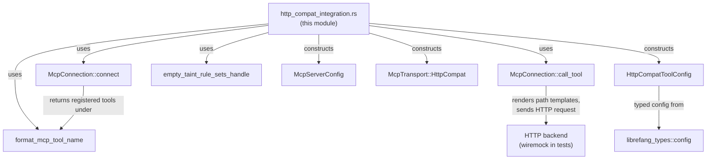

# Other — librefang-runtime-mcp-tests

# HttpCompat Integration Tests

## Overview

This module provides end-to-end integration tests for the `HttpCompat` MCP transport. `HttpCompat` is the simplest transport in the MCP subsystem — it maps declared tool calls onto plain HTTP/JSON requests against a user-supplied base URL without performing an MCP `initialize` handshake. Because it doesn't require a peer that speaks the MCP protocol, it is the ideal transport for exercising the full connect → register → call pipeline against a mock HTTP server.

## What Is Being Tested

The tests validate three behaviours that are critical to correct tool dispatch across the agent loop and dashboard:

1. **Namespaced tool registration** — `McpConnection::connect` must register each declared tool under the `mcp_<server>_<tool>` naming convention. The namespaced form is the key that all API consumers use for tool dispatch; a regression here breaks the entire call chain.

2. **Path rendering, parameter consumption, and response forwarding** — `call_tool` must interpolate path-template placeholders (e.g. `{city}`), consume those keys from the arguments, send the remaining keys as query parameters or a JSON body, attach configured headers, and return the backend response verbatim when `response_mode` is `Json`.

3. **Unknown-tool error handling** — calling a tool name that was never registered must produce an error rather than silently issuing an unrelated HTTP request.

## Test Infrastructure

All tests use **`wiremock`** to spin up an ephemeral mock HTTP server. This avoids external dependencies and provides deterministic request matching via `method`, `path`, `query_param`, and `header` matchers. Each test starts its own `MockServer`, mounts the expectations it needs, and lets the server drop at the end of the test scope.

## Fixture Functions

### `http_compat_config`

```rust
fn http_compat_config(base_url: String, tools: Vec<HttpCompatToolConfig>) -> McpServerConfig
```

Builds a complete `McpServerConfig` wired to the `HttpCompat` transport. It configures:

| Field | Value |
|---|---|
| `name` | `"test-server"` |
| `transport` | `McpTransport::HttpCompat` with a single static header `x-test-token: integration-fixture` |
| `timeout_secs` | 5 |
| `taint_scanning` | disabled |
| `taint_rule_sets` | empty handle via `empty_taint_rule_sets_handle()` |
| `oauth_provider` / `oauth_config` | `None` |

Every test composes its own tool list and passes the `wiremock` base URL, so each test is isolated.

### `weather_tool`

```rust
fn weather_tool() -> HttpCompatToolConfig
```

Returns a representative tool declaration used by most tests:

- **name**: `get_weather`
- **path**: `/weather/{city}` — contains one path-template parameter
- **method**: `GET`
- **request_mode**: `Query` — remaining arguments become query parameters
- **response_mode**: `Json`
- **input_schema**: requires `city` (string), optional `units` (string)

This tool is chosen specifically because its path template lets the tests verify that `{city}` is interpolated and consumed, while `units` is forwarded as a query parameter.

## Test Cases

### `http_compat_connect_registers_namespaced_tools`

**Validates**: Tool registration during `connect`.

Steps:
1. Start a `wiremock` server with a stub for `GET /` (the connectivity probe issued during connect).
2. Build an `McpServerConfig` with the weather tool and call `McpConnection::connect`.
3. Assert that the returned connection's tool list contains `mcp_test-server_get_weather` (produced by `format_mcp_tool_name("test-server", "get_weather")`).
4. Assert that `conn.name()` returns `"test-server"`.

### `http_compat_call_tool_renders_path_and_returns_body`

**Validates**: Path interpolation, argument consumption, header forwarding, and response round-tripping.

Steps:
1. Mount stubs for the connectivity probe (`GET /`) and the actual tool call (`GET /weather/Paris?units=metric` with header `x-test-token: integration-fixture`).
2. Connect, then call `call_tool` with `{"city": "Paris", "units": "metric"}` using the namespaced tool name.
3. Assert the response body contains the JSON fields from the wiremock stub (`"city"`, `"Paris"`, `"18"`).
4. The wiremock `expect(1)` assertion verifies the backend was hit exactly once with the correct path, query param, and header.

This test confirms that `{city}` was consumed from the arguments during path rendering, so only `units` appeared as a query parameter.

### `http_compat_call_tool_unknown_name_errors`

**Validates**: Error handling for unregistered tool names.

Steps:
1. Connect with the weather tool registered.
2. Call `call_tool` with a fabricated tool name `mcp_test-server_does_not_exist`.
3. Assert the result is an `Err` whose message contains "not found", "unknown", or "does not exist".

This prevents a silent fallback to an unrelated HTTP request — a critical safety property for the agent loop.

## Relationship to the Codebase


```mermaid
graph TD
    A["http_compat_integration.rs<br/>(this module)"] -->|uses| B["McpConnection::connect"]
    A -->|uses| C["McpConnection::call_tool"]
    A -->|uses| D["format_mcp_tool_name"]
    A -->|uses| E["empty_taint_rule_sets_handle"]
    A -->|constructs| F["McpServerConfig"]
    A -->|constructs| G["McpTransport::HttpCompat"]
    A -->|constructs| H["HttpCompatToolConfig"]
    B -->|returns registered tools under| D
    C -->|"renders path templates,<br/>sends HTTP request"| I["HTTP backend<br/>(wiremock in tests)"]
    H -->|typed config from| J["librefang_types::config"]
```

The tests depend on the following public API surface from `librefang_runtime_mcp`:

- **`McpConnection::connect`** — establishes the transport and registers tools.
- **`McpConnection::call_tool`** — dispatches a tool call through the transport.
- **`McpConnection::tools`** / **`McpConnection::name`** — accessors on the established connection.
- **`format_mcp_tool_name`** — produces the `mcp_<server>_<tool>` namespaced identifier.
- **`empty_taint_rule_sets_handle`** — provides a no-op taint-rule handle for configs that disable scanning.

Config types (`HttpCompatToolConfig`, `HttpCompatHeaderConfig`, `HttpCompatMethod`, `HttpCompatRequestMode`, `HttpCompatResponseMode`) come from `librefang_types::config`.

## Running

```bash
# Run just these integration tests
cargo test -p librefang-runtime-mcp --test http_compat_integration

# Run with output visible
cargo test -p librefang-runtime-mcp --test http_compat_integration -- --nocapture
```

No external services or environment variables are required — `wiremock` handles all HTTP interactions in-process.