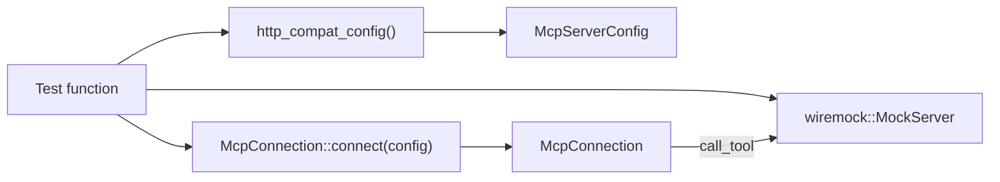

# Other — librefang-runtime-mcp-tests

# librefang-runtime-mcp-tests: HttpCompat Integration Tests

## Purpose

This module contains end-to-end integration tests for the `HttpCompat` MCP transport. `HttpCompat` is the simplest MCP transport — it maps tool declarations onto plain HTTP/JSON requests against a user-supplied base URL, without performing an MCP `initialize` handshake. Because it requires no MCP-protocol-speaking peer, it is the ideal transport for integration testing against a real HTTP server.

The tests use `wiremock` to spin up a real mock HTTP server, then exercise `McpConnection::connect` and `McpConnection::call_tool` against it. This validates the full runtime path from configuration through HTTP request rendering and response forwarding.

## What Is Being Tested

The test suite covers three behaviors critical to the agent loop and tool dispatch:

1. **Tool registration with namespacing** — `McpConnection::connect` succeeds and registers declared tools under the `mcp_<server>_<tool>` naming convention. The agent loop and dashboard key off this prefixed form, so a regression here breaks tool dispatch.
2. **Path template rendering and HTTP dispatch** — `call_tool` renders `{param}` placeholders from arguments into the URL path, consumes those keys, sends remaining arguments as query parameters or JSON body, attaches configured headers, and returns the backend response verbatim.
3. **Unknown tool rejection** — calling a tool that was never registered produces a descriptive error rather than silently issuing a malformed request.

## Test Fixture Architecture


```mermaid
graph LR
    Test["Test function"] --> Config["http_compat_config()"]
    Config --> MCS["McpServerConfig"]
    Test --> WireMock["wiremock::MockServer"]
    Test --> Connect["McpConnection::connect(config)"]
    Connect --> Conn["McpConnection"]
    Conn -->|call_tool| WireMock
```

## Helper Functions

### `http_compat_config`

```rust
fn http_compat_config(base_url: String, tools: Vec<HttpCompatToolConfig>) -> McpServerConfig
```

Builds a complete `McpServerConfig` for the `HttpCompat` transport. Every test uses this to ensure consistent fixture setup. The config includes:

- **Server name**: `"test-server"` — used as the namespace prefix in tool names.
- **Transport**: `McpTransport::HttpCompat` with one static header (`x-test-token: integration-fixture`) and the caller-provided tool declarations.
- **Taint scanning**: disabled, with an empty rule set from `empty_taint_rule_sets_handle`.
- **Timeout**: 5 seconds.

### `weather_tool`

```rust
fn weather_tool() -> HttpCompatToolConfig
```

Returns a canonical `HttpCompatToolConfig` declaration used across all three tests. It defines:

| Field | Value |
|---|---|
| `name` | `"get_weather"` |
| `path` | `"/weather/{city}"` |
| `method` | `HttpCompatMethod::Get` |
| `request_mode` | `HttpCompatRequestMode::Query` |
| `response_mode` | `HttpCompatResponseMode::Json` |
| `input_schema` | Object with required `city` (string) and optional `units` (string) |

The `{city}` path template is central to the path-rendering test: the runtime must interpolate it, consume the key from the argument map, and send only `units` as a query parameter.

## Test Cases

### `http_compat_connect_registers_namespaced_tools`

**What it verifies:** `McpConnection::connect` succeeds for an `HttpCompat` config and registers tools under their namespaced form.

**How it works:**
1. Starts a `wiremock` server with a catch-all `GET /` probe handler (the connect phase issues a probe; failure is tolerated).
2. Calls `McpConnection::connect` with the `http_compat_config` fixture.
3. Asserts the returned connection's tool list contains `format_mcp_tool_name("test-server", "get_weather")` — i.e., `"mcp_test-server_get_weather"`.
4. Asserts `conn.name()` returns `"test-server"`.

**Why it matters:** The agent loop resolves tool calls by the namespaced name. If `connect` fails to register tools under this convention, all downstream tool dispatch breaks silently.

### `http_compat_call_tool_renders_path_and_returns_body`

**What it verifies:** `call_tool` renders path parameters, strips consumed keys, sends remaining args via the configured request mode, attaches static headers, and forwards the backend response.

**How it works:**
1. Configures two wiremock stubs:
   - `GET /` — probe handler for connect.
   - `GET /weather/Paris` with `?units=metric` and header `x-test-token: integration-fixture` — returns `{"city": "Paris", "tempC": 18}`. Set to `expect(1)` to verify exactly one call.
2. Connects, then calls `call_tool` with the namespaced tool name and arguments `{"city": "Paris", "units": "metric"}`.
3. Asserts the response string contains `"city"`, `"Paris"`, and `"18"` (since `response_mode` is `Json`, the body is forwarded verbatim).

**Key behavior validated:** The `city` argument is consumed by the `/weather/{city}` path template and does **not** appear as a query parameter. Only `units` remains and is sent as `?units=metric`.

### `http_compat_call_tool_unknown_name_errors`

**What it verifies:** Calling a tool name that was never registered returns an error rather than issuing an HTTP request.

**How it works:**
1. Connects with the standard one-tool config.
2. Calls `call_tool("mcp_test-server_does_not_exist", {})`.
3. Asserts the result is an `Err` whose message contains one of `"not found"`, `"unknown"`, or `"does not exist"`.

## Dependencies on the Main Library

The tests import these symbols from `librefang_runtime_mcp`:

| Symbol | Role in tests |
|---|---|
| `McpConnection` | The connection object under test; `connect` and `call_tool` are the primary entry points. |
| `McpServerConfig` | Configuration struct passed to `connect`. |
| `McpTransport::HttpCompat` | The transport variant being tested. |
| `format_mcp_tool_name` | Utility to produce the expected namespaced tool name (`mcp_<server>_<tool>`). |
| `empty_taint_rule_sets_handle` | Provides a no-op taint rule set handle; taint scanning is not exercised here. |

From `librefang_types::config`: `HttpCompatHeaderConfig`, `HttpCompatMethod`, `HttpCompatRequestMode`, `HttpCompatResponseMode`, and `HttpCompatToolConfig` — the configuration types that define the transport behavior.

## Running the Tests

```bash
# Run all HttpCompat integration tests
cargo test -p librefang-runtime-mcp --test http_compat_integration

# Run a single test
cargo test -p librefang-runtime-mcp --test http_compat_integration http_compat_call_tool_renders_path_and_returns_body
```

Tests are async (`#[tokio::test]`) and require no external services — `wiremock` provides the HTTP server in-process.