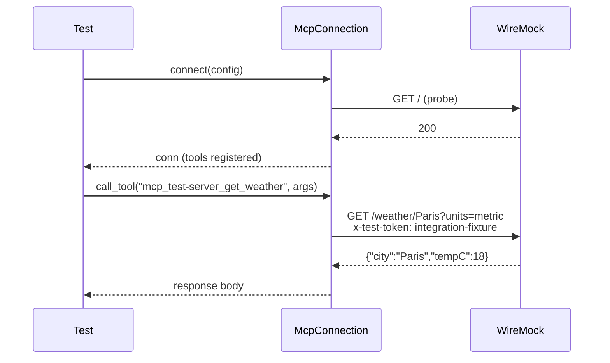

# Other — librefang-runtime-mcp-tests

# HttpCompat Transport — Integration Tests

**File:** `librefang-runtime-mcp/tests/http_compat_integration.rs`

## Purpose

End-to-end integration tests for the `HttpCompat` MCP transport. `HttpCompat` is the simplest transport in the MCP stack: it maps declared tool calls onto plain HTTP/JSON requests against a user-supplied base URL, without performing an MCP `initialize` handshake. Because it requires no protocol-speaking peer, it is the ideal candidate for lightweight integration testing against a real HTTP server.

The tests spin up a `wiremock` server on each run, configure an `McpConnection` with `HttpCompat` transport, and assert correct behaviour through the public API (`connect`, `tools()`, `call_tool`).

---

## What the Tests Verify

| # | Behaviour | Test function |
|---|-----------|---------------|
| 1 | `McpConnection::connect` succeeds and registers declared tools under the namespaced `mcp_<server>_<tool>` naming convention. | `http_compat_connect_registers_namespaced_tools` |
| 2 | `call_tool` issues a real HTTP request, interpolates path-template parameters (`{city}`), sends remaining args as query parameters, attaches configured headers, and returns the response body verbatim. | `http_compat_call_tool_renders_path_and_returns_body` |
| 3 | Calling a tool name that was never registered produces an error containing a clear "not found" / "unknown" / "does not exist" message. | `http_compat_call_tool_unknown_name_errors` |

---

## Test Architecture


```mermaid
sequenceDiagram
    participant Test
    participant McpConnection
    participant WireMock

    Test->>McpConnection: connect(config)
    McpConnection->>WireMock: GET / (probe)
    WireMock-->>McpConnection: 200
    McpConnection-->>Test: conn (tools registered)

    Test->>McpConnection: call_tool("mcp_test-server_get_weather", args)
    McpConnection->>WireMock: GET /weather/Paris?units=metric<br/>x-test-token: integration-fixture
    WireMock-->>McpConnection: {"city":"Paris","tempC":18}
    McpConnection-->>Test: response body
```

---

## Helper Functions

### `http_compat_config(base_url, tools) -> McpServerConfig`

Builds a complete `McpServerConfig` wired with `McpTransport::HttpCompat`. Every test configures:

- **Server name:** `"test-server"` — used as the namespace prefix in tool names.
- **Static header:** `x-test-token: integration-fixture` — verifies header injection on every call.
- **Timeout:** 5 seconds.
- **Taint scanning:** disabled (empty rule sets via `empty_taint_rule_sets_handle()`).

All other optional fields (`oauth_provider`, `oauth_config`, `roots`, `env`) are left at their defaults / empty.

### `weather_tool() -> HttpCompatToolConfig`

Returns a canonical tool fixture used by all three tests:

| Field | Value |
|-------|-------|
| `name` | `"get_weather"` |
| `description` | `"Look up current weather by city"` |
| `path` | `"/weather/{city}"` — one path-template parameter |
| `method` | `HttpCompatMethod::Get` |
| `request_mode` | `HttpCompatRequestMode::Query` — non-path args become query parameters |
| `response_mode` | `HttpCompatResponseMode::Json` — backend JSON forwarded verbatim |
| `input_schema` | JSON Schema requiring `"city"` (string), optional `"units"` (string) |

---

## Test Details

### `http_compat_connect_registers_namespaced_tools`

**What it proves:** After `connect`, the tool list includes the fully namespaced tool name `mcp_test-server_get_weather`. This naming convention is critical — the agent loop, dashboard, and tool-dispatch layer all key off the prefixed form. A regression here breaks end-to-end tool dispatch.

**How it works:**

1. Start a `wiremock` server with a catch-all `GET /` that returns 200 (the connect-phase probe).
2. Build an `McpServerConfig` with one `weather_tool`.
3. Call `McpConnection::connect(config)`.
4. Assert `conn.tools()` contains `format_mcp_tool_name("test-server", "get_weather")`.
5. Assert `conn.name()` returns `"test-server"`.

### `http_compat_call_tool_renders_path_and_returns_body`

**What it proves:** The driver correctly:

- Renders `{city}` from the call arguments into the URL path.
- **Consumes** the path key so it does not also appear as a query parameter.
- Sends remaining arguments (`units=metric`) as query parameters.
- Attaches the static header from the transport config.
- Returns the backend response body verbatim (JSON passthrough).

**How it works:**

1. Set up two mock endpoints on the wiremock server:
   - `GET /` → 200 (connect probe).
   - `GET /weather/Paris` with `units=metric` query param and `x-test-token` header → 200 with JSON body `{"city":"Paris","tempC":18}`. Marked `expect(1)` to verify exactly one call.
2. Connect, then call the namespaced tool with `{"city": "Paris", "units": "metric"}`.
3. Assert the response string contains `"city"`, `"Paris"`, and `"18"` — proving the backend payload round-trips to the caller.

### `http_compat_call_tool_unknown_name_errors`

**What it proves:** Calling a tool that was never declared in the config fails with a descriptive error rather than issuing an arbitrary HTTP request.

**How it works:**

1. Connect with one registered tool (`get_weather`).
2. Call `call_tool("mcp_test-server_does_not_exist", {})`.
3. Assert the call returns `Err` whose message contains "not found", "unknown", or "does not exist".

---

## Dependencies on the Parent Crate

The tests exercise these public items from `librefang_runtime_mcp`:

| Item | Usage |
|------|-------|
| `McpConnection::connect` | Entry point to establish a transport connection |
| `McpConnection::call_tool` | Dispatch a tool call through the transport |
| `McpConnection::tools()` | Read the list of registered tools post-connect |
| `McpConnection::name()` | Read the server name |
| `McpTransport::HttpCompat` | Variant in the transport enum |
| `McpServerConfig` | Configuration struct for a server |
| `format_mcp_tool_name` | Utility to build the `mcp_<server>_<tool>` name |
| `empty_taint_rule_sets_handle` | Provides a no-op taint rule handle |

From `librefang_types::config`:

- `HttpCompatHeaderConfig`, `HttpCompatMethod`, `HttpCompatRequestMode`, `HttpCompatResponseMode`, `HttpCompatToolConfig`

---

## Running the Tests

```bash
# Run just this test file
cargo test -p librefang-runtime-mcp --test http_compat_integration

# Run with output visible
cargo test -p librefang-runtime-mcp --test http_compat_integration -- --nocapture
```

Each test is `#[tokio::test]`-annotated and starts its own isolated `wiremock::MockServer` — no shared state, no port conflicts, safe to run in parallel.