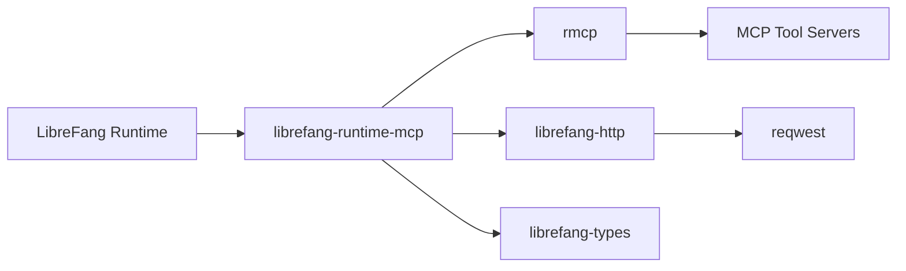

# Other — librefang-runtime-mcp

# librefang-runtime-mcp

MCP (Model Context Protocol) client for the LibreFang runtime.

## Purpose

This crate provides an MCP client that enables the LibreFang runtime to communicate with MCP-compatible tool servers. MCP is a standardized protocol that allows AI models to discover and invoke external tools, access resources, and receive structured prompts. By integrating an MCP client, the runtime can extend its capabilities dynamically by connecting to external tool providers.

## Architecture

The module sits between the LibreFang runtime core and external MCP servers, using the `rmcp` crate as the underlying protocol implementation. It relies on `librefang-http` for consistent HTTP transport configuration and `librefang-types` for shared type definitions.

## Dependencies and Their Roles

### Internal Crates

| Crate | Role |
|---|---|
| `librefang-types` | Shared type definitions used across the LibreFang workspace |
| `librefang-http` | HTTP client construction and configuration, ensuring consistent transport behavior across the project |

### External Crates

| Crate | Role |
|---|---|
| `rmcp` | Core MCP protocol implementation — handles message framing, tool discovery, and invocation semantics |
| `reqwest` | Underlying HTTP client used to communicate with MCP servers |
| `tokio` | Async runtime for non-blocking I/O |
| `serde` / `serde_json` | Serialization of MCP request/response payloads |
| `sha2` / `base64` | Cryptographic hashing and encoding, likely used for message integrity or authentication with MCP servers |
| `url` | URL parsing and construction for MCP server endpoints |
| `rand` | Random number generation, likely for nonce or session identifier creation |
| `arc-swap` | Lock-free atomic swapping of shared state — used for hot-reloading or updating MCP client configuration without disrupting active connections |
| `async-trait` | Async trait definitions for trait objects |
| `http` | Low-level HTTP types (request/response parts, header maps) |
| `tracing` | Structured logging and diagnostics |

## Integration Points

This crate is consumed by the LibreFang runtime to:

1. **Discover tools** — Query MCP servers for available tools and their schemas.
2. **Invoke tools** — Send structured invocation requests and return results to the runtime.
3. **Manage connections** — Maintain and potentially rotate connections to one or more MCP servers using thread-safe state (`arc-swap`).

## Security Considerations

The inclusion of `sha2` and `base64` suggests this module may implement message authentication or integrity checks when communicating with MCP servers. The `rand` crate likely supports generation of cryptographic nonces for such flows. Developers modifying this crate should ensure any authentication logic remains constant-time where comparison is involved.

## Workspace Configuration

This crate is part of the LibreFang workspace and inherits its `version`, `edition`, and `license` from the workspace root. All workspace-level dependency versions are managed centrally.