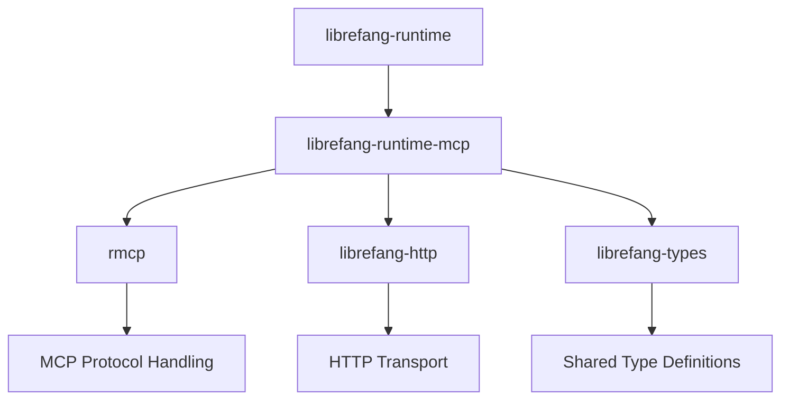

# Other — librefang-runtime-mcp

# librefang-runtime-mcp

MCP (Model Context Protocol) client for the LibreFang runtime. This module provides the integration layer that allows the LibreFang runtime to communicate with MCP-compatible servers, enabling tool discovery, invocation, and context management through the standardized MCP protocol.

## Purpose

The Model Context Protocol (MCP) is an open protocol that standardizes how applications provide context and tools to AI models. This crate implements an MCP client that the LibreFang runtime uses to:

- Connect to MCP servers over HTTP-based transports
- Discover available tools and capabilities exposed by those servers
- Invoke tools and retrieve results
- Manage server connections and lifecycle

## Architecture



The module sits between the LibreFang runtime and external MCP servers. It delegates MCP protocol-level handling to the `rmcp` crate and relies on `librefang-http` for the underlying HTTP transport, while translating between LibreFang's internal types and MCP wire formats.

## Key Dependencies

### Internal Crates

| Crate | Role |
|---|---|
| `librefang-types` | Shared type definitions used across LibreFang — error types, configuration structs, and domain models |
| `librefang-http` | HTTP client abstraction layer, providing consistent request/response handling |

### External Crates

| Crate | Role |
|---|---|
| `rmcp` | Core MCP protocol implementation for Rust — handles JSON-RPC message formatting, capability negotiation, and protocol state |
| `reqwest` | HTTP client used for transport-level requests to MCP servers |
| `tokio` | Async runtime for non-blocking I/O operations |
| `serde` / `serde_json` | Serialization of MCP messages to/from JSON |
| `tracing` | Structured logging and diagnostics |
| `http` | Low-level HTTP type definitions (status codes, headers, methods) |

### Utility Dependencies

- **`sha2`** / **`base64`** — Cryptographic hashing and encoding, likely used for session identifiers, authentication tokens, or message integrity verification
- **`url`** / **`psl`** — URL parsing and Public Suffix List validation for safe server endpoint handling
- **`rand`** — Random number generation for nonce generation or session tokens
- **`arc-swap`** — Atomic swapping of shared state, used for thread-safe updates to server connection state or configuration without locks
- **`async-trait`** — Async trait definitions for transport abstractions
- **`thiserror`** — Derived error types

## Connection Lifecycle

The typical flow for interacting with an MCP server follows this sequence:

1. **Configuration** — Server endpoints, authentication credentials, and transport settings are assembled from the runtime configuration
2. **Initialization** — An MCP session is established with the target server, including capability negotiation (protocol version, supported features)
3. **Discovery** — Available tools and their schemas are queried from the server
4. **Invocation** — Tools are called with structured input parameters, and results are received and decoded
5. **Teardown** — Sessions are gracefully closed when the runtime shuts down or the connection is no longer needed

## Error Handling

Errors are defined using `thiserror` and integrate with `librefang-types`. Expected error categories include:

- **Transport errors** — Connection failures, timeouts, HTTP-level errors from `reqwest`
- **Protocol errors** — MCP-level error responses, capability mismatches, invalid messages
- **Serialization errors** — Malformed JSON in server responses or schema violations

## Testing

The crate uses `wiremock` for mocking HTTP servers in tests, allowing verification of MCP message exchanges without requiring a live server:

```toml
[dev-dependencies]
wiremock = "0.6"
tokio = { workspace = true, features = ["macros", "rt-multi-thread"] }
```

Tests construct mock MCP servers that respond with controlled payloads, validating that the client correctly handles both success and error scenarios.

## Integration with the Runtime

This module is consumed by `librefang-runtime` as its interface to MCP tool servers. The runtime orchestrates when and how MCP connections are created — for example, initializing connections at startup based on configuration, routing tool calls through this client during execution, and managing reconnection or failover.