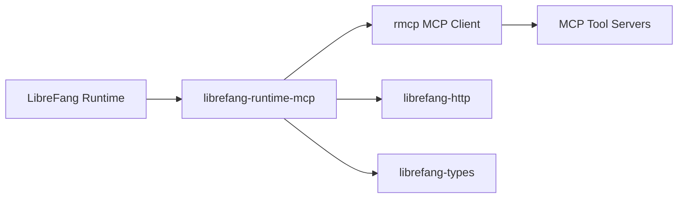

# Other — librefang-runtime-mcp

# librefang-runtime-mcp

MCP (Model Context Protocol) client integration for the LibreFang runtime. This module provides a bridge between LibreFang's runtime environment and MCP-compatible tool servers, enabling dynamic tool discovery and invocation.

## Purpose

Model Context Protocol (MCP) is a standard for exposing tools and resources to LLM-powered applications. This module acts as a client that connects to MCP servers, discovers available tools, and makes them accessible within the LibreFang execution environment.

## Architecture

The module sits between the LibreFang runtime core and external MCP tool servers, translating between LibreFang's internal type system and the MCP protocol.

## Dependencies

### Internal Dependencies

| Crate | Role |
|---|---|
| `librefang-types` | Shared type definitions used across LibreFang crates |
| `librefang-http` | HTTP client infrastructure for communicating with remote MCP servers |

### External Dependencies

| Crate | Role |
|---|---|
| `rmcp` | Rust MCP client implementation — handles protocol negotiation, tool discovery, and JSON-RPC transport |
| `reqwest` | Underlying HTTP client used for MCP server communication |
| `tokio` | Async runtime |
| `serde` / `serde_json` | Serialization for MCP protocol messages |
| `base64` / `sha2` | Likely used for authentication handshakes or payload integrity verification with MCP servers |
| `url` | URL parsing and construction for MCP server endpoints |
| `rand` | Random generation, likely for nonce or session identifier creation |
| `tracing` | Structured logging and diagnostics |
| `async-trait` | Async trait definitions |
| `http` | HTTP primitive types (status codes, headers, method types) |

## Key Concepts

### MCP Client Lifecycle

The module manages the lifecycle of connections to MCP servers:

1. **Connection Setup** — Establishes a connection to an MCP server endpoint (typically over HTTP/SSE or stdio transport)
2. **Capability Negotiation** — Exchanges supported capabilities with the server
3. **Tool Discovery** — Retrieves the catalog of available tools, including their schemas and descriptions
4. **Tool Invocation** — Calls tools by name with structured arguments and returns results

### Integration with LibreFang Types

Tools discovered via MCP are mapped into LibreFang's internal type representations from `librefang-types`, allowing the runtime to treat MCP tools uniformly alongside other tool providers.

### HTTP Transport

MCP servers that expose HTTP endpoints are reached through `librefang-http`, which provides configured HTTP clients with connection pooling, timeouts, and TLS settings consistent with the rest of the LibreFang stack.

## Usage Patterns

This crate is consumed by the LibreFang runtime to:

- **Extend available tools** at runtime by connecting to MCP servers specified in configuration
- **Proxy tool calls** from the execution environment out to MCP-compatible services
- **Aggregate multiple MCP servers** into a unified tool catalog

## Configuration

MCP server connections are typically configured with:

- **Endpoint URL** — The HTTP URL of the MCP server
- **Authentication credentials** — Optional API keys or tokens, handled via the `base64`/`sha2` utilities
- **Transport type** — HTTP-based (SSE stream) or stdio, determined by the `rmcp` client configuration

## Logging and Diagnostics

All MCP operations are instrumented with `tracing` spans, providing visibility into:

- Connection establishment and teardown
- Tool discovery results
- Individual tool call durations and outcomes

This integrates with the broader LibreFang observability stack.