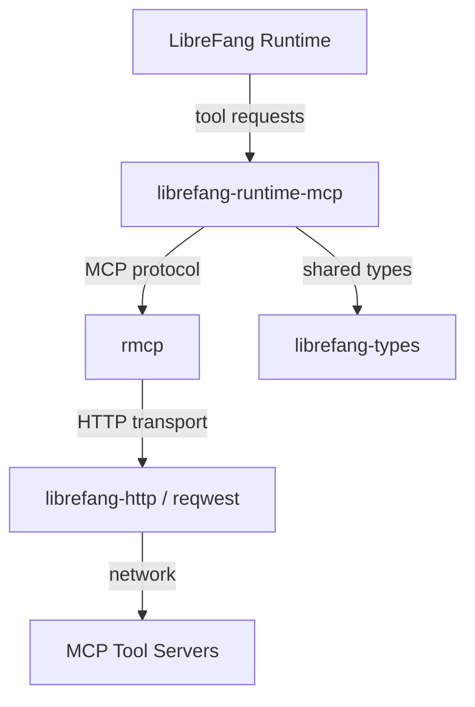

# Other — librefang-runtime-mcp

# librefang-runtime-mcp

MCP (Model Context Protocol) client for the LibreFang runtime. This module provides the integration layer that allows the LibreFang runtime to communicate with MCP-compatible tool servers, enabling dynamic tool discovery, invocation, and resource management.

## Purpose

The Model Context Protocol (MCP) standardizes how AI runtimes interact with external tools and data sources. This module implements the client side of that protocol, allowing the LibreFang runtime to:

- Discover available tools exposed by MCP servers
- Invoke tools with structured parameters
- Manage tool lifecycle and connection state
- Handle authentication and transport security

## Dependencies & What They Indicate

The dependency profile reveals the module's operational character:

| Dependency | Role |
|---|---|
| `rmcp` | Core MCP protocol implementation — handles message framing, negotiation, and the protocol state machine |
| `librefang-types` | Shared type definitions across the LibreFang ecosystem (tool schemas, error types, etc.) |
| `librefang-http` | HTTP transport layer, used for streamable HTTP-based MCP server connections |
| `reqwest` | Low-level HTTP client backing the transport |
| `tokio` | Async runtime for concurrent tool invocations and connection management |
| `serde` / `serde_json` | Serialization of MCP messages, tool parameters, and response payloads |
| `http` | HTTP type primitives (headers, status codes, method types) |
| `async-trait` | Async trait definitions for transport abstraction and handler interfaces |
| `base64` / `sha2` | Likely used for authentication tokens, challenge-response flows, or payload integrity verification |
| `url` | MCP server endpoint parsing and validation |
| `rand` | Nonce generation, session identifiers, or other cryptographic randomness needs |
| `tracing` | Structured logging and diagnostic spans for connection lifecycle events |

## Architecture

The module sits between the core LibreFang runtime and external MCP servers. It translates internal tool invocation requests into MCP protocol messages, sends them over HTTP, and returns structured results back to the runtime.

## Integration Points

### Upstream

The runtime core calls into this module when it needs to interact with an MCP server — for example, to enumerate available tools or execute a specific tool call during fang execution.

### Downstream

This module depends on:
- **`librefang-types`** for domain types that cross module boundaries
- **`librefang-http`** for HTTP transport infrastructure, avoiding duplication of connection pooling, TLS configuration, and error handling

### External

Communication with MCP servers happens over HTTP, using the protocol defined by the MCP specification. The `rmcp` crate handles protocol-level concerns while `reqwest` (via `librefang-http`) handles the actual network I/O.

## Key Design Decisions

**Transport abstraction via `async-trait`**: The module defines async trait interfaces for transports, allowing the MCP protocol to potentially run over different transports in the future (stdio, WebSocket, etc.), though currently only HTTP is supported.

**Cryptographic utilities (`sha2`, `base64`, `rand`)**: The presence of these dependencies suggests the module handles some form of authentication or message integrity, which is common when connecting to remote tool servers that require verified identities or signed requests.

**Structured logging with `tracing`**: Connection events, tool invocations, and errors are instrumented with structured spans, making it possible to trace a single tool invocation from request through response in production logs.