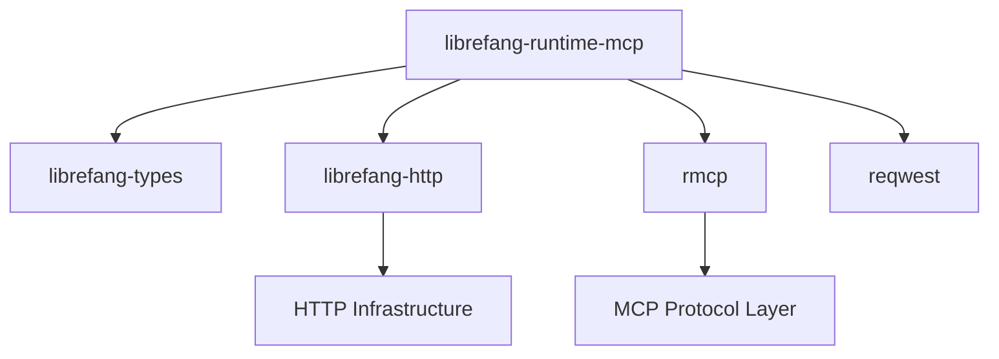

# Other — librefang-runtime-mcp

# librefang-runtime-mcp

MCP (Model Context Protocol) client for the LibreFang runtime. This crate provides the integration layer between the LibreFang system and MCP-compatible services, enabling the runtime to discover and invoke tools, access resources, and manage prompts exposed by MCP servers.

## Purpose

The Model Context Protocol standardizes how AI applications communicate with external tool providers and data sources. This crate implements the client side of that protocol within the LibreFang runtime, allowing the system to:

- Connect to MCP servers over HTTP transport
- Discover available tools and their schemas
- Invoke tools and collect results
- Handle authentication and request signing where required

## Architecture

The crate sits between the higher-level runtime orchestration and the lower-level HTTP/protocol plumbing. It delegates HTTP concerns to `librefang-http` and uses `rmcp` as the underlying MCP protocol implementation, adapting both to the type system defined in `librefang-types`.

## Dependencies and Their Roles

### Internal Crates

| Crate | Role |
|---|---|
| `librefang-types` | Shared type definitions — request/response structures, error types, and domain models used across all LibreFang crates |
| `librefang-http` | HTTP client configuration, connection pooling, and shared request infrastructure |

### External Crates

| Crate | Role |
|---|---|
| `rmcp` | Core MCP protocol implementation — handles message serialization, protocol negotiation, and transport framing |
| `reqwest` | Underlying HTTP client used for requests to MCP servers |
| `http` | Low-level HTTP types (`Request`, `Response`, `HeaderMap`) |
| `tokio` | Async runtime for non-blocking I/O |
| `serde` / `serde_json` | JSON serialization for MCP message payloads |
| `async-trait` | Async trait definitions for pluggable transport or client behaviors |
| `base64` / `sha2` | Encoding and hashing — likely used for authentication signatures or payload integrity checks |
| `url` | URL parsing and construction for MCP server endpoints |
| `rand` | Random number generation — used for nonce generation, request IDs, or similar protocol requirements |
| `tracing` | Structured logging and diagnostics |

## Relationship to the Rest of LibreFang

This crate is a leaf dependency within the LibreFang workspace. It has no dependents among the other workspace crates (no incoming calls detected), which means it is consumed directly by the top-level runtime binary or application entry point rather than by other library crates.

The flow of data is:

1. The runtime entry point loads configuration specifying MCP server endpoints.
2. This crate is initialized with that configuration, using `librefang-http` for the underlying HTTP client.
3. The runtime calls into this crate to discover tools or invoke them during execution.
4. Results are returned as types from `librefang-types`, keeping the interface consistent with the rest of the system.

## Key Design Decisions

**Transport over HTTP.** The dependency on `reqwest` and `http` (rather than `tokio` raw I/O or a WebSocket library) indicates that this client communicates with MCP servers via HTTP. This aligns with the MCP specification's HTTP-based transport.

**Protocol delegation to `rmcp`.** Rather than implementing MCP message framing from scratch, the crate relies on the `rmcp` crate for protocol-level concerns. This crate's responsibility is the integration glue — mapping LibreFang types to `rmcp` types, managing HTTP connections via `librefang-http`, and handling any authentication or retry logic specific to the LibreFang deployment.

**Authentication support.** The presence of `base64`, `sha2`, and `rand` suggests that the crate handles some form of request signing or token-based authentication when communicating with MCP servers. This is implemented locally rather than delegated to `librefang-http`, keeping the authentication logic MCP-specific.

## Contributing

When modifying this crate, keep the following in mind:

- **Do not introduce circular dependencies.** This crate must not depend on any LibreFang crate that itself depends on this one. Currently it only depends on `librefang-types` and `librefang-http`, which are both low-level infrastructure crates.
- **Keep `rmcp` concerns isolated.** Avoid leaking `rmcp` types through the public API. Convert to `librefang-types` at the boundary so consumers don't need to depend on `rmcp` directly.
- **Use `tracing` for all diagnostics.** Do not use `println!` or `eprintln!`. Instrument public functions with `tracing::instrument` where appropriate.
- **All I/O must be async.** Every function that performs network requests should return a `Future` or accept an async runtime context. The crate relies entirely on `tokio` for concurrency.